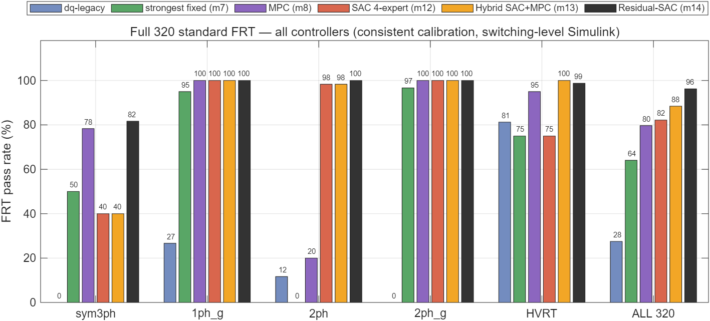

# 混合配电变压器（HPT）标准故障穿越 — 强化学习 vs 传统 dq 控制

400 kVA 混合配电变压器（Hybrid Power Transformer）。按**中国国标 GB/T（风/光伏 LVRT/HVRT）** 重新定义故障穿越（FRT），在**从零脚本重建、全部件齐全的开关级 HPT 模型**上，于**同一决策接口、同一标定口径**下对比 **8 种决策律**：dq 传统固定律及其文献变体、决策层 MPC（在线优化）、SAC 强化学习（忠实 ODE 训练的 4 专家 + 物理门控，权重内嵌 Simulink 真闭环）、以及**混合架构（LVRT 用 SAC、HVRT 用解析 MPC）**。

**最终结果（统一口径全 320，开关级 Simulink）：★★ 残差 SAC（m14）= 96.3%** —— MPC 闭式先验 + 学习残差 + 纹波感知钳位的**单模型**，LVRT 95.4%（三类不对称全 100%）、HVRT 98.8%，对 dq-legacy 为 **3.5×**。完整谱系：残差 SAC 96.3 > 混合 m13 88.4 > SAC 4 专家 82.2 > MPC 79.7 > 最强固定律 64.1 ≫ dq 27.5——**学习与优化结合的两种方式都超过任何单一路线**，先验地板还使训练曲线零震荡。

> 完整学术报告（背景/算式/全方法细说 §4.10/最终对比 §4.11/机理/局限/参考文献/可复现附录）：
> **[results/FRT_Academic_Report.md](results/FRT_Academic_Report.md)**　夜间修正过程：[overnight_report_2026-06-11.md](results/overnight_report_2026-06-11.md)

---

## 二期（系统级，2026-06-12 A 阶段闭环）：多 HPT 配电网协同 FRT

IEEE-33 + 10 台 HPT + 400 系统级故障场景（OpenDSS 三层架构，全部经审计）。**先定量排除五条交流侧协同路径**（≤+0.7 pp），再转向**直流母线互联（簇内直流池）**：

```
负荷穿越率:  solo 57.2% → 池+朴素分配 61.1%（硬件+4.0pp）→ 池+可翻转分配 65.8%（智能+4.7pp）
            可翻转启发式 = 逐簇枚举精确最优（差 0.0pp）→ 系统层无需学习器
最终方案:    装置层 = m14-v2 残差 SAC（学习）/ 系统层 = 直流池 + 解析最优分配器
```

> 二期完整报告（排除法地图/价值链/方法学结论/复现产物）：**[results/PHASE2_Report.md](results/PHASE2_Report.md)**　计划书：[week4/PHASE2_PLAN.md](week4/PHASE2_PLAN.md)　代码：[phase2/](phase2/)

---

## 核心成果（统一口径全 320，5 控制器同台）

| 控制器 | sym3ph | 1ph_g | 2ph | 2ph_g | LVRT 240 | HVRT 80 | **全 320** |
|---|:---:|:---:|:---:|:---:|:---:|:---:|:---:|
| dq-legacy | 0% | 26.7% | 11.7% | 0% | 9.6% | 81.2% | 27.5% |
| 最强固定律（m7，文献+RL回灌） | 50% | 95% | 0% | 96.7% | 60.4% | 75.0% | 64.1% |
| MPC（m8，决策层在线优化） | 78.3% | 100% | 20% | 100% | 74.6% | 95.0% | 79.7% |
| SAC 4 专家（m12） | 40% | 100% | 98.3% | 100% | 84.6% | 75.0% | 82.2% |
| 混合 m13（LVRT-SAC + HVRT-MPC） | 40% | 100% | 98.3% | 100% | 84.6% | **100%** | 88.4% |
| **★★ 残差 SAC（m14，MPC先验+残差+纹波钳位）** | **81.7%** | **100%** | **100%** | **100%** | **95.4%** | 98.8% | **96.3%** |



> 全套对比图：[判据级对比](results/figs/fig_all_criteria.png)、[深跌 sym3ph 多控制器波形](results/figs/fig_wave_sym_deep_all.png)、[不对称 2ph_g 波形](results/figs/fig_wave_2phg_all.png)、[HVRT 深骤升波形（混合 m13 吸无功达标的直观证据）](results/figs/fig_wave_hvrt_all.png)、[SAC 训练收敛](results/figs/fig_sac_convergence.png)。

**三个关键发现**：
1. **“深故障 Vdc 必塌”是控制自伤，不是拓扑硬限**——dq-legacy 深跌满额串联升压，把共享直流母线抽到 0.55 而死；克制串联（SAC）或预算内用串联（MPC）都能稳住 Vdc≥0.81；
2. **sim-to-real 差距靠实测标定消除（忠实 ODE）**——乐观 ODE 训出的专家部署即崩；用开关级 mode-10 扫描数据逐点标定 ODE 直流模型（`Vdc_eq=1−0.08·|iq|/V −1.9·max(0,V_se_d)−0.5·|V_se_q|`，误差 ≤0.02）后同一管线发生质变；
3. **学习与优化互补而非对立**——SAC 赢在不对称域的逐工况自适应，MPC 赢在可解析目标的 HVRT；按域分工的混合以接近零成本兼得两者。

### 演进过程（每步均为开关级 Simulink 实测；诚实记录三次修正）

| 阶段 | 全 320 | 说明 |
|------|:---:|------|
| 单一 SAC（乐观 ODE） | ~25% | HVRT 全败，LVRT 被 Vdc 存活卡住 |
| 3 专家 + 人工分流 | 44.1%（已撤回） | 依赖手工换权重，检查点被覆盖不可复现 |
| 4 专家在线门控（乐观 ODE） | 18.8%* | 诚实验证暴露 sim-to-real 差距 |
| 4 专家在线门控（忠实 ODE） | 90.0%（已作废） | 后发现验证标定泄漏（利好 SAC），触发统一口径重测 |
| 统一口径：SAC 82.2% / 混合 m13 88.4% | 88.4% | 标定泄漏修复 + 混合架构 |
| 残差 SAC v1 | 75.6% | 测量尖峰不忠实通道暴露（1ph_g 限流 36.7%） |
| **★★ 残差 SAC v2（最终）** | **96.3%** | 部署侧不对称域 0.24 纹波钳位（报告 §4.10-(9)/§4.11） |
| dq-legacy（基线） | 27.5% | 深跌串联自伤 + 限流超标 |

\* 18.8% 为 32 场景分层子集的指示值。

**诚实结论**（统一口径）：
- **SAC 在 LVRT 上领先所有方法**（84.6%）：limit/survive 双 100%（dq 分别 ~42%/40%）、2ph 强不对称 98.3% 独一档；
- **SAC 的两个短板及归宿**：HVRT 深骤升吸无功不足（75%）→ 已由混合 m13 的 MPC 律解决（100%）；sym3ph 中深度 connect（40%，支撑深度低于 dq 参照而 Vdc/限流双 100%）→ MPC 证明预算内可以撑更深（78.3%），是下轮训练激励的明确改进点；
- **判据的标定参照依赖**是本轮修正的方法学教训：connect 隐含"故障深度以谁的支撑为参照"，本文显式采用 dq 参照（对 SAC 保守，报告 §5-7）。

---

## 两层方法学（训练—验证分离）

强化学习需数十万步交互，开关级 EMT 单场景约 20 s，**无法直接在 Simulink 上训练**。故：

| 层 | 模型 | 角色 | 文件 |
|----|------|------|------|
| **训练层** | 平均值 ODE（含正负序、无功优先、限流、GB/T 包络） | 快速试错、策略学习 | `frt_standard/frt_env.py` |
| **验证层** | 开关级 Simulink（Simscape Electrical） | 权威评判，逼近真实电磁暂态 | `frt_standard/simulink/hpt_frt_full.slx` |

**忠实 ODE（本项目关键方法学）**：朴素 ODE 系统性偏乐观（无功增益高估 ~4.5×、直流母线可被有功随意充电），训出的策略部署即崩（ODE 82% → Simulink 0%）。修正：用 Simulink mode-10 固定设定值扫描**实测标定** ODE 的直流模型——`Vdc_eq = 1 − 0.08·|iq|/max(0.3,V) − 1.9·max(0,V_se_d) − 0.5·|V_se_q|`（串联升压抽取是主项），标定后 ODE 与 Simulink 的 Vdc 平衡点误差 ≤0.02。**一切结论仍以 Simulink 为准**。

---

## 标准 FRT 定义（GB/T 19963 / 19964）

- **故障类型**：对称三相 `sym3ph`；不对称 `1ph_g / 2ph / 2ph_g`（含负序）；过压 `swell_3ph / swell_1ph`；
- **深度**：LVRT 残压 {0.2, 0.5, 0.75}，HVRT 幅值 {1.2, 1.3}；
- **电网强弱**：强网 SCR=10、弱网 SCR=3；
- **5 项判据**：①不脱网（电压-时间包络内）②无功跟踪（`Iq=1.5(0.9−U)` droop，过压时吸）③限流（≤0.35 pu）④电压恢复（±7%）⑤装置存活（Vdc∈[0.75,1.25]）；
- **场景集**：320 = LVRT 240（4型×3深×2网×10）+ HVRT 80（2型×2幅×2网×10）。

---

## 完整开关级 HPT 模型（验证平台，纯脚本可复现）

`build_hpt_frt_full.m` → `hpt_frt_full.slx`（32 块，真实 10 kV MV / 400 V LV 两电压等级）：

```
MV弱网(R/L按SCR) → MV序故障 → 主变 Δ-Yg(400kVA) → LV负载
        └→ Tsh耦合变(120kVA) → 并联取能VSC(2电平IGBT桥) ┐
                                                          ├ 共享DC母线(2200µF)+条件斩波器(Vdc>1.20pu)
        串联调控VSC(2电平桥) → 3×单相Tse → 串入LV线 ─────┘
```

- 真 IGBT 开关（5 kHz SPWM）、真变压器（含漏抗/Δ-Yg 相移）、EMT 求解器（ode23tb，20 µs）；
- **HVRT 用可编程电压源**（幅值表做骤升）+ 外接串联 Z；
- **控制**：并联 = SRF-PLL + dq 电流环（解耦+前馈+抗饱和）+ Vdc 外环；串联 = 锁 LV 角开环 dq 注入；
- **闭环 SAC（Mode 11 单专家 / Mode 12 四专家在线门控）**：actor 权重 `coder.load` 进控制块，构建 21 维观测（正负序 T/4 延迟提取 + EMA 滤波、故障 one-hot、上步动作）→ MLP 前向 → 出动作。**网络按训练步长 2 ms 降频推理、期间保持动作**（直接以 20 µs 步长推理会因 100× 频率失配产生 ~3 kHz 极限环——实测命令反向 2628 次/故障，降频后 34 次）。Mode-12 门控：`V>1.1` 时按 V2n 分 hvrt_asym/hvrt_sym；`V2n>0.05` → asym；否则 sym。

---

## 文件结构（已精简，仅保留当前 GB/T FRT + 4 专家工作）

```
frt_standard/                    # ★ 当前 FRT 工作全部在此
├── FRT_SPEC.md                  # GB/T 规格：5 判据、包络、场景矩阵
├── gen_frt_scenarios.py         # 生成 320 场景
├── frt_scenarios.csv            # 320 标准场景（含 Rg/Lg/t_fault/dur）
├── frt_scenarios_subset.csv     # 32 场景分层代表子集（快速验证用）
├── frt_env.py                   # ★ 忠实 ODE 训练环境（直流模型 Simulink 实测标定）
├── frt_metrics.py               # 5 项 FRT 判据
├── train_experts.py             # ★ 4 专家训练（sym/asym/hvrt_sym/hvrt_asym 子集）
├── train_frt_sac.py             # 单一 SAC 训练脚本（基线方法）
├── export_experts.py            # ★ 导出 4 专家权重 → sac_{...}_weights.mat
├── export_sac_actor.py          # 导出单个 actor 权重（Mode-11 用）
├── sac_{sym,asym,hvrt_sym,hvrt_asym}_weights.mat   # ★ 4 专家内嵌权重
├── results/                     # frt320_{sym3ph,1ph_g,2ph,2ph_g,hvrt}.{mat,txt} ★全320分块结果
└── simulink/
    ├── build_hpt_frt_full.m     # ★ 完整 HPT 模型脚本重建（Mode12 四路门控+2ms降频+EMA）
    ├── hpt_frt_full.slx         # ★ 完整 HPT 开关级模型（权威验证平台）
    ├── validate_frt_full.m      # ★ LVRT 对比 harness（md=[4 12]，场景映射+残压标定+5判据）
    ├── validate_hvrt.m          # ★ HVRT 对比 harness（骤升注入+过压判据）
    ├── validate_dq_variants{,2}.m  # 文献基线公平性检验（mode 5宋幸式/6贾科式/7回灌版）
    ├── sim_compare.m / diag_*.m # ODE↔Simulink 标定与诊断脚本
    ├── gen_allctrl_figs.m       # ★ 全控制器报告图（柱状/判据/3组多控制器波形/SAC收敛）
    ├── validate_mode_full.m     # ★ 参数化单模式全量 harness（统一口径标定）
    └── sac_*_weights.mat        # 供 coder.load 内嵌

data/models/   sac_{sym,asym,hvrt_sym,hvrt_asym}_{best,final}.zip   # ★ 4 专家模型
results/       FRT_Academic_Report.md（★完整报告）、FRT_SAC_vs_dq_FullHPT.md、figs/
emt/           Python EMT 工具（独立保留）；week1/ week2/  文献
```

> 旧范式工作（350 个器件故障场景、SAC直接调制、MSFFN 分类器、单一/v2/v3 SAC、3 专家旧权重等）**已被本 GB/T 标准 FRT + 4 专家工作取代**（git 可恢复代码；data/models 旧模型已永久删除）。

---

## 复现流程（端到端）

```powershell
# Python 环境：E:\anaconda\envs\pandapower_dev（SB3 2.8.0 + torch + gymnasium）
# 必须先设置（否则 libiomp 冲突导致 numpy/torch matmul 段错误）：
$env:KMP_DUPLICATE_LIB_OK="TRUE"; $env:MKL_THREADING_LAYER="SEQUENTIAL"
$PY="E:\anaconda\envs\pandapower_dev\python.exe"

& $PY frt_standard/gen_frt_scenarios.py        # 1) 生成 320 场景（如需）
& $PY frt_standard/train_experts.py            # 2) 4 专家训练（~100 min CPU）
& $PY frt_standard/export_experts.py           # 3) 导出 4 份权重 .mat
Copy-Item frt_standard/sac_*_weights.mat frt_standard/simulink/
```

```matlab
% 4) MATLAB（R2025a + Simscape Electrical）— mode4(dq) vs mode12(在线门控 4 专家)
cd frt_standard/simulink
validate_frt_full(inf, '../frt_scenarios.csv')                 % LVRT 240（约2h；可用 {'sym3ph'} 等分块）
validate_hvrt()                                                % HVRT 80（约25min）
% 快速指示：validate_frt_full(inf,'../frt_scenarios_subset.csv')  % 32 场景分层子集
```

---

## 诚实局限（详见报告）

1. **HVRT 深骤升（1.3 pu）SAC 落后 dq**（75.0% vs 81.2%）：hvrt_sym 吸无功深度不足（−0.14 vs 需 −0.30），需加强该域训练压力；
2. **残留失败**：sym3ph 0.2@弱网 connect 边界 6 例、sym3ph 0.75@强网过注无功 5 例；
3. **不对称故障的残压深度在 Δ-Yg 拓扑下不可达**：MV 单相故障最深只能把 LV 正序压到 ~0.78，故 1ph_g 三档深度实际是同一工况（场景覆盖名义 240、有效更少）；
4. **模型非真机**：400 kVA 单口（课题书为多端口含直流口）、线性变压器（无饱和/铁损）、故障残压标定、**未硬件对标**；
5. **ODE 标定依赖本模型实测**——换拓扑/参数需重新跑 `sim_compare.m` 标定。

---

## 依赖

- **MATLAB R2025a** + Simulink + **Simscape Electrical**（专用电力系统）；MCP 会话需 `addpath(...agentic-toolkits/simulink); satk_initialize` 共享；
- **Python**：`E:\anaconda\envs\pandapower_dev` — stable-baselines3 2.8.0 + PyTorch（CPU 即可）+ gymnasium + numpy + scipy。
