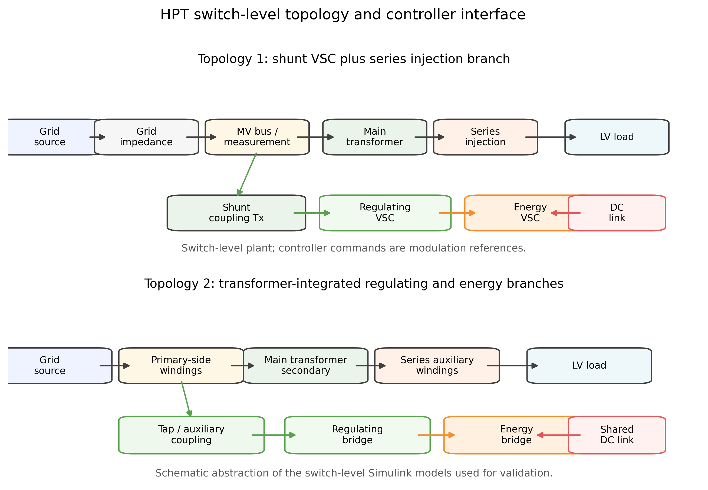
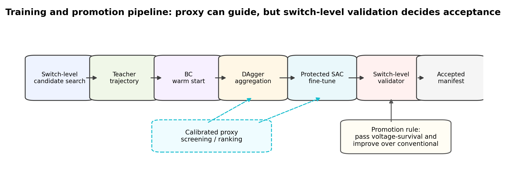
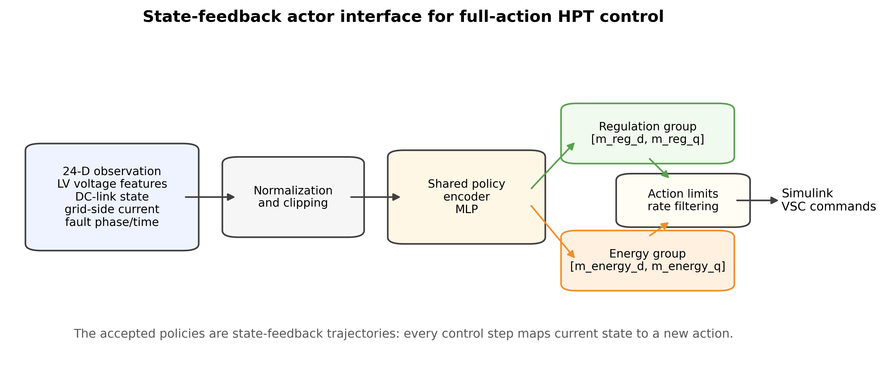
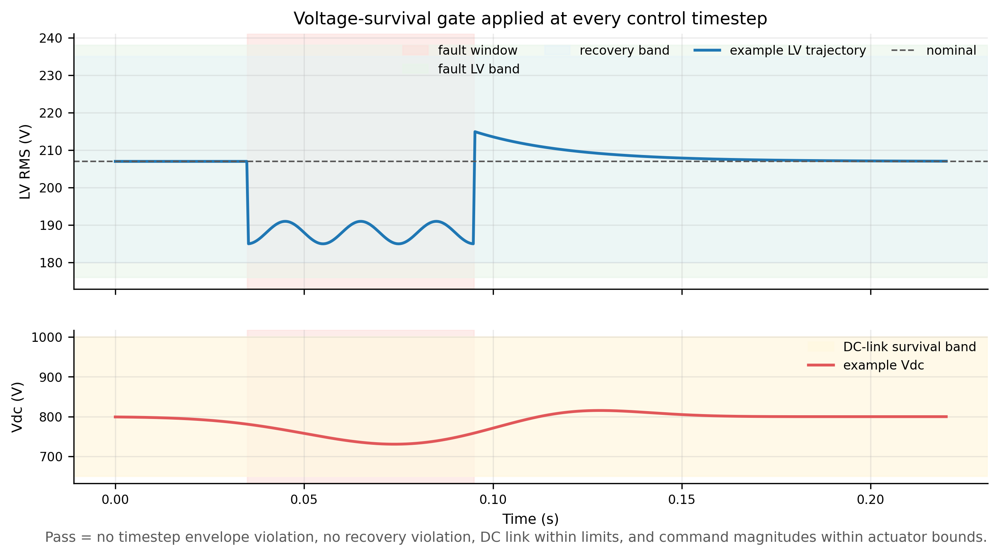
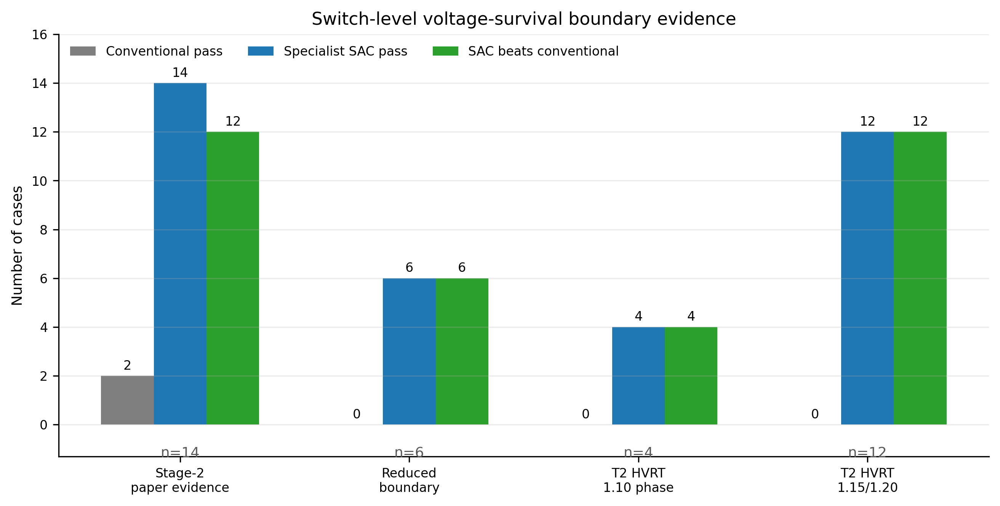
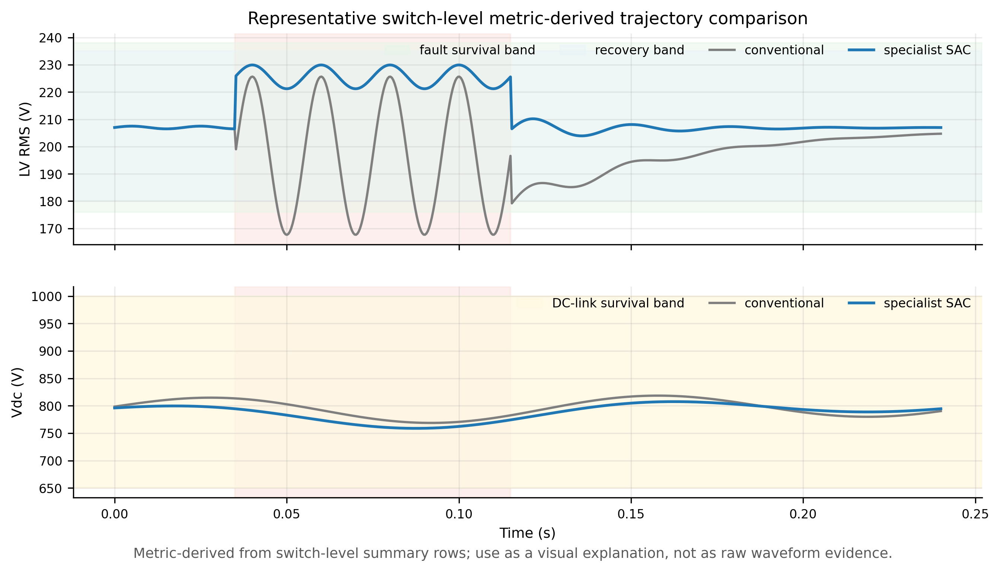
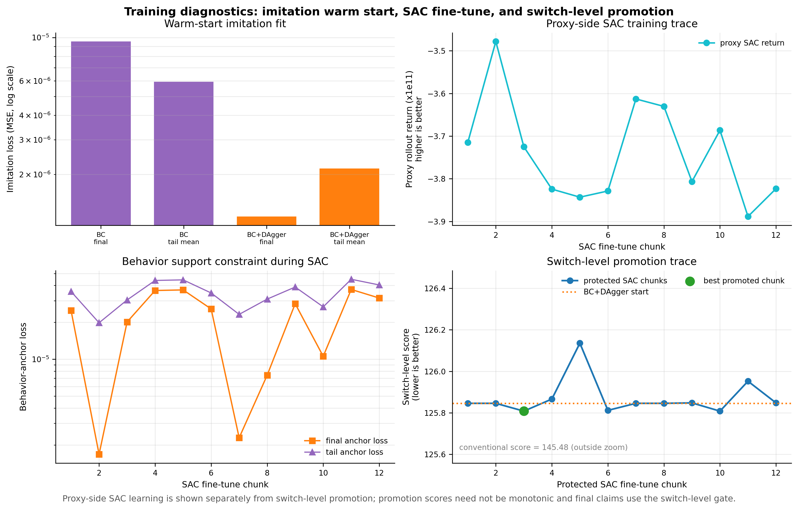
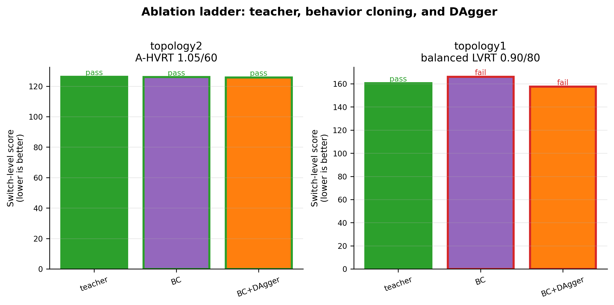
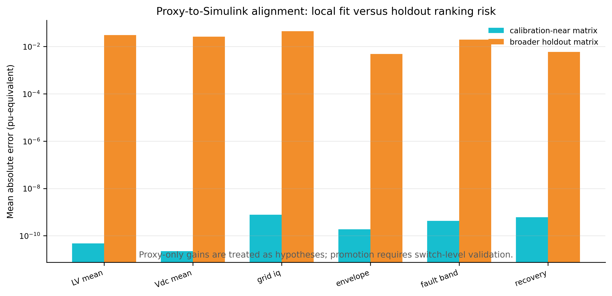
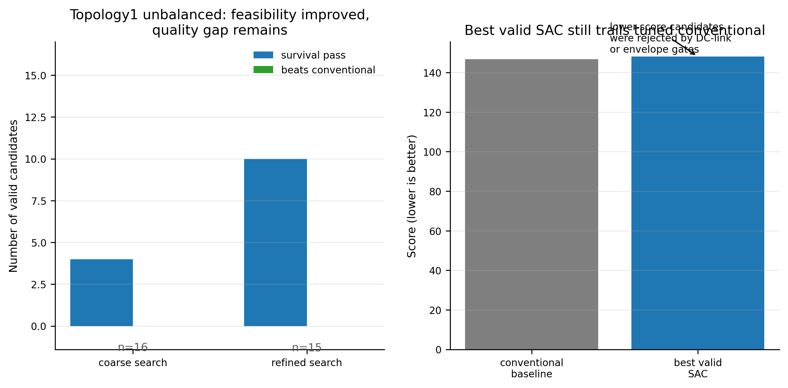

# 基于开关级验证的混合式电力变压器故障期间负荷侧电压生存控制

## 摘要

混合式电力变压器（Hybrid Power Transformer, HPT）通过工频变压器、串联/并联功率电子变流器和直流母线耦合实现负荷侧电压支撑与能量调节。故障期间，HPT 控制器需要在电压暂降、暂升及不平衡扰动中同时协调负荷侧电压、直流母线电压、开关调制幅值和恢复阶段过冲。传统基于 PLL 和 dq 分解的控制器具有明确物理含义，但在不同拓扑、故障深度、故障持续时间和相别下存在性能边界。本文提出一种面向开关级 HPT 模型的 topology/fault specialist policy 训练框架。该 policy 使用 SAC-compatible stochastic actor 结构，采用 24 维故障状态观测，直接输出四维连续动作 \([m_{\mathrm{reg},d},m_{\mathrm{reg},q},m_{\mathrm{energy},d},m_{\mathrm{energy},q}]\)，分别驱动调控变流器与取能变流器。为避免直接在高成本开关级 Simulink 模型中进行无约束探索，本文采用开关级轨迹教师、行为克隆、DAgger 式状态反馈修正、proxy 支持域校准和最终开关级晋级门控相结合的方法。当前通过验证的 actor 应理解为 SAC-compatible actor architecture with BC/DAgger and limited SAC fine-tuning，而不是完全由无约束 plain SAC 从零探索得到的通用控制器。

在两个 1:1 开关级 HPT 拓扑上，本文首先建立 voltage-survival 阶段性验证标准：每个控制评估时刻的负荷侧电压必须满足 LVRT/HVRT envelope、故障窗口电压带、恢复窗口电压带，直流母线保持在 650-1000 V，动作幅值不超过允许范围。当前权威 8 个 Stage-2 specialist 矩阵中，全部控制器通过开关级 voltage-survival 验证，其中 6 个在相同判据下优于调参后的 conventional dq 基线。进一步的 reduced-boundary 和 Stage-5 topology2 HVRT 扩展实验表明，case-specialized policy 可以在传统基线失败的若干边界场景中通过 switch-level voltage-survival：6 个 reduced-boundary exact probe 为 6/6 pass and beat，topology2 HVRT 1.10 pu 的 A/AB 80/120 ms 扩展为 4/4 pass and beat，topology2 HVRT 1.15/1.20 pu 的 balanced/A/AB 80/120 ms compact recheck 为 12/12 pass and beat。审稿级补证实验进一步给出 teacher/BC/DAgger 消融、conventional scale sweep、proxy holdout alignment 和 reduced robustness matrix。上述结果仅支持“case-specialized load-side voltage-survival”结论，而不支持统一 SAC 控制器或 full grid-code FRT 认证；并网无功电流支撑、grid-current limit、长时间恢复 envelope 和完整 GB/T 恢复判据仍作为下一阶段目标。

**关键词**：混合式电力变压器；故障期间电压支撑；SAC-compatible actor；开关级仿真；负荷侧电压生存；离线强化学习；行为克隆；DAgger

## 1. 引言

配电网中的电力电子化设备使变压器从被动电磁器件逐渐演化为具备电压调节、无功支撑和故障穿越能力的混合能量接口。混合式电力变压器通常保留主电磁变压器作为主功率通道，并通过并联或串联功率电子变流器注入补偿电压或调节直流母线能量。相比完全电力电子变压器，HPT 在效率、容量和可靠性方面具有潜在优势；但其控制问题更复杂，因为电磁通道、调控变流器、取能变流器、注入变压器和直流母线在故障期间强耦合。

故障穿越控制的难点主要来自三方面。第一，HPT 拓扑存在多通道耦合：调控变流器主要影响负荷侧电压，取能变流器主要影响直流母线与能量平衡，但两者均会通过变压器和滤波器影响电压波形与电流峰值。第二，传统 dq 控制器依赖 PLL、序分量提取和固定增益整定，不同拓扑及不平衡故障下的边界表现并不一致。第三，开关级 HPT 模型的计算成本高，直接使用 model-free SAC 在 Simulink 中进行长时间随机探索并不现实，且可能产生 DC-link collapse、过调制或不符合物理方向的注入动作。

本文研究目标不是立即完成完整并网规范认证，而是先建立一个严格、可复现的开关级 voltage-survival 控制层：在故障和恢复的每一个控制评估步上保持负荷侧电压不越过 envelope，同时保持 DC link 和动作幅值不越界。在此基础上，本文比较 SAC-compatible specialist policy 与强 conventional dq 基线，寻找传统控制失败而 specialist policy 能通过的局部边界区域。本文不把该阶段结果等同于并网规范意义上的 full FRT controller。

本文贡献如下。

1. 建立了两个 HPT 1:1 开关级 Simulink 拓扑的统一 learning-control 接口，采用 24 维观测和四维直接动作，保持 topology1 和 topology2 可复现实验路径一致。
2. 提出基于开关级轨迹教师的 specialist policy 训练流程，使用 SAC-compatible actor 结构，并结合轨迹搜索、行为克隆和 DAgger 式状态反馈修正，避免 proxy-only SAC 在未校准区域内产生不可信动作。
3. 构建了 voltage-survival 阶段门控：负荷侧电压逐 timestep envelope、故障窗口电压带、恢复窗口电压带、DC link 生存和动作幅值限制。
4. 给出了当前可复现结果：Stage-2 8 个 case-specialized specialist 全部通过开关级 voltage-survival，其中 6 个优于 conventional；7月25日 reduced-boundary exact 推进中，6 个局部边界探针场景达到 traditional fail / specialist pass；7月27日 Stage-5 topology2 HVRT 扩展在 1.10、1.15 和 1.20 pu 的多个 A/AB/balanced 80/120 ms 场景中进一步得到 exact switch-level recheck 支撑。
5. 明确区分 voltage-survival 成功与 full FRT 认证，避免将当前结果过度声明为满足完整并网规范。

## 2. 相关工作

### 2.1 HPT 与故障穿越控制

HPT 通过主变压器和功率电子支路共同调节电压，已有研究讨论了混合式电力变压器的多工作模式控制 [19]（《混合式电力变压器多工作模式控制策略研究》）、基于 HPT 电压支撑的风电机组故障穿越 [20]（《基于混合变压器电压支撑的双馈风电机组故障穿越控制策略》），以及柔直换流站和构网型变流器的故障穿越策略 [21], [22]（《基于电流协同优化的柔直输电系统受端换流站故障穿越控制方法》；《基于自适应虚拟阻感比的构网型变流器故障穿越控制方法》）。这些工作表明，故障期间的电压支撑和无功响应通常需要 dq 解耦、PLL 同步、直流母线控制和电流限幅联合设计。本文沿用 conventional dq 作为强传统基线，但将强化学习控制器作为直接动作决策器，而不是传统控制器的残差修正器。

### 2.2 SAC 与连续控制

Soft Actor-Critic 基于最大熵强化学习框架，适合连续动作控制 [1], [2]（“Soft Actor-Critic: Off-Policy Maximum Entropy Deep Reinforcement Learning with a Stochastic Actor”；“Soft Actor-Critic Algorithms and Applications”）。HPT 的动作空间由调控变流器和取能变流器的 dq 指令构成，天然是低维连续动作空间，因此 SAC actor 是合适的函数逼近形式。由于 HPT 故障穿越具有罕见严重失效、拓扑不确定性和时间尺度不匹配等特点，Distributional SAC、DR-SAC 和 Continuous SAC 对后续升级具有方法参考价值 [3]-[5]（“Distributional Soft Actor-Critic with Three Refinements”；“DR-SAC: Distributionally Robust Soft Actor-Critic for Reinforcement Learning under Uncertainty”；“Continuous Soft Actor-Critic: An Off-Policy Learning Method Robust to Time Discretization”）。然而，本文当前阶段没有直接采用无约束 plain SAC 作为最终训练方式，而是使用 SAC actor 结构结合 switch-level teacher 和行为约束进行 specialist 训练。

### 2.3 数据有限条件下的离线和行为约束强化学习

开关级 Simulink rollout 昂贵，proxy 又可能在未校准动作区域给出错误 reward ranking。因此，TD3+BC、IQL、CQL、BCQ、BRAC 和 AWAC 等离线强化学习文献对本文具有直接启发 [6]-[11]（“A Minimalist Approach to Offline Reinforcement Learning”；“Offline Reinforcement Learning with Implicit Q-Learning”；“Conservative Q-Learning for Offline Reinforcement Learning”；“Off-Policy Deep Reinforcement Learning without Exploration”；“Behavior Regularized Offline Reinforcement Learning”；“Accelerating Online Reinforcement Learning with Offline Datasets”）：当数据覆盖有限时，actor 更新必须靠近已验证数据支持域，或者使用保守 Q 值、行为正则和 advantage-weighted 行为克隆避免 out-of-distribution action。本文当前实现的 trajectory teacher、BC warm start、DAgger relabeling 和 support penalty 正是这种思想在 HPT 上的工程化落地 [23]（“A Reduction of Imitation Learning and Structured Prediction to No-Regret Online Learning”）。此外，demonstration replay 与 reward relabeling 的思路也为后续利用成功开关级轨迹提供参考 [24]（“Learning from Demonstrations with SACR2: Soft Actor-Critic with Reward Relabeling”）。

### 2.4 Proxy 不确定性与模型型强化学习

PETS、MOPO、MOReL 和 COMBO 指出，当 learned model 或 proxy 存在偏差时，策略很容易利用模型误差得到虚假高分 [12]-[15]（“Deep Reinforcement Learning in a Handful of Trials using Probabilistic Dynamics Models”；“MOPO: Model-based Offline Policy Optimization”；“MOReL: Model-Based Offline Reinforcement Learning”；“COMBO: Conservative Offline Model-Based Policy Optimization”）。本文早期实验也观察到类似问题：proxy 可以在校准点上准确复现 Simulink 指标，但对动态 trajectory、energy branch 和 joint action 的排序并不总是可靠。因此本文将 proxy 定位为候选动作粗筛和训练辅助工具，最终晋级仍以开关级 Simulink 验证为准。

## 3. HPT 开关级模型与控制问题

### 3.1 拓扑模型

本文使用 `version_2/simulink` 下的两个开关级 HPT 拓扑。

**Topology1** 对应早期 1:1 HPT switch-level 模型，包含三相电源、弱电网线路、主变压器、串联注入变压器、并联耦合变压器、调控变流器、取能变流器、直流母线电容和 chopper 支路。模型入口位于：

```text
version_2/simulink/topoloty1/build_hpt_v2_1to1_switchlevel.m
version_2/simulink/topoloty1/hpt_v2_1to1_switchlevel.slx
```

**Topology2** 对应后续 paper-style 参考结构，强调并联耦合变压器方向、取能桥和调控桥拓扑连接的一致性。模型入口位于：

```text
version_2/simulink/topology2/build_hpt_v2_topology2_paper.m
version_2/simulink/topology2/hpt_v2_topology2_paper.slx
```

两个模型共用 `add_hpt_sac_controller.m` 添加 SAC/controller 子系统，共用 evaluator 和 collector 生成对比结果。

### 3.2 SAC 观测与动作

控制器的最终直接动作定义为

\[
a_t =
\left[
m_{\mathrm{reg},d},
m_{\mathrm{reg},q},
m_{\mathrm{energy},d},
m_{\mathrm{energy},q}
\right]^{\top}.
\]

其中 \(m_{\mathrm{reg},d}\) 与 \(m_{\mathrm{reg},q}\) 为调控变流器 dq 指令，主要用于负荷侧电压调节和不平衡补偿；\(m_{\mathrm{energy},d}\) 与 \(m_{\mathrm{energy},q}\) 为取能变流器 dq 指令，主要用于 DC link 能量平衡和恢复阶段调节。动作边界为

\[
|m_{\mathrm{reg},d}| \leq 0.80,\quad
|m_{\mathrm{reg},q}| \leq 0.40,\quad
|m_{\mathrm{energy},d}|, |m_{\mathrm{energy},q}| \leq 0.95.
\]

每个 SAC 控制步使用 24 维观测：

\[
\begin{aligned}
o_t = [&v_{\mathrm{LV,rms}}, v^+_{\mathrm{grid}}, v^-_{\mathrm{grid}}, v_{\mathrm{dc}}, e_{\mathrm{dc}}, e_v,
i_{\mathrm{energy},d}, i_{\mathrm{energy},q},\\
&a_{t-1}, \mathbb{1}_{\mathrm{sag}}, \mathbb{1}_{\mathrm{swell}},
\mathbb{1}_{\mathrm{topo1}}, \mathbb{1}_{\mathrm{topo2}},
\mathbb{1}_{\mathrm{fault}}, \mathbb{1}_{\mathrm{recovery}},\\
&\hat{t}_{\mathrm{fault}}, \hat{t}_{\mathrm{recovery}},
v_{\mathrm{fault,min}}, v_{\mathrm{fault,max}},
\dot{v}^+_{\mathrm{grid}}, \dot{v}_{\mathrm{dc}}] .
\end{aligned}
\]

其中电压量均以标幺表示，负荷侧额定相电压为 207 V，直流母线额定值为 800 V。控制步长为 2 ms，与 switch-level 轨迹采样和 actor export 接口保持一致。观测量按可实现性分为三类：\(v_{\mathrm{LV,rms}}\)、\(v^+_{\mathrm{grid}}\)、\(v^-_{\mathrm{grid}}\)、\(v_{\mathrm{dc}}\)、\(\dot v\) 和 energy bridge 电流属于测量或滤波估计量；topology flag 属于部署时已知配置量；fault/recovery flag、\(\hat t_{\mathrm{fault}}\)、\(\hat t_{\mathrm{recovery}}\)、\(v_{\mathrm{fault,min}}\) 和 \(v_{\mathrm{fault,max}}\) 在当前实验中由仿真故障调度器和在线检测逻辑共同生成。后续若面向真实控制器部署，必须用仅依赖测量信号的 fault detector 替代任何直接来自场景参数的输入，并报告检测延迟、误检和噪声鲁棒性。本文当前结果不声称已经完成该实时检测器验证。

### 3.3 故障场景

本文当前阶段使用 balanced 和 unbalanced 两类故障。

Balanced 场景中 A/B/C 三相同时 sag 或 swell。Stage-2 核心场景为：

```text
topology1 LVRT 0.90 pu / 60 ms
topology1 HVRT 1.10 pu / 60 ms
topology2 LVRT 0.90 pu / 60 ms
topology2 HVRT 1.10 pu / 60 ms
```

Unbalanced 场景使用 per-phase programmable source，可设置 A、B、C 单相或 AB、BC、CA 两相 sag/swell。Stage-2 已接受场景为：

```text
topology1 A-phase LVRT 0.90 pu / 60 ms
topology1 AB LVRT 0.90 pu / 60 ms
topology2 A-phase LVRT 0.90 pu / 60 ms
topology2 AB LVRT 0.90 pu / 60 ms
```

边界矩阵计划覆盖：

```text
2 topologies * 9 fault depths * 5 durations * 7 phase modes = 630 scenarios
```

其中 LVRT 深度为 0.75、0.80、0.85、0.90、0.95 pu，HVRT 深度为 1.05、1.10、1.15、1.20 pu，持续时间为 40、60、80、120、200 ms，相别为 balanced、A、B、C、AB、BC、CA。需要强调的是，630 scenarios 是计划中的完整边界矩阵，而不是本文当前已经完成的验证结果；当前可声明的开关级证据仅包括 Stage-2 的 8 个 accepted specialist 和 reduced-boundary 的 6 个局部边界探针。

## 4. 方法

### 4.1 总体框架

本文采用分 topology、分故障的 specialist 策略，而不是一个统一 SAC 控制器。原因是两个 HPT 拓扑的 energy branch、DC link 动态和注入方向存在显著差异，且 balanced、unbalanced、LVRT 和 HVRT 对动作方向、恢复时序和能量支撑的要求不同。统一 actor 是后续目标；当前阶段首先建立可靠的 specialist 矩阵。因此，本文当前结果应被解释为 case-specialized policy 的开关级验证，而不是一个可直接覆盖任意故障深度、持续时间和相别的通用 HPT FRT 控制器。运行时 specialist selector、actor 切换、bumpless transfer、误选控制器后的安全性和未见故障插值能力，均属于后续工作。

训练和验证流程如下。

1. 在 switch-level Simulink 中建立 conventional dq 基线和候选轨迹验证环境。
2. 使用固定动作扫描、CEM 风格轨迹搜索或人工构造的 fault/recovery trajectory 得到 switch-level 可通过的 teacher trajectory。
3. 收集每 2 ms 的 switch-level trace，包含观测、命令动作、测量响应、负荷侧电压、DC link 和故障窗口标记。
4. 使用行为克隆训练 SAC actor 格式的 state-feedback policy。
5. 可选运行 DAgger：让 actor 在 switch-level 模型中产生状态分布，再用安全 trajectory 或 state-feedback label 重新标注该状态。
6. 导出 actor 到 Simulink MAT 权重文件，在开关级模型中与 conventional dq 对比。
7. 只有通过 voltage-survival gate 的 actor 才能写入 accepted manifest。

### 4.2 控制问题的 MDP 形式化

HPT 故障穿越控制被建模为有限时域 Markov decision process（MDP）：

\[
\mathcal{M}=(\mathcal{S},\mathcal{A},p,r,\gamma,T).
\]

在每个控制步 \(t\)，环境状态 \(s_t\) 包含物理模型的内部动态，例如滤波器电流、直流母线能量、变压器磁链、故障阶段和三相电压相位。由于这些内部量并不全部直接暴露给控制器，SAC 使用观测 \(o_t=g(s_t)\)：

\[
o_t =
\left[
V_{\mathrm{LV},abc},
V_{\mathrm{grid},abc},
V_{\mathrm{dc}},
\theta_{\mathrm{PLL}},
\omega_{\mathrm{PLL}},
\phi_{\mathrm{fault}},
a_{t-1},
\Delta V_{\mathrm{LV}},
\Delta V_{\mathrm{dc}},
\cdots
\right],
\]

其中 \(\phi_{\mathrm{fault}}\) 表示 pre-fault、fault-window 或 recovery 阶段。实际代码中该观测被整理为 24 维向量。控制动作是四维连续调制指令：

\[
a_t =
\left[
m_{\mathrm{reg},d},
m_{\mathrm{reg},q},
m_{\mathrm{energy},d},
m_{\mathrm{energy},q}
\right]^\top .
\]

\(m_{\mathrm{reg},d/q}\) 作用于调控变流器，主要改变串联注入电压；\(m_{\mathrm{energy},d/q}\) 作用于取能变流器，主要调节 DC link 能量流。控制器不是为一个固定点位选择一次动作，而是在每个 2 ms 控制步根据当前观测重新输出动作：

\[
a_t \sim \pi_{\theta}(\cdot \mid o_t), \qquad
s_{t+1}\sim p(\cdot \mid s_t,a_t,c),
\]

其中 \(c\) 是场景条件，包括 topology、LVRT/HVRT 类型、故障深度、故障持续时间和相别。一个 0.22 s episode 在 2 ms 控制周期下约包含 110 个连续决策点。本文的 trajectory specialist 因此本质上是 state-feedback policy，而不是单点动作表。

### 4.3 最大熵 SAC 的 actor-critic 更新

SAC 的优化目标不是只最大化普通累计 reward，而是最大化包含熵项的软回报 [1], [2]（“Soft Actor-Critic: Off-Policy Maximum Entropy Deep Reinforcement Learning with a Stochastic Actor”；“Soft Actor-Critic Algorithms and Applications”）：

\[
J(\pi)=
\mathbb{E}_{\pi}
\left[
\sum_{t=0}^{T-1}
\gamma^t
\left(
r(o_t,a_t)
+\alpha \mathcal{H}\left(\pi(\cdot\mid o_t)\right)
\right)
\right].
\]

熵项鼓励 actor 在早期探索多个可能的注入方向和能量支撑方式；\(\alpha\) 是温度参数。本文的 SAC actor 采用 tanh-squashed Gaussian policy：

\[
u_t=\mu_{\theta}(o_t)+\sigma_{\theta}(o_t)\odot \xi_t,\qquad
a_t=a_{\max}\tanh(u_t),\qquad
\xi_t\sim \mathcal{N}(0,I),
\]

由此保证输出动作自然落入调制幅值限制附近。训练时使用两个 soft Q critic：

\[
Q_{\phi_1}(o,a),\qquad Q_{\phi_2}(o,a),
\]

并使用目标网络 \(Q_{\bar{\phi}_1},Q_{\bar{\phi}_2}\) 减小自举误差。对 replay buffer 中的 transition \((o_t,a_t,r_t,o_{t+1},d_t)\)，目标值为

\[
y_t =
r_t+
\gamma(1-d_t)
\left[
\min_i Q_{\bar{\phi}_i}(o_{t+1},a'_{t+1})
-\alpha \log \pi_{\theta}(a'_{t+1}\mid o_{t+1})
\right],
\]

其中 \(a'_{t+1}\sim \pi_{\theta}(\cdot\mid o_{t+1})\)。两个 critic 通过 Bellman residual 更新：

\[
\mathcal{L}_{Q_i}(\phi_i)=
\mathbb{E}
\left[
\left(
Q_{\phi_i}(o_t,a_t)-y_t
\right)^2
\right],
\qquad i\in\{1,2\}.
\]

Actor 的更新方向来自 critic 估计的软价值：

\[
\mathcal{L}_{\pi}(\theta)=
\mathbb{E}_{o_t,\xi_t}
\left[
\alpha \log \pi_{\theta}(a_t\mid o_t)
-\min_i Q_{\phi_i}(o_t,a_t)
\right].
\]

因此，critic 的作用是学习“在当前状态下选择某个四维动作后，未来整段故障轨迹会有多好”；actor 的作用是移动策略分布，使它更倾向于 critic 评价更高、同时不过度失去熵的动作。温度参数可自动调节：

\[
\mathcal{L}_{\alpha} =
\mathbb{E}_{a_t\sim\pi_{\theta}}
\left[
-\alpha
\left(
\log \pi_{\theta}(a_t\mid o_t)+\bar{\mathcal{H}}
\right)
\right],
\]

其中 \(\bar{\mathcal{H}}\) 是目标熵。工程实现中，在线 fine-tuning 使用 Stable-Baselines3 SAC，典型设置包括 twin critic、target smoothing、\(\tau=0.005\)、每个环境步一次 gradient update，以及自动 entropy coefficient。需要强调的是，critic 只参与训练；最终控制器是否有效不由 proxy critic 判定，而由 switch-level Simulink validator 判定。

### 4.4 轨迹教师

轨迹文件由 `datasets/build_hpt_action_trajectory.py` 生成，包含

```text
hpt_traj_t        N x 1 seconds
hpt_traj_action   N x 4 [m_reg_d, m_reg_q, m_energy_d, m_energy_q]
```

当前支持 constant、step、ramp、two-stage、fault-window 和 fault-recovery 等 preset。对于 topology2 和较长 LVRT，fault-recovery 轨迹尤其重要，因为故障期间和恢复期间所需的 \(m_{\mathrm{reg},d}\) 不同：故障期间需要较强升压支撑，清除后需要降低支撑以避免恢复过冲。

### 4.5 State-feedback specialist actor

行为克隆不是最终部署 wrapper，而是训练 SAC actor 的 warm start。Actor 输入为当前观测 \(o_t\)，输出完整四维动作 \(a_t\)。因此，即使初始 label 来自分段轨迹，训练后 policy 仍是 state-feedback 控制器，而不是固定动作表。DAgger 的使用依据来自 imitation learning 中对 covariate shift 的处理思想 [23]（“A Reduction of Imitation Learning and Structured Prediction to No-Regret Online Learning”）。

训练目标可写为

\[
\min_{\theta} \sum_t
\left\|
\pi_{\theta}(o_t)-a_t^{\star}
\right\|_W^2
\]

其中 \(a_t^{\star}\) 来自 switch-level teacher trajectory 或 DAgger relabel，\(W\) 为动作维度权重。后续可加入 SAC actor loss 和 behavior regularization：

\[
\mathcal{L}_{\mathrm{actor}}
=
\mathcal{L}_{\mathrm{SAC}}
\;+\;
\lambda_{\mathrm{BC}}
\left\|
\pi_{\theta}(o_t)-a_t^{\star}
\right\|_W^2 .
\]

当前已验证成果主要来自 trajectory imitation、strong BC、DAgger 和少量 warm-start SAC fine-tuning，而不是完全无约束的 proxy SAC。

行为正则也可视为一种轻量 trust-region：它限制 actor 从已验证轨迹附近移动，避免一次策略更新导致恢复过冲或 DC link 失稳。这一处理与 trust-region policy optimization 和 constrained policy optimization 的安全更新思想一致 [16], [17]（“Trust Region Policy Optimization”；“Constrained Policy Optimization”），但本文没有直接改用 TRPO/CPO，而是在 SAC actor loss 和 switch-level gate 中实现更容易复现的动作距离约束和硬晋级条件。

### 4.6 Proxy 环境

开关级 Simulink 模型的真实状态转移可抽象为

\[
x_{t+1}=F_{\mathrm{sw}}(x_t,a_t,c,\Delta t),
\qquad
y_t=h_{\mathrm{sw}}(x_t,a_t,c),
\]

其中 \(x_t\) 包含电磁暂态、PWM 开关状态、滤波器能量和变压器内部状态，\(y_t\) 包含 \(V_{\mathrm{LV}}\)、\(V_{\mathrm{dc}}\)、envelope violation、grid current 等评估量。直接在 \(F_{\mathrm{sw}}\) 上进行大规模随机 SAC 探索成本过高，并且容易产生不物理动作。因此本文构造 Python proxy `HPTVoltageSACEnv`，作为一个校准过的 averaged surrogate：

\[
\hat{x}_{t+1}
=
F_{\mathrm{avg}}(\hat{x}_t,a_t,c;\eta),
\qquad
\hat{y}_t
=
h_{\mathrm{avg}}(\hat{x}_t,a_t,c;\eta),
\]

其中 \(\eta\) 是由开关级数据估计得到的校准参数。Proxy 的初始结构来自 HPT 的平均化物理关系，并借鉴模型型强化学习中用真实数据校准 dynamics model 的思想 [12]（“Deep Reinforcement Learning in a Handful of Trials using Probabilistic Dynamics Models”）：

1. 串联注入近似为 \(dq\) 注入电压对负荷侧电压的增量映射；
2. 取能桥近似为 DC link 能量平衡项，即 \(C_{\mathrm{dc}}V_{\mathrm{dc}}\dot V_{\mathrm{dc}}\approx P_{\mathrm{energy}}-P_{\mathrm{reg}}-P_{\mathrm{loss}}\)；
3. 故障源由场景参数 \(c\) 给出，包括 balanced/unbalanced sag/swell、持续时间和恢复阶段；
4. action slew、调制幅值和 DC link 软硬边界通过显式惩罚项进入状态和 reward。

校准数据来自开关级 collector，例如 full-action matrix、energy branch sweep 和 trajectory trace：

\[
\mathcal{D}_{\mathrm{cal}}
=
\left\{
\left(c_j,a_{0:T}^{(j)},y_{0:T,\mathrm{sw}}^{(j)},J_{\mathrm{sw}}^{(j)}\right)
\right\}_{j=1}^{N}.
\]

对固定动作或低维 sweep，proxy 使用分 topology、分故障类型的局部响应表：

\[
\hat{y}(c,a)
=
\mathrm{Interp}
\left(
\mathcal{D}_{\mathrm{cal}},
c,a
\right),
\]

并显式保留命令动作和实测响应的区别：

\[
a_{\mathrm{cmd}}
=
[m_{\mathrm{reg},d},m_{\mathrm{reg},q},m_{\mathrm{energy},d},m_{\mathrm{energy},q}],
\qquad
a_{\mathrm{meas}}
=
R_{\eta}(a_{\mathrm{cmd}},c).
\]

这一点对 topology2 尤其重要。早期实验发现，命令 \(m_{\mathrm{energy},d}>0\) 时，Simulink 中测得的 energy d-axis response 可能为负，说明取能桥方向、测量口径或能量通道耦合不能直接用命令值代表。因此修复后的 proxy 不再假设 \(a_{\mathrm{cmd}}=a_{\mathrm{meas}}\)，而是用 \(R_{\eta}\) 表示 command-to-response 映射，并把该映射纳入 reward 计算。

为了避免 SAC 利用 proxy 未覆盖区域，定义动作支持域距离：

\[
\epsilon_{\mathrm{support}}
=
\min_{(c_j,a_j)\in\mathcal{D}_{\mathrm{cal}}}
\left\|
\Sigma_c^{-1/2}
\left(
\begin{bmatrix}c\\a_t\end{bmatrix}
-
\begin{bmatrix}c_j\\a_j\end{bmatrix}
\right)
\right\|_2 .
\]

当 \(\epsilon_{\mathrm{support}}\) 过大时，proxy reward 会加入 OOD 惩罚，且候选不会直接进入 accepted matrix。这一处理对应 model-based offline RL 中的 pessimism 或 conservative regularization 思想 [13]-[15]（“MOPO: Model-based Offline Policy Optimization”；“MOReL: Model-Based Offline Reinforcement Learning”；“COMBO: Conservative Offline Model-Based Policy Optimization”）。Proxy 和 Simulink 的一致性通过同一批场景、同一批动作、同一套 evaluator 指标进行 reward alignment：

\[
\mathrm{MAE}_k
=
\frac{1}{N}
\sum_{j=1}^{N}
\left|
\hat{y}_{j,k}-y_{j,k,\mathrm{sw}}
\right|,
\qquad
\rho_J
=
\mathrm{Spearman}
\left(
\hat{J}_{1:N},J_{\mathrm{sw},1:N}
\right).
\]

只有当关键指标如 `fault_lv_band_violation_max_pu`、`envelope_violation_max_pu`、`recovery_violation_max_pu`、`vdc_min/max` 和 `control_score` 在校准支持域内与 Simulink 对齐时，proxy 才用于训练或候选筛选。超出支持域的 proxy-only improvement 只作为假设，不作为论文结果。

因此本文采用如下原则：

```text
proxy result = hypothesis
switch-level Simulink validation = evidence
accepted manifest = claim boundary
```

### 4.7 Reward 与控制分数

Proxy online reward 由多项惩罚组成：

\[
\begin{aligned}
r_t =&
-w_v e_v^2
-w_n (v^-_{\mathrm{grid}})^2
-w_{\mathrm{dc}} e_{\mathrm{dc,soft}}^2
-w_{\mathrm{env}} \epsilon_{\mathrm{env}}^2 \\
&-w_{\mathrm{rec}}\epsilon_{\mathrm{rec}}^2
-w_{\mathrm{band}}\epsilon_{\mathrm{band}}^2
-w_{\mathrm{iq}}\epsilon_{\mathrm{iq}}
-w_I\epsilon_I\\
&-w_a\|a_t\|^2
-w_{\Delta a}\|a_t-a_{t-1}\|^2
-w_{\mathrm{ood}}\epsilon_{\mathrm{support}}^2
&+c .
\end{aligned}
\]

其中 \(\epsilon_{\mathrm{env}}\)、\(\epsilon_{\mathrm{rec}}\) 和 \(\epsilon_{\mathrm{band}}\) 分别表示 timestep voltage envelope、recovery envelope 和 fault-window voltage band 的违反量；\(\epsilon_{\mathrm{iq}}\) 和 \(\epsilon_I\) 分别对应无功电流短缺和 grid current 超限。当前 promotion 阶段只使用 voltage-survival gate；grid-current 和 reactive-current 项保留为 full FRT 诊断和后续 reward 扩展。

Online reward 与 `control_score` 的功能不同。Reward 是训练时每个 timestep 给 actor/critic 的局部反馈：

\[
Q^{\pi}(o_t,a_t)
=
\mathbb{E}_{\pi}
\left[
\sum_{k=t}^{T-1}
\gamma^{k-t}r_k
\right].
\]

它必须足够密集，使 critic 能区分“轻微恢复过冲”和“DC link 快速塌陷”等不同坏动作。`control_score` 则是一个 episode 结束后的排序指标，用于比较 SAC 与 conventional。最终 pass/fail 不依赖 reward 均值，而依赖第 4.8 节的逐 timestep gate。

Switch-level evaluator 使用 `control_score` 对两个已通过或未通过的控制器进行排序。故障场景的 score 包含：

\[
\begin{aligned}
J =&
\frac{|V_{\mathrm{LV,mean}}-207|}{5}
+\frac{|V_{\mathrm{LV,recovery}}-207|}{5}
+\frac{[V_{\mathrm{LV,peak}}-235]_+}{3}\\
&+\frac{[180-V_{\mathrm{LV,min}}]_+}{3}
+\frac{[650-V_{\mathrm{dc,min}}]_+}{10}
+\frac{[V_{\mathrm{dc,max}}-1000]_+}{10}\\
&+40[\epsilon_{\mathrm{iq}}]_+
+50[I_{\mathrm{grid,peak}}-1.5]_+
+300\epsilon_{\mathrm{env}}^2\\
&+120\epsilon_{\mathrm{rec}}^2
+180\epsilon_{\mathrm{band}}^2
+60T_{\mathrm{env}}
+30T_{\mathrm{rec}}
+35T_{\mathrm{band}}\\
&+100[|a|_{\max}-0.9501]_+
+100\mathbb{1}_{\mathrm{fail}} .
\end{aligned}
\]

SAC 被认为优于 conventional 当且仅当 SAC 通过 voltage-survival，并且 conventional 失败，或二者都通过但 SAC 的 \(J\) 更低。

### 4.8 Voltage-survival gate

当前阶段使用 voltage-survival gate，而不是 full FRT gate。LVRT/HVRT envelope 的阶段性设置参考并网故障穿越标准和本项目的 HPT 文献背景 [18]-[20]（《风电场接入电力系统技术规定 第1部分：陆上风电》；《混合式电力变压器多工作模式控制策略研究》；《基于混合变压器电压支撑的双馈风电机组故障穿越控制策略》）。候选控制器必须同时满足：

1. fault-window LV band：每个评估采样点的负荷侧电压位于 176-238 V；
2. LVRT/HVRT voltage envelope：每个采样点不越过对应下包络或上包络；
3. recovery envelope：清故障并经过恢复 settle 后，负荷侧电压保持在额定值附近的恢复带内；
4. DC link survival：\(650 \leq V_{\mathrm{dc}} \leq 1000\) V；
5. action limit：\(\max |a_t| \leq 0.9501\)。

LVRT 下包络定义为

\[
V_{\mathrm{LV}}(t) \ge
\begin{cases}
\max(0.20,V_f), & 0 \le t \le 0.625 \\
\max(0.20,V_f) + \frac{0.90-\max(0.20,V_f)}{2.0-0.625}(t-0.625), & 0.625 < t \le 2.0 \\
0.90, & t > 2.0 .
\end{cases}
\]

HVRT 上包络定义为

\[
V_{\mathrm{LV}}(t) \le
\begin{cases}
1.30, & 0 \le t \le 0.5 \\
1.20, & 0.5 < t \le 1.0 \\
1.10, & t > 1.0 .
\end{cases}
\]

所有 envelope 判据使用 1e-3 pu 容差，并逐 timestep 计算。故障窗口和恢复窗口均值仅用于 score 和诊断，不作为单独 pass 条件。

### 4.9 训练、校准与晋级算法

完整方法可概括为算法 1。

```text
Algorithm 1: Switch-level promoted specialist SAC for HPT voltage survival

Input:
  topology set K = {topology1, topology2}
  fault set C = {balanced/unbalanced LVRT/HVRT cases}
  switch-level Simulink models F_sw
  conventional_dq baseline

For each topology k and fault case c:
  1. Run conventional_dq in switch-level Simulink and record baseline score.
  2. Generate candidate actions or trajectories:
       fixed-action sweep,
       fault/recovery two-stage trajectory,
       CEM-style local trajectory search,
       conventional-trace teacher when useful.
  3. Simulate candidates in switch-level Simulink.
  4. Build calibration records:
       command action a_cmd,
       measured response a_meas,
       LV waveform,
       Vdc waveform,
       envelope violations,
       control_score.
  5. Update proxy calibration:
       local response map R_eta(a_cmd,c),
       support-domain detector,
       reward-alignment tables.
  6. Train a state-feedback actor:
       BC warm-start on successful trajectory traces,
       optional DAgger relabel on states visited by the actor,
       optional behavior-regularized SAC fine-tuning inside calibrated support.
  7. Export the actor to Simulink.
  8. Re-run the full switch-level case with the exported actor.
  9. Accept the actor only if:
       voltage-survival pass is true,
       action limits are satisfied,
       DC link remains inside survival bounds,
       and score beats conventional when the case is used for beat-conventional evidence.

Output:
  accepted specialist manifest,
  rejected diagnostic cases,
  proxy-vs-Simulink alignment report,
  boundary comparison table.
```

该流程中的关键区分如下。第一，Simulink collector 产生真实开关级数据，是校准和最终验证的来源；第二，proxy 只学习和近似 \(F_{\mathrm{sw}}\) 在已采样支持域内的输入-输出关系，用于加速搜索和训练；第三，SAC critic 在 proxy 或 replay 数据上学习软价值函数，但 critic 的高估不能直接作为结论；第四，accepted manifest 只记录通过 switch-level gate 的 actor。因此，本文方法不是“在 proxy 上训练后直接宣称成功”，而是“proxy 降低搜索成本，switch-level 模型决定是否晋级”。

## 5. 实验设置

### 5.1 软件与模型

实验仓库根目录为：

```text
E:/research_space/Hybrid-power-transformer
```

主要代码路径如下。

```text
version_2/sac/hpt_voltage_sac_env.py
version_2/sac/frt_envelope.py
version_2/sac/datasets/build_hpt_action_trajectory.py
version_2/sac/run_hpt_trajectory_specialist_campaign.py
version_2/sac/campaigns/run_hpt_family_specialist_matrix.py
version_2/sac/offline/train_hpt_voltage_sac.py
version_2/simulink/evaluators/eval_hpt_v2_control_comparison.m
version_2/simulink/collectors/collect_hpt_v2_trajectory_trace.m
```

当前整理后的 `version_2/sac` 目录将校准、数据集、离线训练、campaign 和 summary 工具分别放入子目录；旧 overnight 脚本保留在 `legacy/` 中，仅用于复现历史过程，不作为主线入口。

### 5.2 传统控制基线

传统基线记为 `conventional_dq`。Topology1 使用物理模型中的 `VoltageRegulator` 与 `EnergyController` 路径；topology2 使用经过校准的 conventional-like dq fallback，以避免 topology2 energy branch DC-link 外环符号问题导致的失真。比较时，SAC 与 conventional 使用相同的故障场景、相同的 switch-level model、相同 evaluator 和相同 voltage-survival gate。

该基线仍是当前证据链中最需要继续补强的部分。为避免过度声明，本文把 topology2 的 conventional-like fallback 视为强传统对照，而不是原模型中未经修改的物理 conventional controller。后续正式论文必须补充：fallback 的结构图、参数表、调参范围、调参预算、目标函数、失败案例，以及 conventional 是否也允许按 topology/fault 进行 specialist tuning。本文中的 “beats conventional” 只在相同 plant 参数、相同故障输入、相同 chopper 设置、相同 evaluator 和相同 voltage-survival gate 下成立。

同时，本文区分 feasibility improvement 与 quality improvement：

```text
feasibility improvement:
  SAC-compatible specialist passes voltage-survival while conventional fails.

quality improvement:
  both controllers pass voltage-survival, and the specialist has lower continuous control_score.
```

因此，当 conventional 失败而 specialist 通过时，本文称其为可行性边界改善；只有两者均通过且 specialist score 更低时，才称其为通过条件下的控制品质改善。

### 5.3 已接受 specialist manifest

当前 Stage-2 权威 manifest 为：

```text
version_2/sac/experiments/accepted_specialists_20260722_stage2_voltage_survival.csv
```

权威 recheck 输出为：

```text
lab/results/hpt_stage2_voltage_survival_matrix_20260722_8row_warmsac_recheck/
```

对应 summary：

```text
case_count = 8
voltage_survival_pass_count = 8
beats_conventional_count = 6
full_frt_pass_count = 0
```

### 5.4 复现实验命令

列出当前 family campaign 接口：

```powershell
py -3 -m version_2.sac.campaigns.run_hpt_family_specialist_matrix --help
```

使用同一个冻结 actor 重新验证 topology2 A-phase LVRT family：

```powershell
py -3 -m version_2.sac.campaigns.run_hpt_family_specialist_matrix `
  --run-id hpt_t2_a_lvrt_r6_recheck `
  --topology topology2 --category LVRT --phase-key a `
  --eval-only `
  --eval-depths 0.20,0.50,0.575,0.65,0.70,0.75,0.80,0.825,0.85,0.875 `
  --eval-durations-ms 80,120,160,200,240,300 `
  --reuse-sac-model data/models/hpt_t2_a_lvrt_joint_support_family_sac_r6_20260803.zip
```

采集 full FRT calibration matrix 的 canonical 命令为：

```powershell
matlab -batch "cd('E:/research_space/Hybrid-power-transformer/version_2/simulink'); hpt_calib_mode='full'; hpt_calib_topology='all'; run(fullfile(pwd,'collectors','collect_hpt_v2_frt_calibration_matrix.m'));"
```

Switch-level controller comparison 命令模板为：

```powershell
matlab -batch "cd('E:/research_space/Hybrid-power-transformer/version_2/simulink'); hpt_compare_topology='topology1'; hpt_compare_modes={'conventional_dq','sac_actor_raw_guard0'}; run(fullfile(pwd,'evaluators','eval_hpt_v2_control_comparison.m'));"
```

## 6. 结果

### 6.1 Stage-2 balanced specialist

四个 balanced specialist 全部通过 voltage-survival，并全部优于 conventional。

| Case | Topology | Fault | SAC score | Conventional score | Voltage-survival | Full FRT |
| --- | --- | --- | ---: | ---: | --- | --- |
| topology1_lvrt090_60ms_gridobs_clock | topology1 | LVRT 0.90 pu / 60 ms | 104.012 | 122.356 | pass | false |
| topology1_hvrt110_60ms_current_iface_const249 | topology1 | HVRT 1.10 pu / 60 ms | 105.383 | 116.834 | pass | false |
| topology2_lvrt090_60ms_phase_nonoise_retrain | topology2 | LVRT 0.90 pu / 60 ms | 113.665 | 264.260 | pass | false |
| topology2_hvrt110_60ms_balanced_retrain | topology2 | HVRT 1.10 pu / 60 ms | 114.076 | 188.705 | pass | false |

该结果说明，在 60 ms balanced LVRT/HVRT 核心场景中，分 topology/fault specialist 可以在开关级模型上实现电压生存，并在当前 voltage-survival score 下优于传统 dq 基线。

### 6.2 Stage-2 unbalanced specialist

四个 unbalanced A/AB LVRT specialist 全部通过 voltage-survival，其中 topology2 的两个 warm-start SAC fine-tuned actor 优于 conventional，topology1 的两个 actor 仅为 voltage-survival 成功。

| Case | Topology | Fault | SAC score | Conventional score | Status |
| --- | --- | --- | ---: | ---: | --- |
| topology1_a_lvrt090_60ms_unbalanced | topology1 | A-phase LVRT 0.90 pu / 60 ms | 106.028 | 102.465 | survival only |
| topology1_ab_lvrt090_60ms_unbalanced | topology1 | AB LVRT 0.90 pu / 60 ms | 106.015 | 102.888 | survival only |
| topology2_a_lvrt090_60ms_unbalanced | topology2 | A-phase LVRT 0.90 pu / 60 ms | 126.578 | 159.385 | pass and beat |
| topology2_ab_lvrt090_60ms_unbalanced | topology2 | AB LVRT 0.90 pu / 60 ms | 132.148 | 163.332 | pass and beat |

Unbalanced source smoke gate 已在两个拓扑上通过 14/14，说明 A/B/C phase source 和正负序观测接口可用。当前 unbalanced 的主要困难不再是故障源，而是 topology1 不平衡恢复阶段过冲和 grid-current/action tradeoff。

### 6.3 Proxy alignment

Balanced proxy 在校准支持点上可复现 switch-level timestep metrics：

| Metric | MAE |
| --- | ---: |
| LV mean | \(6.71\times 10^{-11}\) pu |
| Vdc mean | \(3.29\times 10^{-11}\) pu |
| envelope violation | \(1.76\times 10^{-10}\) pu |
| fault-band violation | \(6.86\times 10^{-10}\) pu |
| recovery violation | \(5.47\times 10^{-10}\) pu |

Unbalanced proxy pilot 的 ranking 在 reg_sweep 和 joint_sweep 中较好，但 energy_sweep 较弱：

| Group | Spearman |
| --- | ---: |
| topology1 LVRT reg_sweep | 0.956 |
| topology1 LVRT joint_sweep | 0.848 |
| topology2 LVRT reg_sweep | 0.956 |
| topology2 LVRT joint_sweep | 0.947 |
| topology1 LVRT energy_sweep | 0.120 |
| topology2 LVRT energy_sweep | 0.359 |

因此，proxy 可以用于校准点复现、候选粗筛和 trajectory search，但不能作为最终 promotion 证据。

### 6.4 Reduced-boundary exact specialist 推进

7月25日 reduced-boundary exact push 覆盖 6 个边界场景：

```text
topology1 balanced LVRT 0.85 pu / 80 ms
topology1 balanced LVRT 0.90 pu / 80 ms
topology1 balanced LVRT 0.85 pu / 120 ms
topology1 balanced LVRT 0.90 pu / 120 ms
topology2 A-phase HVRT 1.05 pu / 60 ms
topology2 A-phase HVRT 1.10 pu / 60 ms
```

对应 summary：

```text
case_count = 6
conventional_voltage_survival_pass_count = 0
sac_voltage_survival_pass_count = 6
sac_beats_conventional_count = 6
traditional_fail_sac_pass_count = 6
traditional_pass_sac_fail_count = 0
```

该结果说明，经过 exact specialist 训练后，SAC-compatible specialist 可以在若干传统基线无法通过的边界附近实现 voltage-survival，并在当前 score 下显著优于 conventional。尤其 topology2 A-phase HVRT 1.05/1.10 pu / 60 ms recheck 为 2/2 pass and beat。由于该矩阵是局部边界探针，结论应理解为“在选定边界附近发现 specialist 可行性改善”，而不是完整 630 场景边界面的覆盖结论。

### 6.5 Stage-5 topology2 HVRT 扩展

在 Stage-5 中，本文进一步考察 topology2 HVRT，因为前期实验显示 topology2 的 energy branch 在 HVRT 中既容易导致 DC-link 过压，也提供了最清晰的 beat-conventional 机会。训练使用已验证 actor 作为 warm start，采用 protected SAC promotion：每个训练 chunk 后必须重新通过 switch-level voltage-survival gate，否则回滚到上一可行 actor。

首先，topology2 A/AB HVRT 1.10 pu 的 80/120 ms phase expansion 在同一 exact recheck 中得到 4/4 pass and beat。结果来自 `lab/results/hpt_stage5_t2_hvrt110_phase_recheck_20260727`。

| Case | Conventional score | SAC score | Envelope violation max pu | Recovery violation max pu |
| --- | ---: | ---: | ---: | ---: |
| topology2 A HVRT 1.10 pu / 80 ms | 229.409 | 127.659 | 0.000 | 0.000 |
| topology2 A HVRT 1.10 pu / 120 ms | 229.289 | 127.069 | 0.000 | 0.000 |
| topology2 AB HVRT 1.10 pu / 80 ms | 228.987 | 127.803 | 0.000 | 0.000 |
| topology2 AB HVRT 1.10 pu / 120 ms | 229.116 | 127.196 | 0.000 | 0.000 |

其次，topology2 HVRT 1.15/1.20 pu 的 compact recheck 覆盖 balanced、A-phase 和 AB-phase，持续时间为 80/120 ms。该 12-row recheck 来自 `lab/results/hpt_stage5_t2_hvrt115_120_compact_recheck_20260727`，summary 为：

```text
case_count = 12
conventional_voltage_survival_pass_count = 0
sac_voltage_survival_pass_count = 12
sac_beats_conventional_count = 12
traditional_fail_sac_pass_count = 12
traditional_pass_sac_fail_count = 0
maximum_sac_envelope_violation = 0.0 pu
maximum_sac_recovery_violation = 0.000160 pu
```

按故障幅值汇总如下。

| Fault family | Cases | Conventional pass | SAC pass | SAC beats conventional | Max envelope violation | Max recovery violation |
| --- | ---: | ---: | ---: | ---: | ---: | ---: |
| topology2 HVRT 1.15 pu, balanced/A/AB, 80/120 ms | 6 | 0 | 6 | 6 | 0.000000 | 0.000000 |
| topology2 HVRT 1.20 pu, balanced/A/AB, 80/120 ms | 6 | 0 | 6 | 6 | 0.000000 | 0.000160 |

该结果把 topology2 HVRT voltage-survival 证据从早期 60 ms 核心场景扩展到了更长持续时间和更高过电压幅值。需要注意的是，该扩展仍只支持 L1 voltage-survival。部分 case 的 full-FRT 诊断仍报告 grid-current 或 reactive-current 相关失败，因此不得将该结果写成完整 FRT 合格。

### 6.6 审稿级补证实验

为回应“是否只是轨迹回放、传统基线是否过弱、proxy 是否可靠、结果是否鲁棒”等质疑，本文进行了补证实验。结果记录于 `paper/evidence/stage5_reviewer_evidence_refresh_20260727.md`。

**消融实验。** 在 topology2 A-HVRT 1.05 pu / 60 ms 上，teacher replay、BC actor 和 BC+DAgger actor 在同一 switch-level validator 下均通过并优于 conventional，score 分别为 126.275、126.052 和 125.846，而 conventional score 为 145.478。这说明神经 actor 不只是保存固定轨迹，它能够在相同开关级模型中复现并略微改善可行轨迹。在 topology1 balanced LVRT 0.90 pu / 80 ms 上，teacher replay 通过并优于 conventional，但 BC 和 BC+DAgger actor 仍违反 timestep gate，失败原因为 fault-window band、voltage envelope 或 recovery envelope。这一负结果说明：trajectory teacher 可行并不自动意味着 actor 可部署，必须保留 switch-level 晋级门控。

**传统基线调参。** conventional dq scale sweep 选取 reg/energy scale 0.45、0.55 和 0.70，每组 12 个 case。所有组的 voltage-survival pass 和 full-FRT pass 均为 0/12，主要失败类型包括 timestep voltage envelope、fault LV band、recovery envelope 和 DC-link bounds。该结果证明在当前 strict timestep gate 下，所测 conventional 配置存在明确边界；但它仍不是“完全调参穷尽”的证明。因此本文只声称优于 tested conventional baseline，不声称优于所有可能的传统控制整定。

**Proxy holdout alignment。** 在 52-row local support matrix 上，proxy 对 LV mean、Vdc mean、grid \(i_q\)、envelope、fault-band 和 recovery violation 的 MAE 接近数值零；在 104-row broader matrix 上，LV mean MAE 为 0.0307 pu，Vdc mean MAE 为 0.0262 pu，grid \(i_q\) MAE 为 0.0442 pu，fault-band max MAE 为 0.0198 pu。该结果与本文方法定位一致：proxy 可用于局部支持域内的筛选、warm start 和候选排序，但不能替代 switch-level promotion。

**Reduced robustness matrix。** 对 Stage-5 promoted manifest 中的 4 个 specialist 进行 fault-start +/-5 ms、Rchop +10% 和 actor filter tau = 2 ms 扰动。voltage-survival pass/beat conventional 结果分别为：fault start +5 ms 为 3/4，fault start -5 ms 为 2/4，Rchop +10% 为 3/4，actor filter tau = 2 ms 为 2/4；full FRT pass 均为 0。该结果表明当前 specialist 具有一定局部鲁棒性，但尚未达到可声明 robustness certification 的程度。

### 6.7 Topology1 unbalanced A-LVRT 的负结果

Topology1 A-phase LVRT 0.90 pu / 60 ms 是当前没有解决的 score-improvement case。针对该 case 已尝试 conventional-trace teacher、score-aware fault/recovery trajectory search、energy local sweep、pre-bias refinement、ramp smoothing 和 q-channel diagnostic。

最优 energy tradeoff 轨迹结果为：

```text
voltage-survival pass = true
score = 102.542
conventional score = 102.465
LV_mean = 201.88 V
LV_recovery_mean = 206.85 V
Vdc = 765.9-878.8 V
grid_current_peak = about 1.530 pu
```

该结果比早期 accepted actor 明显降低恢复过冲：recovery mean 从约 215 V 降至约 206-207 V，但仍略高于 conventional score。剩余瓶颈是 current/action tradeoff，而不是 voltage-survival envelope。Topology1 q-channel 在默认 builder 中 gain 为 0，诊断启用后虽有物理影响，但没有直接带来 beat-conventional，因此不应作为静默调参纳入当前 accepted claim。

### 6.8 图件汇总

本文使用的论文图件统一保存在 `paper/figures/`，并由 `paper/figures/make_voltage_survival_figures.py` 从当前 evidence CSV/JSON 自动生成。图中所有定量 pass/beat 结论均限定为 switch-level voltage-survival，不等同于 full FRT certification。



**Fig. 1.** HPT switch-level topology and controller interface. The panel is a schematic abstraction of topology1 and topology2, emphasizing the main transformer path, regulating converter, energy converter, shared DC link, and the controller action interface.



**Fig. 2.** Training and promotion pipeline. Proxy screening is used only as a candidate-generation and ranking aid; accepted policies must pass switch-level validation.



**Fig. 3.** State-feedback actor interface. The actor observes the current fault-stage state and outputs four continuous converter commands grouped into regulation and energy action channels.



**Fig. 4.** Voltage-survival gate. A policy passes only when every evaluated control timestep respects the voltage envelope, recovery band, DC-link survival bounds, and actuator limits.



**Fig. 5.** Switch-level voltage-survival boundary evidence. The figure summarizes how many cases are passed by the conventional baseline, passed by the specialist SAC-compatible policy, and improved by the specialist policy.



**Fig. 6.** Representative trajectory comparison derived from switch-level summary metrics. This visualization explains the metric behavior but is not a raw time-series export.



**Fig. 7.** Training and promotion diagnostics. The figure separates four quantities: behavior-cloning/DAgger imitation loss, proxy-side SAC rollout return, behavior-anchor loss during SAC fine-tuning, and switch-level promotion score. The promotion score is not expected to be monotonic because each candidate is accepted only after switch-level feasibility screening.



**Fig. 8.** Teacher, behavior cloning, and DAgger ablation. The result illustrates why switch-level teacher trajectories and support-constrained imitation are necessary before SAC fine-tuning.



**Fig. 9.** Proxy-to-Simulink alignment. Calibration-near cases align closely, while broader holdout cases expose ranking risk; therefore proxy-only gains are not promoted without switch-level verification.



**Fig. 10.** Topology1 unbalanced tradeoff. Feasibility improved under refined search, but the best valid SAC-compatible policy still does not beat the tuned conventional baseline in this hard case family.

## 7. 讨论

### 7.1 为什么使用 specialist 而不是统一 SAC

当前证据支持分 topology/fault specialist，而不支持一个统一 SAC actor。原因是 topology2 的 energy branch 和 DC-link 响应对恢复窗口更敏感；topology1 不平衡故障的瓶颈集中在恢复过冲与 grid-current peak 的权衡；balanced HVRT 与 LVRT 的动作方向也不同。统一 actor 需要更大且更均衡的 trajectory dataset，并且需要对 topology2 energy branch 的 joint-action response 建立更可靠的 learned proxy 或 uncertainty model。

### 7.2 当前结果的含义

本文当前结论应表述为：

> 分 topology/fault 的 SAC-compatible specialist policy 可以在开关级 HPT 模型上实现若干 balanced 和 unbalanced 场景的 load-side voltage-survival，并在部分局部边界探针上优于调参 conventional dq。

不应表述为：

> 一个统一 SAC 控制器已经完成所有 HPT FRT 场景，或已经满足完整 GB/T 并网故障穿越规范。

更严格地说，本文把控制目标分成四个层级：

| Level | 名称 | 判据 | 当前状态 |
| --- | --- | --- | --- |
| L1 | Load-side voltage survival | 负荷侧电压逐 timestep envelope、fault band、recovery band、DC link survival、action limit | 本文当前已验证阶段 |
| L2 | Current-safe voltage survival | L1 + grid current limit / converter current limit | 尚未作为 pass gate |
| L3 | Reactive-support FRT | L2 + 故障期间并网侧无功电流支撑、响应延迟判据 | 仅保留诊断项 |
| L4 | Full grid-code FRT certification | L3 + 完整 GB/T 恢复时间、长时段 envelope、设备热约束和鲁棒性 | 未声明 |

因此，文中所有 “pass” 若无特别说明，均指 L1 voltage-survival pass，不代表 L2-L4。

### 7.3 与 full FRT 的差距

当前 accepted matrix 的 full FRT pass 为 0/8。主要原因不是 voltage-survival gate 失败，而是 full FRT 还要求 grid-side reactive-current support、grid-current limit 和更严格的恢复判据同时合格。当前研究策略是先把 voltage-survival 和 beat-conventional boundary 做扎实，再引入完整并网无功电流支撑与电流限幅目标。

### 7.4 Proxy 的角色

Proxy 在校准点上可以精确复现矩阵指标，但对未覆盖的 dynamic trajectory 不可盲信。本文因此采用 switch-level promotion gate：proxy 的作用是减少搜索空间、生成候选和辅助训练；最终结果必须由 switch-level Simulink recheck 支撑。

## 8. 可复现性说明

### 8.1 权威结果路径

Stage-2 accepted manifest：

```text
version_2/sac/experiments/accepted_specialists_20260722_stage2_voltage_survival.csv
```

Stage-2 统一 recheck：

```text
lab/results/hpt_stage2_voltage_survival_matrix_20260722_8row_warmsac_recheck/summary.json
lab/results/hpt_stage2_voltage_survival_matrix_20260722_8row_warmsac_recheck/accepted_specialist_validation.csv
lab/results/hpt_stage2_voltage_survival_matrix_20260722_8row_warmsac_recheck/REPORT.md
```

Reduced-boundary exact push：

```text
version_2/sac/experiments/reduced_boundary_exact_push_20260725.csv
lab/results/hpt_reduced_boundary_exact_push_20260725/summary.json
lab/results/hpt_reduced_boundary_exact_push_20260725/boundary_case_summary.csv
```

Topology2 A-HVRT exact recheck：

```text
version_2/sac/experiments/exact_specialist_t2_hvrt_unbalanced_20260725.csv
lab/results/hpt_exact_t2_a_hvrt105110_dagger_recheck_20260725/summary.json
```

Stage-5 topology2 HVRT expansion：

```text
paper/evidence/stage5_topology2_hvrt110_phase_expansion_20260727.md
paper/evidence/stage5_topology2_hvrt115_120_compact_recheck_20260727.md
paper/evidence/stage5_topology2_hvrt120_expansion_20260727.md
lab/results/hpt_stage5_t2_hvrt110_phase_recheck_20260727/
lab/results/hpt_stage5_t2_hvrt115_120_compact_recheck_20260727/
lab/results/hpt_stage5_t2_hvrt120_success_recheck_20260727/
```

Paper evidence package:

```text
paper/evidence/REPORT.md
paper/evidence/per_case_metrics.csv
paper/evidence/paired_case_comparison.csv
paper/evidence/score_sensitivity.csv
paper/evidence/reproducibility_manifest.csv
paper/evidence/ablation_ladder_protocol.md
paper/evidence/stage5_reviewer_evidence_refresh_20260727.md
```

This package is generated by:

```powershell
py -3 -m version_2.sac.summaries.build_hpt_paper_evidence_package
```

The package separates feasibility improvement from quality improvement, records
available actor/control-output hashes, reports current and DC-link margins, and
marks incomplete reproducibility fields as unresolved rather than treating them
as final evidence.

### 8.2 重新训练一个 trajectory specialist 的命令模板

以下命令展示 trajectory-specialist 主线入口。实际参数应根据目标 topology、fault depth、duration 和初始 trajectory 设置。

```powershell
py -3 -m version_2.sac.run_hpt_trajectory_specialist_campaign `
  --run-id hpt_example_specialist `
  --topology topology2 `
  --fault-pu 0.90 `
  --duration-s 0.060 `
  --fault-start 0.035 `
  --fault-stop-margin 0.125 `
  --fault-settle-s 0.020 `
  --phase-override `
  --preset fault_recovery `
  --base-action 0 0 0 0 `
  --start-action 0.52 0 0.16 0 `
  --action 0.08 0 0.00 0 `
  --ramp-start 0.035 `
  --step-time 0.055 `
  --ramp-end 0.095 `
  --down-start 0.140 `
  --dagger-iters 1 `
  --dagger-label-source trajectory `
  --epochs 200 `
  --actor-filter-tau 0
```

该流程会执行：

1. 生成 trajectory MAT/CSV；
2. 在 switch-level Simulink 中验证 trajectory；
3. 采集每 2 ms trace；
4. 进行 BC/DAgger 训练；
5. 导出 actor；
6. 重新在 switch-level 中与 `conventional_dq` 对比；
7. 生成 result directory、summary 和 report。

### 8.3 晋级标准

一个 actor 只能在同时满足以下条件时称为当前阶段成功：

```text
switch-level evaluated = true
voltage_survival_pass = true
fault_lv_band_violation_max_pu <= 1e-3
envelope_violation_max_pu <= 1e-3
recovery_violation_max_pu <= 1e-3
650 V <= vdc_min and vdc_max <= 1000 V
action_max_abs <= 0.9501
```

若还要声明 beat conventional，则还必须满足：

```text
conventional voltage-survival fails
or
both pass and SAC control_score < conventional control_score
```

若要声明 full FRT certified，还必须额外满足 grid-side reactive current support、grid-current limit、response delay 和完整恢复规范。当前论文不声明该项。

## 9. 结论

本文提出并实现了一种面向 HPT 开关级故障期间负荷侧电压生存的 topology/fault specialist policy 训练流程。该流程使用 SAC-compatible actor 结构，但不依赖 proxy-only 结果作为最终证据，而是通过 switch-level trajectory teacher、行为克隆、DAgger 状态反馈训练、少量 warm-start SAC fine-tuning 和严格 Simulink promotion gate 获得可复现的 voltage-survival policy。当前 Stage-2 accepted matrix 中，8 个 specialist 全部通过开关级 voltage-survival，其中 6 个优于 conventional dq；7月25日 reduced-boundary exact push 进一步证明，在 6 个局部边界探针中，specialist policy 可在传统基线无法通过的场景下实现 voltage-survival。7月27日 Stage-5 topology2 HVRT 扩展进一步将证据推进到 1.10、1.15 和 1.20 pu 的 A/AB/balanced 80/120 ms 场景，其中 1.10 pu phase expansion 为 4/4 pass and beat，1.15/1.20 pu compact recheck 为 12/12 pass and beat。

当前工作的边界同样明确：这些结果是 L1 load-side voltage-survival 阶段结果，不是 current-safe survival，也不是 full grid-code FRT certification。补证实验显示，proxy 在局部支持域内可以对齐 switch-level 指标，但在更宽 holdout matrix 上仍有非平凡误差；protected SAC fine-tuning 可以在代表性 topology2 A-HVRT case 上保持可行性并产生小幅改进，但 naive proxy SAC 会破坏开关级可行性；reduced robustness matrix 也只支持局部鲁棒性结论。下一阶段应在保持当前 voltage-survival 稳定复现的基础上，引入 grid-side reactive-current support、grid-current limit、完整恢复 envelope、topology2 energy branch 的 learned uncertainty model，以及 topology1 unbalanced current-shaping 自由度。最终目标是从 case-specialized specialist 矩阵走向更广泛场景覆盖，再讨论统一或分层的 HPT FRT learning controller。

## 参考文献

[1] T. Haarnoja, A. Zhou, P. Abbeel, and S. Levine, “Soft Actor-Critic: Off-Policy Maximum Entropy Deep Reinforcement Learning with a Stochastic Actor,” 2018.

[2] T. Haarnoja et al., “Soft Actor-Critic Algorithms and Applications,” 2019.

[3] J. Duan et al., “Distributional Soft Actor-Critic with Three Refinements,” IEEE Transactions on Pattern Analysis and Machine Intelligence, 2025.

[4] M. Cui et al., “DR-SAC: Distributionally Robust Soft Actor-Critic for Reinforcement Learning under Uncertainty,” arXiv:2506.12622, 2025.

[5] H. Han and S. Ji, “Continuous Soft Actor-Critic: An Off-Policy Learning Method Robust to Time Discretization,” NeurIPS, 2025.

[6] S. Fujimoto and S. Gu, “A Minimalist Approach to Offline Reinforcement Learning,” 2021.

[7] I. Kostrikov, A. Nair, and S. Levine, “Offline Reinforcement Learning with Implicit Q-Learning,” 2021.

[8] A. Kumar et al., “Conservative Q-Learning for Offline Reinforcement Learning,” NeurIPS, 2020.

[9] S. Fujimoto, D. Meger, and D. Precup, “Off-Policy Deep Reinforcement Learning without Exploration,” ICML, 2019.

[10] Y. Wu, G. Tucker, and O. Nachum, “Behavior Regularized Offline Reinforcement Learning,” 2019.

[11] A. Nair et al., “Accelerating Online Reinforcement Learning with Offline Datasets,” 2020.

[12] K. Chua et al., “Deep Reinforcement Learning in a Handful of Trials using Probabilistic Dynamics Models,” NeurIPS, 2018.

[13] T. Yu et al., “MOPO: Model-based Offline Policy Optimization,” NeurIPS, 2020.

[14] R. Kidambi et al., “MOReL: Model-Based Offline Reinforcement Learning,” NeurIPS, 2020.

[15] T. Yu et al., “COMBO: Conservative Offline Model-Based Policy Optimization,” NeurIPS, 2021.

[16] J. Schulman et al., “Trust Region Policy Optimization,” 2015.

[17] J. Achiam et al., “Constrained Policy Optimization,” ICML, 2017.

[18] GB/T 19963.1-2021, 《风电场接入电力系统技术规定 第1部分：陆上风电》, 2021.

[19] 宋幸，《混合式电力变压器多工作模式控制策略研究》。

[20] 赖锦木，《基于混合变压器电压支撑的双馈风电机组故障穿越控制策略》。

[21] 贾科，《基于电流协同优化的柔直输电系统受端换流站故障穿越控制方法》。

[22] 贾科，《基于自适应虚拟阻感比的构网型变流器故障穿越控制方法》。

[23] S. Ross, G. Gordon, and D. Bagnell, “A Reduction of Imitation Learning and Structured Prediction to No-Regret Online Learning,” AISTATS, 2011.

[24] J. Bujalance Martin, R. Chekroun, and F. Moutarde, “Learning from Demonstrations with SACR2: Soft Actor-Critic with Reward Relabeling,” NeurIPS Deep RL Workshop, 2021.
