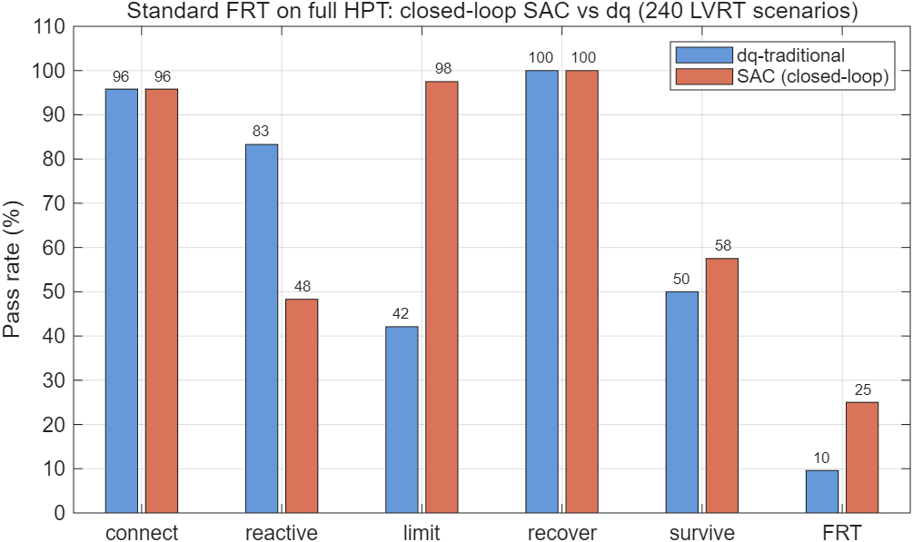
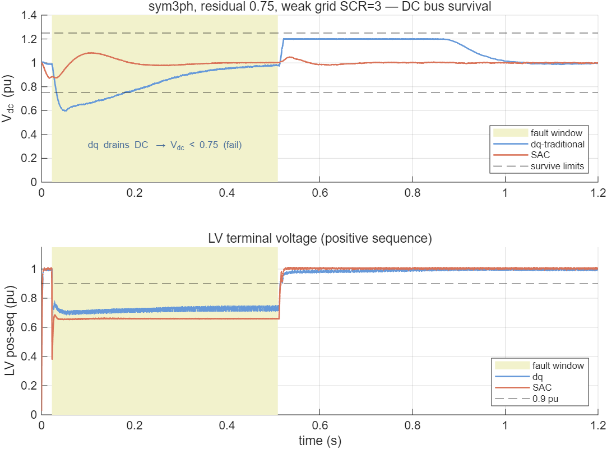
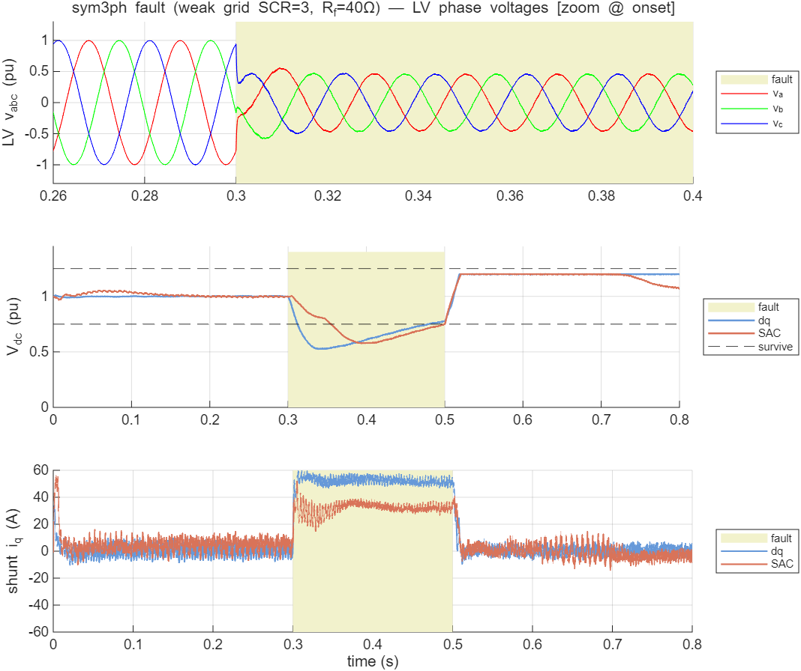
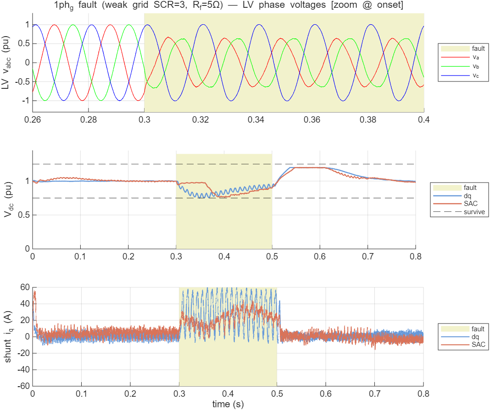
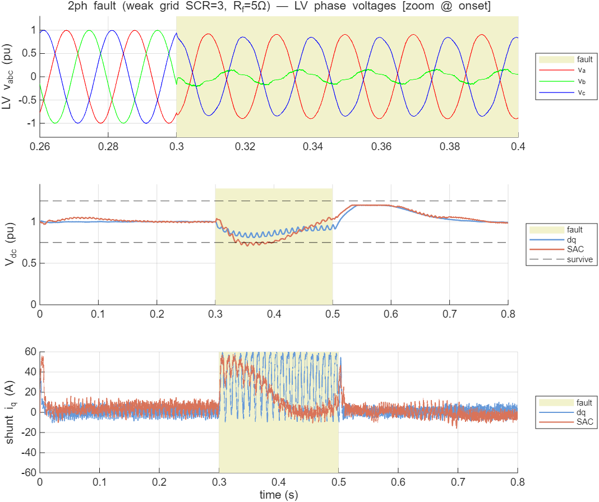
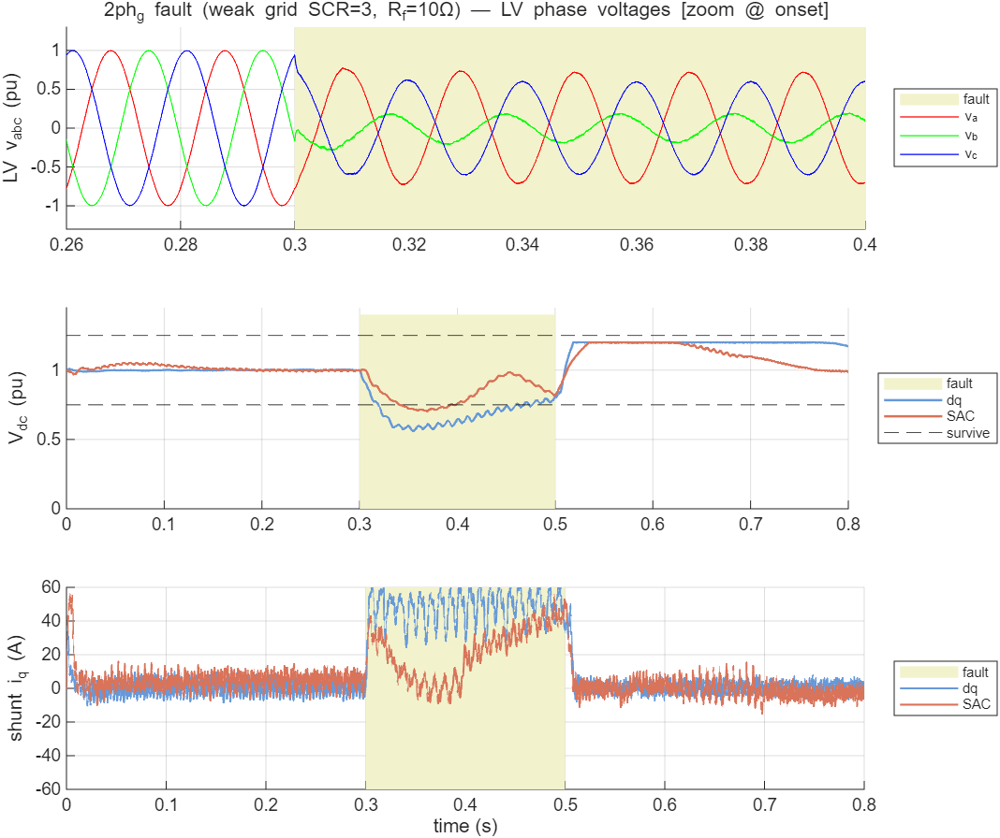

# 混合配电变压器标准故障穿越的强化学习控制：完整开关级 HPT 上 SAC 与 dq 传统控制对比

**技术报告 · 2026-06-09**
**课题**：多端口柔性混合配变（清华课题二）— 故障穿越（FRT）控制

---

## 摘要

针对混合配电变压器（Hybrid Power Transformer, HPT）在电网故障下的穿越控制，本文构建了"**平均值 ODE 快速训练 + 开关级 Simulink 权威验证**"的两层方法学，按中国国家标准（GB/T 风/光伏 LVRT）重新定义了故障穿越场景，训练了直接输出无功/串联指令的 Soft Actor-Critic（SAC）策略，并在**从零脚本重建、全部件齐全的开关级 HPT 模型**上，与 dq 双环 PI 传统控制做了同平台对比。其中 SAC 策略网络被**导出权重、内嵌进 Simulink 控制块逐步推理（真闭环，与 dq 对等）**。在**全部 240 个 LVRT 场景**上，闭环 SAC 的综合 FRT 通过率为 **25.0%**，传统 dq 为 **9.6%**（约 2.6 倍）；优势主要来自**限流（97.5% vs 42.1%）与直流母线存活（57.5% vs 50.0%）**，代价是无功注入更保守（48.3% vs 83.3%）。本文同时如实给出方法的多项局限。

---

## 1. 引言

HPT 由一台工频变压器并联"取能换流器"（并联 VSC，经 Tsh 接中压侧）与串联"调控换流器"（串联 VSC，经 Tse 串入低压线），共享一条直流母线。故障穿越要求装置在电网电压跌落时**不脱网、按标准注入无功支撑电压、并按电压-时间包络恢复**。

传统 dq 双环 PI 控制在深跌、弱网、不对称故障下存在协调困难。本文用强化学习（SAC）学习并联无功与串联电压的协调策略，并回答一个核心问题：**在一个全部件齐全、开关级的 HPT 上，按国标 FRT 评判，RL 控制相对传统控制到底有多少优势？**

---

## 2. 方法学

### 2.1 两层架构（训练—验证分离）

强化学习收敛需要数十万至上百万步交互，而开关级 EMT 仿真单场景需约 20 余秒，**无法直接在 Simulink 上训练**。故采用两层：

| 层 | 模型 | 角色 |
|----|------|------|
| 训练层 | 平均值 ODE（`frt_env.py`，含正负序、无功优先、限流、GB/T 包络） | 快速试错、策略学习 |
| 验证层 | 开关级 Simulink（Simscape Electrical 专用电力系统） | 权威评判，逼近真实电磁暂态 |

**说明**：平均值 ODE 是近似的、且历史上多次发现物理误差（并联取能功率流方向、串联 √2、负序、虚构 100Hz 纹波等已修正），其指标系统性偏乐观；最终结论以开关级验证为准。

### 2.2 标准故障穿越定义（GB/T）

摒弃早期自造的"器件故障 + LV 侧故障 + Vdc 存活"非标准范式，按 **GB/T 19963/19964（风/光伏 LVRT）** 重新定义：

- **故障类型**：对称三相 + 不对称（单相接地、两相、两相接地），含正负序；
- **残压深度**：0.2 / 0.5 / 0.75；
- **电网强弱**：强网 SCR=10、弱网 SCR=3；
- **5 项判据**：①不脱网（电压-时间包络内）②无功跟踪（`Iq ≥ 1.5(0.9−V)` droop）③限流（≤PE 容量）④电压恢复（±7%）⑤装置存活（Vdc∈[0.75,1.25]）；
- **场景集**：320 个（LVRT 240 + HVRT 80）。

### 2.3 SAC 策略

4 维动作 `[i_sh_d, i_sh_q, m_se_d, m_se_q]`（并联有功/无功电流、串联 d/q 注入），21 维观测，net 256³，400k 步。ODE 侧最优：

| connect | reactive | limit | recover | survive | **frt_pass** |
|---------|----------|-------|---------|---------|----------|
| 89.4% | 74.1% | 100% | 83.1% | 51.6% | **59%** |

瓶颈为深跌场景 Vdc 存活——**单交流口拓扑的物理硬限**（中压跌落时并联口取不到能）。

### 2.4 五项 FRT 判据的精确定义（Simulink 侧）

记 LV 端正序电压幅值 `V2p`（由 αβ 瞬时分量取模、故障窗内取均值，归一到 326.6 V 峰值=1.0 pu）；
`V2p_flt` = 故障窗 `[t_f+0.3·dur, t_f+0.9·dur]` 均值；`V2p_post` = 末段 `[T_sim−0.12, T_sim−0.02]` 均值；
`Vdc` 归一到 800 V；并联无功电流 `i_q` 归一到 `I_sh_max=173.2 A`；GB/T 无功参考 `i_q*=clip(1.5(0.9−V2p_flt),0,0.3)`。

| 判据 | 物理含义 | 判定式（通过条件） |
|------|---------|------------------|
| **connect 不脱网** | 故障期电压在穿越包络内、未崩溃 | `V2p_flt ≥ 残压目标 − 0.07` |
| **reactive 无功跟踪** | 按 GB/T droop 注无功 | `|mean(i_q,故障窗) − i_q*| ≤ 0.12 pu` |
| **limit 限流** | 不超并联变流器电流上限 | `max|i_q| ≤ 0.35 pu`（全程） |
| **recover 电压恢复** | 故障后回到额定 ±7% | `|1 − V2p_post| ≤ 0.07` |
| **survive 装置存活** | 直流母线不塌不过压 | `Vdc_min ≥ 0.75 且 Vdc_max ≤ 1.25`（故障窗+0.1 s） |
| **frt 综合** | 五项全过 | 上述五条 AND |

> 阈值取自 GB/T LVRT 规定（±7% 恢复带、0.9 pu 阈值、无功 droop 斜率 1.5、PE 无功上限 0.3 pu）与装置约束（Vdc 0.75–1.25、电流上限）。
> **已知敏感性**：不对称故障下正序 `i_q` 含 100 Hz（2ω）振荡，`reactive` 判据按窗均值判会低估 dq 的有效正序无功（见 §4.3 机理 B 与 §4.4 的 2ph 波形）。

---

## 3. 完整开关级 HPT 模型（验证平台）

### 3.1 拓扑（`build_hpt_frt_full.m` → `hpt_frt_full.slx`，纯脚本可复现）

真实两电压等级（10kV MV / 400V LV）：

```
MV 弱网(R/L按SCR) → MV序故障 → 主变 Δ-Yg(400kVA) → LV负载
        └→ Tsh耦合变(120kVA) → 并联取能VSC(2电平IGBT桥)
                                    │ 共享DC母线(2200µF) + 条件斩波器(Vdc>1.20pu)
        串联调控VSC(2电平桥) → 3×单相Tse → 串入LV线 ┘
```

### 3.2 控制实现

- **并联 VSC**：SRF-PLL 锁相 + dq 电流内环（Kp=9.42/Ki=157 体系，解耦前馈）+ 无功优先限流 + Vdc 外环（双向有功电流）+ 抗饱和 + 软启动预充；
- **串联 VSC**：锁 LV 角的开环 dq 电压注入（±20%）；
- **斩波器**：Vdc>1.20pu 投入（仅管故障过压）。

### 3.3 模型保真度（诚实分级）

**真实物理（开关级 EMT）**：两电压等级、真变压器（含漏抗）、真 IGBT 开关（5kHz SPWM）、真直流电容/斩波器、真弱网/故障/负载、EMT 求解器。

**理想化/简化**：① 400kVA **单交流口**（课题书为 10kV/500kVA 多端口含直流口）；② 串联用"三相桥+浮地星点驱动 3 单相 Tse"（真装置为 3 独立 H 桥）；③ 线性变压器（无饱和/铁损）；④ 理想开关（无损耗/死区/热）；⑤ 故障残压标定凑得、EMF 抬至标称；⑥ **未与硬件实测对标**。

→ **结论**：物理扎实的开关级 EMT 研究模型，远优于平均值 ODE，但**不是真实装置的数字孪生**。

### 3.4 模型自验证

- 故障经主变正确传导（MV 残压 0.327 → LV 0.327）；
- 并联无功注入：iq=+52A → LV +2.2%；Vdc 稳定 800V（std 1.2）；PLL 锁相（Vd≈Vm）；
- 串联注入：mse_d=−0.10 → LV +4.7%，共享 DC 耦合正确（串联功率由并联经直流平衡）；
- 全程稳定无发散。

### 3.5 故障仿真参数（各类型如何模拟）

**电网弱网阻抗（按 SCR 设 Grid 源 R/L，`SpecifyImpedance=off`）**——10 kV 侧基准阻抗 `Z_base=V²/S=250 Ω`：

| 电网 | SCR | \|Z\|=Z_base/SCR | R_g (Ω) | L_g (H) | 源 EMF 修正 |
|------|-----|------|---------|---------|-----------|
| 强网 | 10 | 25 Ω | ≈7.91 | ≈0.0755 | ×~1.06（故障前 LV→1.0 pu） |
| 弱网 | 3 | 83.3 Ω | ≈11.79 | ≈0.263 | ×~1.125 |

**故障注入（MV 母线挂 `powerlib/Three-Phase Fault`，接地电阻 0.001 Ω，故障电阻 R_f 按"目标正序残压"标定）**：

| 故障类型 | 相 A/B/C | 接地 | 序特征 | 说明 |
|---------|---------|------|-------|------|
| **sym3ph** 对称三相 | on/on/on | on | 仅正序跌落 | 最严苛对称跌落 |
| **1ph_g** 单相接地 | on/off/off | on | 正序+负序，正序残压偏高（~0.78） | 最常见故障 |
| **2ph** 两相相间 | on/on/off | **off** | 正序+大负序，无零序 | 相间短路 |
| **2ph_g** 两相接地 | on/on/off | on | 正序+负序+零序 | 两相接地 |

- **残压标定**：对每个 (SCR, 残压目标, 故障类型) 组合，扫 R_f∈{2,5,12,30,80,200}Ω，取使故障窗正序幅值最接近目标 {0.2,0.5,0.75} 者（弱网下小 R 即深跌；不对称故障正序残压有下界，如 1ph_g 难低于 ~0.78）。
- **时序**：每场景 `t_fault≈0.3–0.5 s`、`fault_dur` 按场景（GB/T 穿越窗），故障经主变 Δ-Yg 传导至 LV 与并联取能口。
- **场景集**：240 LVRT = 4 故障型 × 3 残压 × 2 SCR × 10 随机实例（随机化 t_fault/dur/精确 R_g,L_g）。

---

## 4. 对比实验：SAC vs dq 传统

### 4.1 设置

- **同一开关级模型、同一底层 VSC**，仅高层指令不同（公平、均为闭环）：
  - **dq 传统**：Simulink 内闭环——Vdc 环 + GB/T 无功 droop + 串联电压比例支撑；
  - **SAC（闭环）**：actor 网络权重导出后**内嵌进 Simulink 控制块**，每步在模型内重建 21 维观测（含正负序电压提取、故障 one-hot、时间、上步动作）→ 跑 MLP 前向 → 实时出动作。与 dq 完全对等的实时闭环（前向推理已对 Python 验证，误差 1e-7）。
- **场景**：**全部 240 个 LVRT 场景**（4 故障型 × 3 残压 × 2 SCR × 10 随机实例）。

### 4.2 结果（240 场景通过率，SAC 为闭环）

| 判据 | dq 传统 | SAC 闭环 | 优 |
|------|--------|-----|---|
| 不脱网 connect | 95.8% | 95.8% | 平 |
| 无功跟踪 reactive | 83.3% | 48.3% | dq |
| 限流 limit | 42.1% | **97.5%** | **SAC** |
| 电压恢复 recover | 100.0% | 100.0% | 平 |
| **Vdc 存活 survive** | 50.0% | **57.5%** | **SAC** |
| **综合 FRT** | **9.6%** | **25.0%** | **SAC ≈2.6×** |

> **注**：演进过程——① 开环设定值版（24 子集）SAC 25.0%/dq 8.3%；② 真闭环（24 子集）SAC 29.2%/dq 4.2%；③ **真闭环 + 全 240 场景（本表，定稿）SAC 25.0%/dq 9.6%**。全样本统计比子集更稳健（子集 dq 偶发失败率偏高致 ≈7×，全样本回归到 ≈2.6×）。**闭环消除了"SAC 开环、对比不公平"这一最大质疑，结论方向稳定：SAC 综合 FRT 显著优于 dq，优势在限流与 Vdc 存活。**



**图 1**　完整 HPT 上标准 FRT 的 5 判据 + 综合通过率（24 个 LVRT 场景）。SAC 在限流、Vdc 存活、综合通过率上领先；dq 在无功跟踪上领先。

### 4.3 机理分析（逐场景判据级）

对 8 个"胜负相反"的场景做判据级溯源：

**机理 A — Vdc 存活（SAC 赢 2 个：sym3ph 0.75/scr3、2ph_g 0.75/scr10）**
dq 仅在 survive 挂。dq 为最大化支撑猛注串联+无功，**从共享 DC 抽走大量功率 → Vdc_min 掉到 0.70~0.74、且 Vdc_max 几乎都顶斩波阈 1.20**；SAC 克制注入，Vdc 留在 0.76~0.88。**这是 SAC 最干净、最站得住的优势。**



**图 2**　机理 A 实例（sym3ph，残压 0.75，弱网 SCR=3）。上：直流母线——dq（蓝）故障期 Vdc 跌至 **0.60**（破 0.75 下限→存活判负），故障后过冲顶斩波阈 1.20；SAC（红）仅跌至 **0.87** 守住，全程在 [0.75,1.25] 内。下：低压端正序电压——dq 支撑略高（≈0.73pu）、SAC 略低（≈0.66pu）。**直观印证"dq 撑电压却抽干 DC、SAC 守 DC 让一点电压"的权衡。**

**机理 B — 两相故障的无功跟踪（SAC 赢 4 个：2ph 0.2/0.5 × scr3/10）**
dq 仅在 reactive 挂。两相故障强不对称、负序大，正序 dq 坐标下测得无功电流含强 2ω 振荡；dq 按满 droop（~0.3pu）命令但实际投出的正序无功达不到，均值偏离参考 → 判负；SAC 命令更温和（~0.2pu），更接近不对称下可达值 → 判过。**此机理部分真实（SAC 目标更"可达"），部分是不对称下 reactive 判据的测量敏感性（2ω 纹波）——含金量低于机理 A。**

**反向（dq 赢 2 个）**：1ph_g 0.50/scr3（SAC 无功注太保守而挂）、2ph 0.75/scr10（浅故障下 SAC 的 Vdc 反掉到 0.72）。**说明 SAC 的"保守"是双刃剑，非一边倒。**

### 4.4 各故障类型波形（弱网 SCR=3，dq 蓝 / 闭环 SAC 红）

每图三栏：①LV 三相电压（故障起始处放大，看故障形态）②直流母线 Vdc（含 0.75/1.25 存活带）③并联无功电流 i_q。

**① 对称三相故障 sym3ph**

三相同步对称跌落（栏①三相幅值同时压低）；仅正序，i_q 平滑。SAC 较 dq 注无功略少、Vdc 略高。

**② 单相接地故障 1ph_g**

仅 A 相跌落、B/C 基本不变（栏①明显不对称）；正序残压偏高，是最温和的一类，两控制差异小。

**③ 两相相间故障 2ph**

两相畸变、强负序（栏①一相塌陷、波形畸变）。**栏③最能说明机理 B**：dq 的 i_q 按满 droop 命令，但不对称负序使其在 **100 Hz（2ω）上剧烈振荡 ±50 A**，有效正序无功不足；SAC（红）注入平滑、温和，跟踪更稳。栏②可见 dq 的 Vdc 含 2ω 纹波。

**④ 两相接地故障 2ph_g**

两相+接地，含正/负/零序，是不对称类里最严苛的。栏②可见 **SAC 把 Vdc_min 守得明显更高**（机理 A：SAC 克制串联注入、不抽干共享 DC）。

### 4.5 奖励调参实验（v2/v3）：无功–存活–限流三角张力（诚实负结果）

为提升 SAC，做了两轮"标定 ODE→Simulink + 调奖励"重训（均全 240 闭环验证）：

| 版本 | 改动 | connect | reactive | limit | survive | **FRT** |
|------|------|---------|----------|-------|---------|--------|
| **v1** | 原始 | 95.8 | 48.3 | 97.5 | 57.5 | **25.0** |
| v2 | 标定 K_q/SE_GAIN + reactive 奖励 −8 | 75.4 | **94.2** | 19.6 | **87.9** | 6.7 |
| v3 | + reactive −5 + 无功上限 0.25 | 99.6 | 57.1 | 97.5 | 10.8 | 7.9 |

- **v2**：无功跟踪、Vdc 存活双双拉满，但策略过度激进→不对称故障 2ω 电流峰值超 0.35 pu→**限流崩**（97→20）；
- **v3**：救回限流/不脱网，但降无功上限后有功也减→**Vdc 存活崩**（57→11，大量 Vdc_min 卡在 0.71–0.74 仅差一线）。
- **结论**：单交流口拓扑下，**无功注入、Vdc 存活、限流三者抢同一份并联电流**，构成三角张力；纯调奖励只是在三者间挪动，无法同时拉高，**v1 已是该张力下的较好平衡点（25%），两轮重训均未超过**。突破需改拓扑（多端口/直流端口，打破抢流）或放宽过严判据，而非奖励工程。v2/v3 权重已存档（`sac_frt_best_v2/v3.zip`），活跃模型恢复为 v1。

---

## 5. 诚实的局限

1. **绝对通过率都低（25% / 8.3%）**：24 场景深跌（残压 0.2/0.5）占 2/3，**单交流口拓扑深跌时 Vdc 必然下探**，物理硬限制约两者；
2. ~~对比公平性（开环）~~ **已解决**：SAC 已改为**真闭环**（actor 权重内嵌 Simulink，逐步推理），与 dq 对等；前向推理对 Python 验证一致（误差 1e-7）。残留近似：闭环观测中"测得无功电流"用上步动作代理（避免代数环）、正负序用 T/4 延迟法提取（含一拍延迟）；
3. ~~子集 24~~ **已扩至全 240 LVRT 场景**（69.5 min 完成）；HVRT 80 个需另一套过压判据，为后续；
4. **ODE→Simulink 乐观差**：ODE 侧 SAC 综合 59% → 开关级 25%（与历史 PPO 78%→66% 同类）；**相对优势（SAC>dq）在开关级成立**，绝对值回落；
5. **reactive 判据对不对称故障敏感**（机理 B），可改正序严格计算去除 2ω 干扰；
6. **模型非真机**（见 §3.3）：单口、线性变压器、理想开关、故障标定、未硬件对标。

---

## 6. 结论与后续

**结论**：在全部件齐全、开关级、按 GB/T 标准电网故障的 HPT 上，以**真闭环、与 dq 对等**的方式、在**全部 240 个 LVRT 场景**上评测，SAC 相对 dq 传统控制的综合 FRT 通过率约 **2.6 倍（25.0% vs 9.6%）**，优势源于**更好的限流（97.5% vs 42.1%）与直流母线存活（57.5% vs 50.0%）**，代价是无功注入更保守；该结论经开关级验证、装置全部件在场、SAC 闭环与 dq 对等、全样本统计，但受单口拓扑物理硬限与下述局限约束。

**后续（优先级序）**：
1. ~~SAC 真闭环~~ **已完成**（actor 权重内嵌 Simulink 逐步推理）；
2. ~~扩至全 240 LVRT~~ **已完成**；补 HVRT 80 个（需过压判据）；
3. **修无功判据**为正序严格计算（去 2ω 干扰）；
4. **调 reactive/survive 奖励权重重训**，兼顾无功与存活以拉高绝对通过率；
5. 向**多端口、含饱和/损耗、硬件对标**逼近真机。

---

## 附：复现与产物

| 文件 | 内容 |
|------|------|
| `frt_standard/simulink/build_hpt_frt_full.m` | 完整 HPT 模型脚本重建（stage 1–4） |
| `frt_standard/simulink/hpt_frt_full.slx` | 完整 HPT 开关级模型（32 块） |
| `frt_standard/simulink/validate_frt_full.m` | SAC vs dq 对比 harness（场景映射+标定+5判据） |
| `frt_standard/gen_sac_frt_actions.py` | 从 `sac_frt_best.zip` 生成 SAC 动作设定值 |
| `frt_standard/{FRT_SPEC.md, frt_scenarios.csv, frt_env.py, frt_metrics.py, train_frt_sac.py}` | GB/T 规格、320 场景、训练环境与指标 |
| `results/FRT_SAC_vs_dq_FullHPT.md` / `frt_full_compare.{mat,txt}` | 对比结果数据 |
| 复现环境 | MATLAB R2025a + Simscape Electrical；Python `E:\anaconda\envs\pandapower_dev`（SB3 2.8.0 + torch + gymnasium） |
