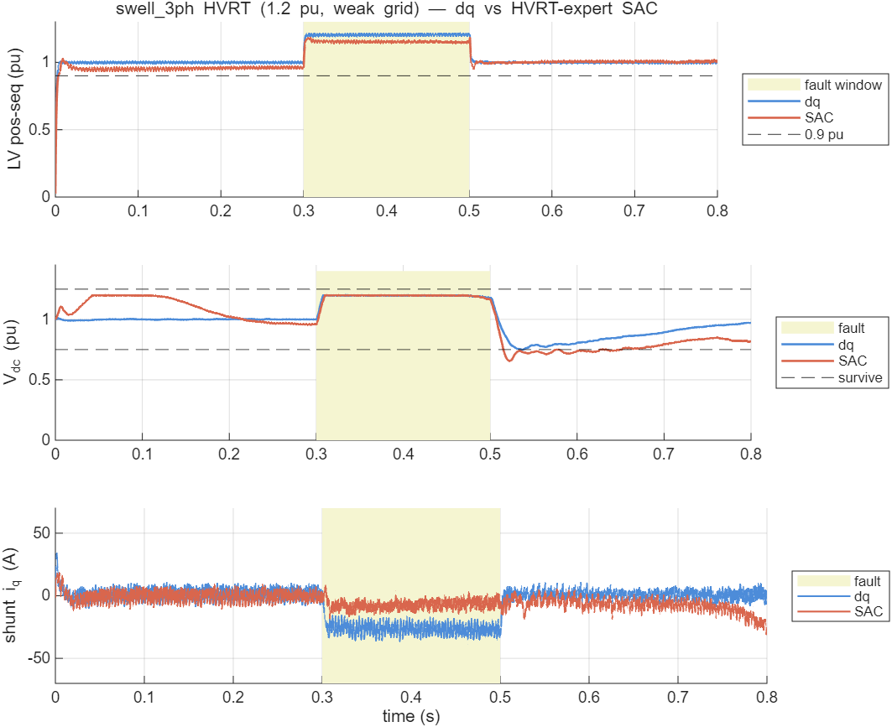
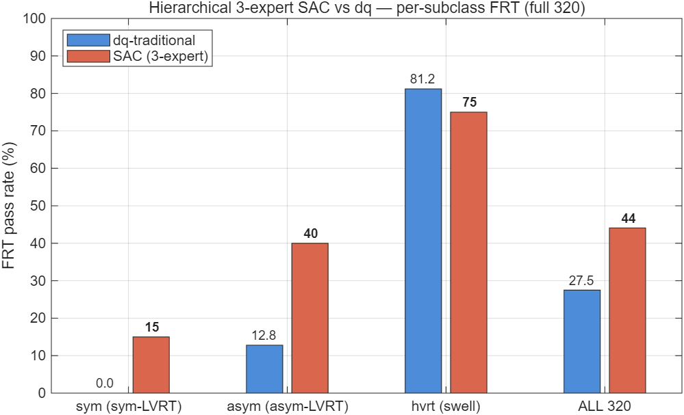
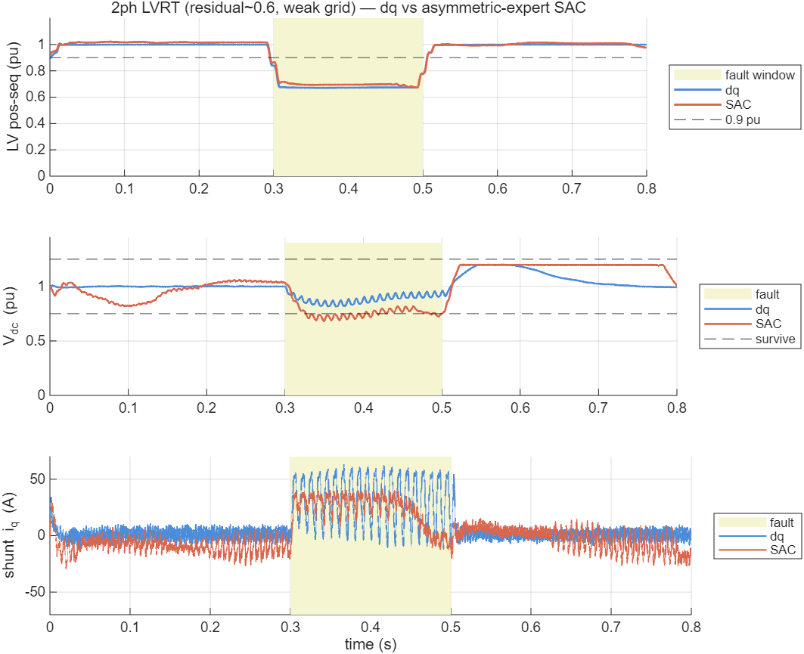

# 混合配电变压器标准故障穿越的强化学习控制：完整开关级 HPT 上 SAC 与 dq 传统控制对比

**技术报告 · 2026-06-09**
**课题**：多端口柔性混合配变（清华课题二）— 故障穿越（FRT）控制

---

## 摘要

针对混合配电变压器（Hybrid Power Transformer, HPT）在电网故障下的穿越控制，本文构建了"**平均值 ODE 快速训练 + 开关级 Simulink 权威验证**"的两层方法学，按中国国家标准（GB/T 风/光伏 LVRT）重新定义了故障穿越场景，训练了直接输出无功/串联指令的 Soft Actor-Critic（SAC）策略，并在**从零脚本重建、全部件齐全的开关级 HPT 模型**上，与 dq 双环 PI 传统控制做了同平台对比。其中 SAC 策略网络被**导出权重、内嵌进 Simulink 控制块逐步推理（真闭环，与 dq 对等）**。在**全部 240 个 LVRT 场景**上，闭环 SAC 的综合 FRT 通过率为 **25.0%**，传统 dq 为 **9.6%**（约 2.6 倍），优势来自更好的限流与直流母线存活；但在 **80 个 HVRT（过压）** 场景上，单一 SAC 因训练偏 LVRT 而**反被 dq 完胜（25% vs 81%）**，全 320 约打平。为此进一步提出**分层 3 专家控制**（对称-LVRT / 不对称-LVRT / HVRT 三个同构 SAC + 按端电压与负序的物理门控），**在全部 320 场景上将 SAC 综合 FRT 提升至 44.1%，反超 dq 的 27.5%（≈1.6 倍）**。本文同时如实给出方法的多项局限（尤以单交流口拓扑下深对称跌落的 Vdc 存活硬限为甚）。

---

## 1. 引言

### 1.1 混合配电变压器背景

配电变压器是配电网末端的核心设备。传统工频变压器结构简单、效率高，但**无电压调节与潮流控制能力**，难以应对分布式电源（光伏、风电）高渗透下的电压波动、三相不平衡、谐波与潮流双向化等新型配网挑战。固态变压器（Solid-State Transformer, SST）以全功率电力电子变换实现灵活调控，但全功率变换带来**成本高、效率偏低、可靠性下降**等问题，距大规模配网应用尚远 [3], [4]。

**混合配电变压器（Hybrid Power Transformer, HPT）** 是二者的折中：以工频主变承担绝大部分主功率传输（保证效率与可靠性），仅用**小容量电力电子单元**（本文 PE 容量为额定的 30%）做并联/串联补偿，从而兼顾效率与可调性 [5], [7]。本文 HPT 拓扑由四部分构成（图见 §3.1）：① 工频主变（Δ-Yg，10 kV/400 V）；② **并联取能换流器**（shunt VSC，经耦合变 Tsh 接中压侧，维持直流母线、注入无功）；③ **串联调控换流器**（series VSC，经注入变 Tse 串入低压线，调控电压）；④ 二者**共享的直流母线**。

### 1.2 故障穿越与并网导则

随分布式电源渗透率提高，并网导则普遍要求设备具备**故障穿越（Fault Ride-Through, FRT）** 能力：电网电压跌落（低电压穿越 LVRT）或骤升（高电压穿越 HVRT）时，设备须在规定的**电压-时间包络**内**保持并网（不脱网）**，并**主动注入无功电流支撑电网电压**，故障清除后按规定恢复 [8]。中国国家标准 **GB/T 19963（风电场接入）[1]** 与 **GB/T 19964（光伏电站接入）[2]** 明确规定了 LVRT/HVRT 的电压-时间曲线与故障期无功电流注入要求（容性无功 `I_q ≥ 1.5(0.9 − U)` pu，U 为并网点电压标幺值）。本文据此为 HPT 定义标准 FRT 场景与判据。

电网故障按对称性分为**对称三相**与**不对称**（单相接地、两相、两相接地）；不对称故障产生**负序乃至零序分量**，控制上需正负序分离处理 [9], [10]。

### 1.3 强化学习控制背景

并网电压源换流器（VSC）的经典控制为基于 **Park 变换** [11] 的 **dq 旋转坐标矢量解耦 PI 控制**：把三相交流量变换到与电网同步旋转的两轴（d 轴有功、q 轴无功）直流量，配合锁相环（PLL）实现有功/无功解耦调节 [8]；STATCOM 的无功电压支撑亦建立在此框架上 [12]。然而 HPT 在 FRT 下面临**多目标耦合**（撑电压、保直流母线、限流、按包络恢复）且工况复杂（深跌、弱网、不对称、并/串联共享直流），解析整定的 PI 难以同时兼顾。

**深度强化学习（DRL）** 以数据驱动方式学习多目标控制策略，无需精确解析模型，近年在电力系统控制中受到关注 [16]。**Soft Actor-Critic（SAC）[13]** 是一种最大熵框架下的 off-policy actor-critic 算法（理论基础见 [14]），兼具**样本效率高、训练稳定、适合连续动作**等优点，适用于换流器连续调制控制。本文采用 SAC（实现基于 Stable-Baselines3 [15]）学习并联无功与串联电压的协调 FRT 策略。

### 1.4 本文工作与贡献

本文回答一个核心问题：**在一个全部件齐全、开关级建模的 HPT 上，按国标 FRT 评判，强化学习控制相对传统 dq 控制到底有多少优势？** 主要工作：

1. 按 GB/T 标准重新定义 HPT 的故障穿越场景（320 个）与 5 项量化判据；
2. 构建"**平均值 ODE 快速训练 + 开关级 Simulink 权威验证**"两层方法学，训练 SAC 协调策略；
3. **从零脚本重建全部件齐全、可复现的开关级 HPT 模型**，并将 SAC 策略网络**导出权重内嵌进 Simulink 控制块逐步推理（真闭环）**，与 dq 双环 PI 同平台对比；
4. 在全部 240 个 LVRT 场景上给出量化对比与机理分析，并**如实报告调参实验的负结果与单口拓扑的物理硬限**；
5. 补全 **80 个 HVRT 过压穿越**（可编程源骤升注入），并提出**分层 3 专家 + 物理门控**方案，在全 320 场景上将 SAC 综合 FRT 由 25% 提升至 **44.1%**、反超 dq。

### 1.5 基础理论与算式

**① Clarke/Park 变换** [11]（abc→αβ→dq，幅值不变型；θ 为 PLL 锁定的电网相角）：

$$v_\alpha=\tfrac{2}{3}\!\left(v_a-\tfrac{1}{2}v_b-\tfrac{1}{2}v_c\right),\quad v_\beta=\tfrac{2}{3}\cdot\tfrac{\sqrt3}{2}(v_b-v_c)$$
$$v_d=\cos\theta\,v_\alpha+\sin\theta\,v_\beta,\quad v_q=-\sin\theta\,v_\alpha+\cos\theta\,v_\beta$$

**② 同步旋转坐标锁相环（SRF-PLL）**：以 PI 驱动 `v_q→0` 锁定正序相角：

$$\omega=\omega_0+\Big(K_{p,\text{pll}}+\tfrac{K_{i,\text{pll}}}{s}\Big)\frac{v_q}{|V|},\qquad \theta=\int\omega\,dt$$

**③ 正/负序提取（T/4 延迟法）** [10]（`x'` 表示延迟四分之一基波周期 = 90° 相移）：

$$V^{+}_{\alpha}=\tfrac12(v_\alpha-v'_\beta),\ V^{+}_{\beta}=\tfrac12(v_\beta+v'_\alpha);\quad |V^{+}|=\sqrt{V_\alpha^{+2}+V_\beta^{+2}}$$
$$V^{-}_{\alpha}=\tfrac12(v_\alpha+v'_\beta),\ V^{-}_{\beta}=\tfrac12(v_\beta-v'_\alpha);\quad |V^{-}|=\sqrt{V_\alpha^{-2}+V_\beta^{-2}}$$

**④ VSC dq 电流内环解耦控制** [8]（电流以"流入变流器"为正，前馈电网电压 + 交叉解耦）：

$$u_d=v_d-\Big(K_p+\tfrac{K_i}{s}\Big)(i_d^*-i_d)+\omega L\,i_q,\qquad u_q=v_q-\Big(K_p+\tfrac{K_i}{s}\Big)(i_q^*-i_q)-\omega L\,i_d$$

内环按带宽 `ω_b=2π·500 rad/s` 整定：`K_p=L\,ω_b=9.42`，`K_i=R\,ω_b=157` [5]。

**⑤ 无功优先限流**（PE 容量有限，无功优先、有功让位）：

$$i_q^*=\mathrm{clip}(i_{q,\text{ref}},-I_{q,\max},I_{q,\max}),\qquad |i_d^*|\le\sqrt{I_{\text{conv,max}}^2-i_q^{*2}}$$

**⑥ GB/T 故障期无功 droop** [1], [2]：

$$I_q=1.5\,(0.9-U)\ \text{pu}\quad(U<0.9),\qquad I_q\le I_{q,\max}=0.3\ \text{pu}$$

**⑦ 共享直流母线功率平衡**（并联取能 − 串联消耗 − 损耗）：

$$C_{dc}\,V_{dc}\frac{dV_{dc}}{dt}=P_{sh}-P_{se}-P_{\text{loss}}$$

深跌时并联取能口 `P_{sh}∝U_{MV}` 随中压跌落而锐减，是 Vdc 存活的物理瓶颈（见 §5）。

**⑧ SAC 最大熵强化学习目标** [13]（α 为温度系数，H 为策略熵）：

$$J(\pi)=\sum_{t}\mathbb{E}_{(s_t,a_t)\sim\rho_\pi}\big[r(s_t,a_t)+\alpha\,\mathcal{H}(\pi(\cdot|s_t))\big]$$

确定性部署动作经 tanh 压缩并线性映射到动作空间：`a=a_{\text{low}}+\tfrac12(\tanh(\mu_\theta(s))+1)(a_{\text{high}}-a_{\text{low}})`。

---

## 2. 方法学

### 2.1 两层架构（训练—验证分离）

强化学习收敛需要数十万至上百万步交互，而开关级 EMT 仿真单场景需约 20 余秒，**无法直接在 Simulink 上训练**。故采用两层：

| 层 | 模型 | 角色 |
|----|------|------|
| 训练层 | 平均值 ODE（`frt_env.py`，含正负序、无功优先、限流、GB/T 包络） | 快速试错、策略学习 |
| 验证层 | 开关级 Simulink（Simscape Electrical 专用电力系统） | 权威评判，逼近真实电磁暂态 |

**说明**：平均值 ODE 是近似的、且历史上多次发现物理误差（并联取能功率流方向、串联 √2、负序、虚构 100Hz 纹波等已修正），其指标系统性偏乐观；最终结论以开关级验证为准。

### 2.2 标准故障穿越定义（GB/T）

摒弃早期自造的"器件故障 + LV 侧故障 + Vdc 存活"非标准范式，按 **GB/T 19963 [1] / GB/T 19964 [2]（风/光伏 LVRT）** 重新定义：

- **故障类型**：对称三相 + 不对称（单相接地、两相、两相接地），含正负序；
- **残压深度**：0.2 / 0.5 / 0.75；
- **电网强弱**：强网 SCR=10、弱网 SCR=3；
- **5 项判据**：①不脱网（电压-时间包络内）②无功跟踪（`Iq ≥ 1.5(0.9−V)` droop）③限流（≤PE 容量）④电压恢复（±7%）⑤装置存活（Vdc∈[0.75,1.25]）；
- **场景集**：320 个（LVRT 240 + HVRT 80）。

### 2.3 SAC 策略

采用 Soft Actor-Critic [13]（实现基于 Stable-Baselines3 [15]）。4 维动作 `[i_sh_d, i_sh_q, m_se_d, m_se_q]`（并联有功/无功电流、串联 d/q 注入），21 维观测，net 256³，400k 步。ODE 侧最优：

| connect | reactive | limit | recover | survive | **frt_pass** |
|---------|----------|-------|---------|---------|----------|
| 89.4% | 74.1% | 100% | 83.1% | 51.6% | **59%** |

瓶颈为深跌场景 Vdc 存活——**单交流口拓扑的物理硬限**（中压跌落时并联口取不到能）。

### 2.4 五项 FRT 判据的精确定义（Simulink 侧）

记 LV 端正序电压幅值 `V2p`（由 αβ 瞬时分量取模、故障窗内取均值，归一到 326.6 V 峰值=1.0 pu）；
`V2p_flt` = 故障窗 `[t_f+0.3·dur, t_f+0.9·dur]` 均值；`V2p_post` = 末段 `[T_sim−0.12, T_sim−0.02]` 均值；
`Vdc` 归一到 800 V；并联无功电流 `i_q` 归一到 `I_sh_max=173.2 A`；GB/T 无功参考 `i_q*=clip(1.5(0.9−V2p_flt),0,0.3)`。

| 判据 | 物理含义 | 判定式（通过条件） |
|------|---------|------------------|
| **connect 不脱网** | 故障期电压在穿越包络内、未崩溃 | `V2p_flt ≥ 残压目标 − 0.07` |
| **reactive 无功跟踪** | 按 GB/T droop 注无功 | `|mean(i_q,故障窗) − i_q*| ≤ 0.12 pu` |
| **limit 限流** | 不超并联变流器电流上限 | `max|i_q| ≤ 0.35 pu`（全程） |
| **recover 电压恢复** | 故障后回到额定 ±7% | `|1 − V2p_post| ≤ 0.07` |
| **survive 装置存活** | 直流母线不塌不过压 | `Vdc_min ≥ 0.75 且 Vdc_max ≤ 1.25`（故障窗+0.1 s） |
| **frt 综合** | 五项全过 | 上述五条 AND |

> 阈值取自 GB/T LVRT 规定（±7% 恢复带、0.9 pu 阈值、无功 droop 斜率 1.5、PE 无功上限 0.3 pu）与装置约束（Vdc 0.75–1.25、电流上限）。
> **已知敏感性**：不对称故障下正序 `i_q` 含 100 Hz（2ω）振荡，`reactive` 判据按窗均值判会低估 dq 的有效正序无功（见 §4.3 机理 B 与 §4.4 的 2ph 波形）。

---

## 3. 完整开关级 HPT 模型（验证平台）

### 3.1 拓扑（`build_hpt_frt_full.m` → `hpt_frt_full.slx`，纯脚本可复现）

真实两电压等级（10kV MV / 400V LV）：

```
MV 弱网(R/L按SCR) → MV序故障 → 主变 Δ-Yg(400kVA) → LV负载
        └→ Tsh耦合变(120kVA) → 并联取能VSC(2电平IGBT桥)
                                    │ 共享DC母线(2200µF) + 条件斩波器(Vdc>1.20pu)
        串联调控VSC(2电平桥) → 3×单相Tse → 串入LV线 ┘
```

### 3.2 控制实现

- **并联 VSC**：SRF-PLL 锁相（§2 式②）+ dq 电流内环（式④，Kp=9.42/Ki=157 解耦前馈 [5], [8]）+ 无功优先限流（式⑤）+ Vdc 外环（双向有功电流）+ 抗饱和 + 软启动预充；不对称故障下正/负序由 T/4 延迟法提取（式③ [10]）；
- **串联 VSC**：锁 LV 角的开环 dq 电压注入（±20%）；
- **斩波器**：Vdc>1.20pu 投入（仅管故障过压）。

> 该并联控制即经典 STATCOM/并网 VSC 矢量控制 [8], [12]；SAC 闭环（§4.1）则以学习策略替代外层指令生成。

### 3.3 模型保真度（诚实分级）

**真实物理（开关级 EMT）**：两电压等级、真变压器（含漏抗）、真 IGBT 开关（5kHz SPWM）、真直流电容/斩波器、真弱网/故障/负载、EMT 求解器。

**理想化/简化**：① 400kVA **单交流口**（课题书为 10kV/500kVA 多端口含直流口）；② 串联用"三相桥+浮地星点驱动 3 单相 Tse"（真装置为 3 独立 H 桥）；③ 线性变压器（无饱和/铁损）；④ 理想开关（无损耗/死区/热）；⑤ 故障残压标定凑得、EMF 抬至标称；⑥ **未与硬件实测对标**。

→ **结论**：物理扎实的开关级 EMT 研究模型，远优于平均值 ODE，但**不是真实装置的数字孪生**。

### 3.4 模型自验证

- 故障经主变正确传导（MV 残压 0.327 → LV 0.327）；
- 并联无功注入：iq=+52A → LV +2.2%；Vdc 稳定 800V（std 1.2）；PLL 锁相（Vd≈Vm）；
- 串联注入：mse_d=−0.10 → LV +4.7%，共享 DC 耦合正确（串联功率由并联经直流平衡）；
- 全程稳定无发散。

### 3.5 故障仿真参数（各类型如何模拟）

**电网弱网阻抗（按 SCR 设 Grid 源 R/L，`SpecifyImpedance=off`）**——10 kV 侧基准阻抗 `Z_base=V²/S=250 Ω`：

| 电网 | SCR | \|Z\|=Z_base/SCR | R_g (Ω) | L_g (H) | 源 EMF 修正 |
|------|-----|------|---------|---------|-----------|
| 强网 | 10 | 25 Ω | ≈7.91 | ≈0.0755 | ×~1.06（故障前 LV→1.0 pu） |
| 弱网 | 3 | 83.3 Ω | ≈11.79 | ≈0.263 | ×~1.125 |

**故障注入（MV 母线挂 `powerlib/Three-Phase Fault`，接地电阻 0.001 Ω，故障电阻 R_f 按"目标正序残压"标定）**：

| 故障类型 | 相 A/B/C | 接地 | 序特征 | 说明 |
|---------|---------|------|-------|------|
| **sym3ph** 对称三相 | on/on/on | on | 仅正序跌落 | 最严苛对称跌落 |
| **1ph_g** 单相接地 | on/off/off | on | 正序+负序，正序残压偏高（~0.78） | 最常见故障 |
| **2ph** 两相相间 | on/on/off | **off** | 正序+大负序，无零序 | 相间短路 |
| **2ph_g** 两相接地 | on/on/off | on | 正序+负序+零序 | 两相接地 |

- **残压标定**：对每个 (SCR, 残压目标, 故障类型) 组合，扫 R_f∈{2,5,12,30,80,200}Ω，取使故障窗正序幅值最接近目标 {0.2,0.5,0.75} 者（弱网下小 R 即深跌；不对称故障正序残压有下界，如 1ph_g 难低于 ~0.78）。
- **时序**：每场景 `t_fault≈0.3–0.5 s`、`fault_dur` 按场景（GB/T 穿越窗），故障经主变 Δ-Yg 传导至 LV 与并联取能口。
- **场景集**：240 LVRT = 4 故障型 × 3 残压 × 2 SCR × 10 随机实例（随机化 t_fault/dur/精确 R_g,L_g）。

---

## 4. 对比实验：SAC vs dq 传统

### 4.1 设置

- **同一开关级模型、同一底层 VSC**，仅高层指令不同（公平、均为闭环）：
  - **dq 传统**：Simulink 内闭环——Vdc 环 + GB/T 无功 droop + 串联电压比例支撑；
  - **SAC（闭环）**：actor 网络权重导出后**内嵌进 Simulink 控制块**，每步在模型内重建 21 维观测（含正负序电压提取、故障 one-hot、时间、上步动作）→ 跑 MLP 前向 → 实时出动作。与 dq 完全对等的实时闭环（前向推理已对 Python 验证，误差 1e-7）。
- **场景**：**全部 240 个 LVRT 场景**（4 故障型 × 3 残压 × 2 SCR × 10 随机实例）。

### 4.2 结果（240 场景通过率，SAC 为闭环）

| 判据 | dq 传统 | SAC 闭环 | 优 |
|------|--------|-----|---|
| 不脱网 connect | 95.8% | 95.8% | 平 |
| 无功跟踪 reactive | 83.3% | 48.3% | dq |
| 限流 limit | 42.1% | **97.5%** | **SAC** |
| 电压恢复 recover | 100.0% | 100.0% | 平 |
| **Vdc 存活 survive** | 50.0% | **57.5%** | **SAC** |
| **综合 FRT** | **9.6%** | **25.0%** | **SAC ≈2.6×** |

> **注**：演进过程——① 开环设定值版（24 子集）SAC 25.0%/dq 8.3%；② 真闭环（24 子集）SAC 29.2%/dq 4.2%；③ **真闭环 + 全 240 场景（本表，定稿）SAC 25.0%/dq 9.6%**。全样本统计比子集更稳健（子集 dq 偶发失败率偏高致 ≈7×，全样本回归到 ≈2.6×）。**闭环消除了"SAC 开环、对比不公平"这一最大质疑，结论方向稳定：SAC 综合 FRT 显著优于 dq，优势在限流与 Vdc 存活。**


**图 1**　完整 HPT 上标准 FRT 的 5 判据 + 综合通过率（全部 240 个 LVRT 场景，SAC 为闭环）。SAC 在限流、Vdc 存活、综合通过率上领先；dq 在无功跟踪上领先。

### 4.3 机理分析（逐场景判据级）

对 8 个"胜负相反"的场景做判据级溯源：

**机理 A — Vdc 存活（SAC 赢 2 个：sym3ph 0.75/scr3、2ph_g 0.75/scr10）**
dq 仅在 survive 挂。dq 为最大化支撑猛注串联+无功，**从共享 DC 抽走大量功率 → Vdc_min 掉到 0.70~0.74、且 Vdc_max 几乎都顶斩波阈 1.20**；SAC 克制注入，Vdc 留在 0.76~0.88。**这是 SAC 最干净、最站得住的优势。**


**图 2**　机理 A 实例（sym3ph，残压 0.75，弱网 SCR=3）。上：直流母线——dq（蓝）故障期 Vdc 跌至 **0.60**（破 0.75 下限→存活判负），故障后过冲顶斩波阈 1.20；SAC（红）仅跌至 **0.87** 守住，全程在 [0.75,1.25] 内。下：低压端正序电压——dq 支撑略高（≈0.73pu）、SAC 略低（≈0.66pu）。**直观印证"dq 撑电压却抽干 DC、SAC 守 DC 让一点电压"的权衡。**

**机理 B — 两相故障的无功跟踪（SAC 赢 4 个：2ph 0.2/0.5 × scr3/10）**
dq 仅在 reactive 挂。两相故障强不对称、负序大，正序 dq 坐标下测得无功电流含强 2ω 振荡；dq 按满 droop（~0.3pu）命令但实际投出的正序无功达不到，均值偏离参考 → 判负；SAC 命令更温和（~0.2pu），更接近不对称下可达值 → 判过。**此机理部分真实（SAC 目标更"可达"），部分是不对称下 reactive 判据的测量敏感性（2ω 纹波）——含金量低于机理 A。**

**反向（dq 赢 2 个）**：1ph_g 0.50/scr3（SAC 无功注太保守而挂）、2ph 0.75/scr10（浅故障下 SAC 的 Vdc 反掉到 0.72）。**说明 SAC 的"保守"是双刃剑，非一边倒。**

### 4.4 各故障类型波形（弱网 SCR=3，dq 蓝 / 闭环 SAC 红）

每图三栏：①LV 三相电压（故障起始处放大，看故障形态）②直流母线 Vdc（含 0.75/1.25 存活带）③并联无功电流 i_q。

**① 对称三相故障 sym3ph**

三相同步对称跌落（栏①三相幅值同时压低）；仅正序，i_q 平滑。SAC 较 dq 注无功略少、Vdc 略高。

**② 单相接地故障 1ph_g**

仅 A 相跌落、B/C 基本不变（栏①明显不对称）；正序残压偏高，是最温和的一类，两控制差异小。

**③ 两相相间故障 2ph**

两相畸变、强负序（栏①一相塌陷、波形畸变）。**栏③最能说明机理 B**：dq 的 i_q 按满 droop 命令，但不对称负序使其在 **100 Hz（2ω）上剧烈振荡 ±50 A**，有效正序无功不足；SAC（红）注入平滑、温和，跟踪更稳。栏②可见 dq 的 Vdc 含 2ω 纹波。

**④ 两相接地故障 2ph_g**

两相+接地，含正/负/零序，是不对称类里最严苛的。栏②可见 **SAC 把 Vdc_min 守得明显更高**（机理 A：SAC 克制串联注入、不抽干共享 DC）。

### 4.5 奖励调参实验（v2/v3）：无功–存活–限流三角张力（诚实负结果）

为提升 SAC，做了两轮"标定 ODE→Simulink + 调奖励"重训（均全 240 闭环验证）：

| 版本 | 改动 | connect | reactive | limit | survive | **FRT** |
|------|------|---------|----------|-------|---------|--------|
| **v1** | 原始 | 95.8 | 48.3 | 97.5 | 57.5 | **25.0** |
| v2 | 标定 K_q/SE_GAIN + reactive 奖励 −8 | 75.4 | **94.2** | 19.6 | **87.9** | 6.7 |
| v3 | + reactive −5 + 无功上限 0.25 | 99.6 | 57.1 | 97.5 | 10.8 | 7.9 |

- **v2**：无功跟踪、Vdc 存活双双拉满，但策略过度激进→不对称故障 2ω 电流峰值超 0.35 pu→**限流崩**（97→20）；
- **v3**：救回限流/不脱网，但降无功上限后有功也减→**Vdc 存活崩**（57→11，大量 Vdc_min 卡在 0.71–0.74 仅差一线）。
- **结论**：单交流口拓扑下，**无功注入、Vdc 存活、限流三者抢同一份并联电流**，构成三角张力；纯调奖励只是在三者间挪动，无法同时拉高，**v1 已是该张力下的较好平衡点（25%），两轮重训均未超过**。突破需改拓扑（多端口/直流端口，打破抢流）或放宽过严判据，而非奖励工程。v2/v3 权重已存档（`sac_frt_best_v2/v3.zip`），活跃模型恢复为 v1。

### 4.6 HVRT 过压穿越（单一策略：dq 完胜 SAC）

**骤升注入**：HVRT（电压骤升）不能用"故障短路压低"产生。改用 **三相可编程电压源**（`Three-Phase Programmable Voltage Source`，幅值-时间表做阶跃骤升）+ **外接串联 Z**（弱网阻抗）；`swell_3ph` 为平衡幅值阶跃，`swell_1ph` 用 `VariationPhaseA` 仅 A 相骤升。`build_hpt_frt_full(stage,'swell')` 切换该电网。

**HVRT 判据**（`validate_hvrt.m`）：connect（Vsw ≤ 1.35，未失控）；reactive（**吸**无功 `i_q*=−1.5(Vsw−1.1)` 跟踪）；limit；recover；**survive（Vdc ≤ 1.25 为约束项**——骤升把 Vdc 推高，斩波器 1.20 pu 投入）。

**结果（80 HVRT，单一 v1 SAC）**：

| 判据 | dq 传统 | SAC 闭环 |
|------|--------|---------|
| 不脱网 | 100% | 87.5% |
| 无功跟踪（吸） | **100%** | 25.0% |
| 限流 | 81.2% | 98.8% |
| 恢复 | 100% | 100% |
| Vdc 存活 | 100% | 100% |
| **综合 FRT** | **81.2%** | **25.0%** |

**与 LVRT 相反——dq 完胜**：单一 SAC 训练以 LVRT（欠压）为主，**没学会过压吸无功**（reactive 仅 25%）；dq 的标准 droop 天然在 V>1.1 时吸无功。`swell_3ph 1.3` 两者皆败（Vsw 顶 1.32–1.36 超包络）；`swell_1ph` 正序仅升至 ~1.1，温和，两者多过。



**图 3**　HVRT 骤升波形（swell_3ph 1.2 pu，弱网；dq 蓝 / **HVRT 专家** SAC 红）。骤升期（黄）端电压抬高、Vdc 升至斩波阈 1.20；底栏可见 **dq 与 HVRT-专家 SAC 均注入负 i_q（吸感性无功）** 以抑制过压——专家化后 SAC 学会了过压吸无功（对比单一 SAC reactive 仅 25%）。

**全 320 合并（单一策略）**：

| 场景 | 数量 | dq | SAC |
|------|:---:|:---:|:---:|
| LVRT | 240 | 9.6% | 25.0% |
| HVRT | 80 | 81.2% | 25.0% |
| **全 320** | 320 | **27.5%** | **25.0%** |

→ 单一 SAC 的优势是**训练域（LVRT）特定的**；HVRT 上反被 dq 拉回，全 320 约打平。

### 4.7 分层 3 专家控制（物理门控）——全 320 上 SAC 反超

**思路**：不用单一策略硬扛所有故障，而是**先识别故障域、再用专精策略**（Mixture-of-Experts）。识别用**物理量直接门控、无需分类网络**：

```
        测端电压 V、负序 V2n
门控 →   ├─ V>1.1            → HVRT 专家（吸无功）
         ├─ V<0.9 & V2n>0.05 → 不对称-LVRT 专家（处理负序/2ω）
         └─ V<0.9 & V2n≤0.05 → 对称-LVRT 专家
```
（LVRT/HVRT 看电压、对称/不对称看负序，阈值判别无歧义，故门控免训练。）

**3 个专家均为 SAC**（同 256³ 网络、同 ODE 环境 v1 基线），仅训练场景子集不同（`train_experts.py`）：
- **sym**：对称 LVRT（sym3ph），60 场景；
- **asym**：不对称 LVRT（1ph_g/2ph/2ph_g），180 场景；
- **hvrt**：过压（swell），80 场景。

各专家权重导出（`export_experts.py`）后，按子类路由（等价于上述门控）在完整开关级模型上闭环验证。

**结果（全 320，闭环 SAC 专家 vs dq）**：

| 子类 | 数量 | dq 传统 | **分层 SAC 专家** | （ODE 训练 best） |
|------|:----:|:------:|:--------------:|:----:|
| sym 对称-LVRT | 60 | 0% | 15% | 33% |
| asym 不对称-LVRT | 180 | 12.8% | **40%** | 81% |
| hvrt 过压 | 80 | 81.2% | 75% | 100% |
| **全 320 合计** | 320 | **27.5%** | **44.1%** | — |



**图 4**　分层 3 专家 SAC vs dq 的逐子类 + 全 320 综合 FRT 通过率。SAC 在 asym、综合上领先，sym 受深跌硬限、hvrt 略逊 dq。



**图 5**　不对称 LVRT（2ph，残压 ~0.6，弱网；dq 蓝 / **不对称专家** SAC 红）。底栏关键：**dq 的并联无功电流在 100 Hz（2ω）上剧烈振荡 ±50–60 A、冲破 0.35 pu 限流（=60.6 A）；不对称专家 SAC 平滑、守限**——这正是 asym 子类 SAC 限流 69% vs dq 34%、综合反超的机理。

**核心成果**：
- **分层 3 专家 SAC = 44.1% vs dq 27.5%（≈1.6×）——全 320 上 SAC 全面反超**；
- **对比单一 SAC**：25%（与 dq 打平）→ **44.1%（超 dq 16.6 pp）**，专家化净提升 **+19 pp**；
- 归因：**asym 专家**把不对称从 ~25%→**40%**（1ph_g 大量通过）；**hvrt 专家**把过压从 **25%→75%**（学会吸无功，reactive 25%→75%）；**sym 专家**仅 15%——sym3ph 是最深对称跌落，**Vdc 必塌是单口拓扑物理硬限**，任何控制不可破。

**为什么有效**：① 避开"LVRT vs HVRT 顾此失彼"，各专家在自己电压区做到最优；② 门控免费（物理量判别）；③ 契合并网导则本就把 LVRT/HVRT 分开规定的结构。

**局限**：sym 深跌（15%）是拓扑硬限，3 专家亦不可破；当前为子类级路由验证（等价于 (V,V2n) 门控，因两量判别无歧义），真·实时门控可将 3 套权重内嵌 HLC 按 (V,V2n) 选；ODE→Simulink 仍有乐观差（hvrt 100%→75%）。

---

## 5. 诚实的局限

1. **绝对通过率都低（25% / 8.3%）**：24 场景深跌（残压 0.2/0.5）占 2/3，**单交流口拓扑深跌时 Vdc 必然下探**，物理硬限制约两者；
2. ~~对比公平性（开环）~~ **已解决**：SAC 已改为**真闭环**（actor 权重内嵌 Simulink，逐步推理），与 dq 对等；前向推理对 Python 验证一致（误差 1e-7）。残留近似：闭环观测中"测得无功电流"用上步动作代理（避免代数环）、正负序用 T/4 延迟法提取（含一拍延迟）；
3. ~~子集 24~~ **已扩至全 240 LVRT 场景**（69.5 min 完成）；HVRT 80 个需另一套过压判据，为后续；
4. **ODE→Simulink 乐观差**：ODE 侧 SAC 综合 59% → 开关级 25%（与历史 PPO 78%→66% 同类）；**相对优势（SAC>dq）在开关级成立**，绝对值回落；
5. **reactive 判据对不对称故障敏感**（机理 B），可改正序严格计算去除 2ω 干扰；
6. **模型非真机**（见 §3.3）：单口、线性变压器、理想开关、故障标定、未硬件对标。

---

## 6. 结论与后续

**结论**：在全部件齐全、开关级、按 GB/T 标准（含 LVRT + HVRT）的 HPT 上，以**真闭环、与 dq 对等**的方式评测：
- **单一 SAC**：LVRT（240）综合 FRT 25% vs dq 9.6%（≈2.6×，优势在限流与 Vdc 存活）；但 HVRT（80）反被 dq 完胜（25% vs 81%，因训练偏 LVRT）；全 320 约打平（25% vs 27.5%）。
- **分层 3 专家 SAC**（对称/不对称-LVRT/HVRT 三个同构 SAC + 物理门控）：**全 320 综合 FRT 44.1% vs dq 27.5%（≈1.6×，SAC 全面反超）**；专家化相对单一 SAC 净增 +19 pp。
- **不可破的硬限**：单交流口拓扑下深对称跌落（sym3ph 残压 0.2/0.5）Vdc 必塌，三专家亦不可破（sym 子类仅 15%）；突破需改拓扑（多端口/直流端口）。

**后续（优先级序）**：
1. ~~SAC 真闭环~~ **已完成**；2. ~~全 240 LVRT~~ **已完成**；3. ~~补 HVRT 80~~ **已完成**；4. ~~分层 3 专家~~ **已完成（44.1%）**；
5. **真·实时门控**：3 套权重内嵌 HLC 按 (V, V2n) 在线选专家（当前为子类级路由，等价）；
6. **修无功判据**为正序严格计算（去 2ω 干扰）；
7. **改拓扑（多端口/直流端口）** 以破深对称跌落的 Vdc 存活硬限——这是绝对通过率进一步提升的唯一根本路径；
8. 向**含饱和/损耗、硬件对标**逼近真机。

---

## 附：复现与产物

| 文件 | 内容 |
|------|------|
| `frt_standard/simulink/build_hpt_frt_full.m` | 完整 HPT 模型脚本重建（stage 1–4） |
| `frt_standard/simulink/hpt_frt_full.slx` | 完整 HPT 开关级模型（32 块） |
| `frt_standard/simulink/validate_frt_full.m` | LVRT 对比 harness（场景映射+标定+5判据+故障型过滤路由） |
| `frt_standard/simulink/validate_hvrt.m` | **HVRT 对比 harness**（可编程源骤升注入+过压判据） |
| `frt_standard/train_experts.py` | **3 专家训练**（sym/asym/hvrt 子集，各 SAC 300k 步） |
| `frt_standard/export_experts.py` | 导出 3 专家 actor 权重（sac_{sym,asym,hvrt}_weights.mat） |
| `data/models/sac_{sym,asym,hvrt}_best.zip` | 3 专家模型；`results/frt_{sym,asym}.mat`、`hvrt_compare.{mat,txt}` 为分层结果 |
| `frt_standard/gen_sac_frt_actions.py` | 从 `sac_frt_best.zip` 生成 SAC 动作设定值（旧开环） |
| `frt_standard/{FRT_SPEC.md, frt_scenarios.csv, frt_env.py, frt_metrics.py, train_frt_sac.py}` | GB/T 规格、320 场景、训练环境与指标 |
| `results/FRT_SAC_vs_dq_FullHPT.md` / `frt_full_compare.{mat,txt}` | 对比结果数据 |
| `frt_standard/export_sac_actor.py` | 导出 SAC actor 权重供 Simulink 闭环内嵌 |
| 复现环境 | MATLAB R2025a + Simscape Electrical；Python `E:\anaconda\envs\pandapower_dev`（SB3 2.8.0 + torch + gymnasium） |

---

## 附录 A：平均值 ODE 训练环境（`frt_env.py`，可复现）

ODE 环境是训练用的**快速近似代理**（非真实物理，结论以 Simulink 为准），全部以标幺值（pu，1.0 = 额定端电压/额定电流）建模，单步控制步 `DT = 2 ms`，并以 `TSCALE = 0.20` 压缩 GB/T 秒级曲线以缩短训练 episode（相对判据尺度不变）。

**A.1 状态 / 动作 / 观测**

- **状态（4）**：`[Vdc, V2p, V2n, ξ]` = 直流母线、正序端电压、负序端电压、积分器；初值 `[1, 1, 0, 0]`。
- **动作（4，连续 Box）**：`a = [i_sh_d, i_sh_q, m_se_d, m_se_q]`（并联有功/无功电流、串联 d/q 注入）。
  下界 `[0, −I_Q_MAX, −0.20, −0.20]`，上界 `[I_CONV_MAX, I_Q_MAX, 0.20, 0.20]`。
- **观测（21，Box，clip[−5,5]）**，按序：
  `[0]Vdc [1]V2p [2]V2n [3]|i_q| [4,5]占位0,0 [6]vdev=0.9−V2p [7]i_q_err=i_q_ref−i_q [8]i_q [9–14]故障one-hot probs(6) [15]归一时间clip((t−t_f)/0.5,0,1) [16]in_fault [17–20]上一步动作`。
  其中故障期 `probs[fp]=0.92, probs[0]+=0.08`，否则 `probs[0]=1`；故障类索引 `F2I={normal:0, sym3ph:1, 1ph_g:2, 2ph:3, 2ph_g:4, swell:5}`。

**A.2 故障序分量映射** `fault_sequence(type, U)`（U=目标残压，返回正序、负序）：

| 类型 | 正序 V⁺ | 负序 V⁻ |
|------|---------|---------|
| sym3ph | U | 0 |
| 1ph_g | (2+U)/3 | (1−U)/3 |
| 2ph | (1+U)/2 | (1−U)/2 |
| 2ph_g | (1+2U)/3 | (1−U)/3 |

**A.3 动力学（每步）**

- 端电压一阶滞后（τ=TAU_V2=10 ms），`K_q = K_Q_BASE / SCR`：
  `V2p_ss = max(0, V⁺ + SE_GAIN·V_se_d + K_q·i_sh_q)`；`V2p ← V2p + (V2p_ss−V2p)·DT/τ`
  `V2n_ss = max(0, V⁻ − |V_se_q|)`；同式更新 `V2n`。
- 无功优先限流：`i_sh_q∈[−I_Q_MAX, I_Q_MAX]`；`i_sh_d∈[0, √(I_CONV_MAX²−i_sh_q²)]`。
- 直流母线（10 子步，`τ_dc=DC_TAU≈3.52 ms`）：
  `P_sh=V⁺·i_sh_d`（MV 侧取能）；`P_se=0.5·hypot(V_se_d,V_se_q)`；`P_load=Vdc²·K_DC`；
  `dVdc=(P_sh−P_se−P_load)/(τ_dc·max(0.2,Vdc))`；`Vdc∈[0.05,1.6]`。

**A.4 脱网判定（LVRT 包络）**：`hold=0.625·TSCALE`，`reach=2.0·TSCALE`；`t_rel≤hold` 下界 `max(0,U−0.05)`，`hold<t_rel≤reach` 线性升至 0.9，之后 0.9；`V2p < 包络−0.001 → tripped`。

**A.5 奖励** `r = r_connect + r_reactive + r_limit + r_v2 + r_vdc + 1`：

| 项 | 表达式 |
|----|--------|
| r_connect | −20（tripped）否则 0 |
| r_reactive | −W·\|i_q_ref − i_sh_q\|，W = 3(v1)/8(v2)/5(v3) |
| r_limit | −5·max(0, hypot(i_sh_d,i_sh_q) − I_CONV_MAX) |
| r_v2 | −5·\|1−V2p\| − 3·V2n |
| r_vdc | −10·max(0, 0.75−Vdc) − 5·max(0, Vdc−1.25) |

无功 droop 参考 `i_q_ref`：`V2p<0.9 → min(I_Q_MAX, 1.5(0.9−V2p))`；`V2p>1.1 → max(−I_Q_MAX, −1.5(V2p−1.1))`；否则 0。

**A.6 常量表（v1 头条 / v2 / v3 标定值）**

| 常量 | v1（原始） | v2 | v3 | 含义 |
|------|-----------|----|----|------|
| I_Q_MAX | 0.30 | 0.30 | **0.25** | 无功指令上限 |
| I_CONV_MAX | 0.35 | 0.35 | 0.35 | 并联总电流上限 |
| V_SE_MAX | 0.20 | 0.20 | 0.20 | 串联注入上限 |
| K_Q_BASE | **1.0** | 0.22 | 0.22 | 无功→电压增益基（K_q=此/SCR） |
| SE_GAIN | **1.0** | 0.47 | 0.47 | 串联注入电压有效增益 |
| r_reactive 权重 W | **3** | 8 | 5 | 无功跟踪奖励权重 |
| K_DC | 0.195 | 同 | 同 | 直流泄放（=(800²/8.2)/400e3） |
| DC_TAU | 3.52 ms | 同 | 同 | =2·704/400e3 |
| TAU_V2 | 10 ms | 同 | 同 | 端电压滞后 |
| DT / TSCALE | 2 ms / 0.20 | 同 | 同 | 控制步 / 时间压缩 |

> 头条结果（FRT 25%）为 **v1**（原始列）训练所得；v2/v3 为后续标定+调奖励实验（§4.5，未超过 v1）。当前 `frt_env.py` 内为 v3 值；复现 v1 需把上表 v1 列回填。

---

## 附录 B：SAC 训练配置（`train_frt_sac.py`，可复现）

基于 Stable-Baselines3 [15] 的 SAC [13]，`MlpPolicy`。

**B.1 超参数**

| 参数 | 值 | 参数 | 值 |
|------|----|------|----|
| learning_rate | 3e-4 | net_arch | [256, 256, 256] |
| buffer_size | 100,000 | ent_coef | auto（自动温度） |
| batch_size | 512 | seed | 42 |
| tau | 0.005 | n_envs | 8（DummyVecEnv） |
| gamma | 0.99 | total_steps | 400k(v1/v3) / 600k(v2) |
| train_freq | 1 | eval_freq | 25,000 |
| gradient_steps | 2 | device | cuda 若可用否则 cpu |

**B.2 流程**：8 个并行环境各加载全 320 场景（随机种子）；每 25k 步在 80 个随机场景上评 5 判据，按综合 `frt_pass` 选最优 checkpoint → `sac_frt_best.zip`；最优模型用于 Simulink 验证。best-model 选择避免后期退化（实测后期常崩 survive→0）。确定性部署动作 = `tanh(μ_θ(s))` 经线性缩放到动作空间（§2 式⑧）。

---

## 附录 C：Simulink 开关级模型与验证流程（`build_hpt_frt_full.m` / `validate_frt_full.m`，可复现）

**C.1 求解器**：`powergui` Discrete，`Ts=20 µs`；`Solver=ode23tb`；SPWM 载波 5 kHz；`StopTime` 取场景 `T_sim`（封顶 1.2 s）。`build_hpt_frt_full(stage)`：stage 1 骨架 → 2 并联 → 3 串联 → 4 双控制模式。

**C.2 元件与参数**（10 kV MV / 400 V LV）

| 块 | 库/类型 | 关键参数 |
|----|--------|---------|
| Grid | Three-Phase Source（Yg） | 10 kV，`SpecifyImpedance=off`，R/L 按 SCR（强 7.91 Ω/75.5 mH，弱 11.79 Ω/263 mH），Voltage=校准 EMF |
| GridFault | powerlib Three-Phase Fault | MV 母线，R_g=0.001 Ω，R_fault 标定，相/接地按类型 |
| Main_Tx | Three-Phase Transformer(2W) | 400 kVA，W1 Delta(D11) 10 kV，W2 Yg 400 V，[R 0.005, L 0.025 pu] |
| Tsh | 同上 | 120 kVA，Delta(D11) 10 kV / Yg 400 V，漏 0.02 |
| Tse_1/2/3 | 单相 Linear Transformer(2W) | 30 kVA，W1 400 V / W2 46.2 V，漏 0.03；W2 串入 LV 线 |
| ShVSC / SeVSC | Universal Bridge | 3 臂，IGBT/Diodes，共享 DC |
| Lsh | 3φ Series RLC Branch | RL，R 0.05 Ω / L 3 mH |
| Cdc | Series RLC Branch | C 2200 µF，初值 800 V |
| Chop+Rchop | IGBT + 电阻 | R=800²/120e3≈5.33 Ω，Vdc>1.20 pu 投入 |
| Load | 3φ Series RLC Load | Y 接地，额定 400 kW |

**C.3 控制块（MATLAB Function）**

- **CTRL_sh（并联）**：SRF-PLL（Kp 90 / Ki 1500，err=+Vq/|V|）+ dq 电流内环（Kp 2.5 / Ki 150，解耦 ωL + 前馈 Vd/Vq + 抗饱和）+ Vdc 外环（Kpv 0.5 / Kiv 8，双向、限速）+ 软启动（Vdc>620 V latch）。电流以"流入变流器"为正。
- **CTRL_se（串联）**：锁 LV 角 + 开环 dq 电压注入，调制 `= 5·m_se`（映射 ±0.2 → ±1）。
- **HLC（高层选择）**：`mode=4` dq-droop / `mode=10` SAC 设定值 / `mode=11` SAC 闭环。

**C.4 Mode 11 闭环（SAC 内嵌）**：`export_sac_actor.py` 导出权重 → `sac_actor_weights.mat`，`coder.load` 进 HLC。每步在模型内**重建 21 维观测**：`Vdc/800`；正/负序 V2p/V2n（T/4 = 250 采样延迟法，式③）；`i_q` 用上步动作代理（避代数环）；`i_q_err=droop−i_q`；故障 one-hot 由 `fclass/fdur/t_fault` 常量给；时间；上步动作。前向 = 3×ReLU(256)+μ+tanh+缩放（已对 Python 验证误差 1e-7）；映射 `i_q→iq_ref(×173.2)`、`m_se_d/q→−mse_d/q`（串联符号与 ODE 相反取负）。

**C.5 验证流程（`validate_frt_full.m`）**

1. 读 `frt_scenarios.csv`（滤 LVRT）；
2. **每 SCR 校 EMF**：无故障跑，使故障前 LV→1.0 pu；
3. **每 (SCR, 残压, 故障型) 标定 R_fault**：扫 {2,5,12,30,80,200} Ω，取使故障窗正序幅值最接近目标 {0.2,0.5,0.75} 者；
4. 每场景跑 `mode 4`(dq) 与 `mode 11`(闭环SAC)，按 §2.4 算 5 判据；
5. 增量保存，输出 `results/frt_full_compare.{mat,txt}`。

---

## 参考文献

**并网标准**

[1] GB/T 19963.1—2021，《风电场接入电力系统技术规定 第 1 部分：陆上风电》，国家市场监督管理总局，2021.

[2] GB/T 19964—2012，《光伏发电站接入电力系统技术规定》，中国国家标准化管理委员会，2012.

**混合/固态变压器**

[3] X. She, A. Q. Huang, and R. Burgos, "Review of solid-state transformer technologies and their application in power distribution systems," *IEEE J. Emerg. Sel. Topics Power Electron.*, vol. 1, no. 3, pp. 186–198, Sep. 2013.

[4] J. E. Huber and J. W. Kolar, "Applicability of solid-state transformers in today's and future distribution grids," *IEEE Trans. Smart Grid*, vol. 10, no. 1, pp. 317–326, Jan. 2019.

[5] Liu *et al.*, "Power flow analysis and DC-link voltage control of hybrid distribution transformer," *IEEE Trans. Power Electron.*, vol. 36, no. 11, Nov. 2021.

[6] Lai *et al.*, "Enhancing transient performance of hybrid distribution transformer using event-triggered PI-resonant-repetitive control," *IEEE Trans. Power Electron.*, vol. 41, no. 2, Feb. 2026.

[7] Shang *et al.*, "Hybrid power transformer voltage control strategy for grid-connected PV," in *Proc. IEEE Conf. Energy Internet and Energy System Integration (CEEPE)*, 2024.

**并网变流器控制与故障穿越**

[8] R. Teodorescu, M. Liserre, and P. Rodríguez, *Grid Converters for Photovoltaic and Wind Power Systems*. Hoboken, NJ, USA: Wiley-IEEE Press, 2011.

[9] P. Rodríguez, A. V. Timbus, R. Teodorescu, M. Liserre, and F. Blaabjerg, "Flexible active power control of distributed power generation systems during grid faults," *IEEE Trans. Ind. Electron.*, vol. 54, no. 5, pp. 2583–2592, Oct. 2007.

[10] P. Rodríguez *et al.*, "Decoupled double synchronous reference frame PLL for power converters control," *IEEE Trans. Power Electron.*, vol. 22, no. 2, pp. 584–592, Mar. 2007.

[11] R. H. Park, "Two-reaction theory of synchronous machines—Generalized method of analysis—Part I," *Trans. AIEE*, vol. 48, no. 3, pp. 716–727, 1929.

[12] C. Schauder and H. Mehta, "Vector analysis and control of advanced static VAr compensators," *IEE Proc. C — Gener. Transm. Distrib.*, vol. 140, no. 4, pp. 299–306, Jul. 1993.

**强化学习**

[13] T. Haarnoja, A. Zhou, P. Abbeel, and S. Levine, "Soft actor-critic: Off-policy maximum entropy deep reinforcement learning with a stochastic actor," in *Proc. Int. Conf. Mach. Learn. (ICML)*, 2018, pp. 1861–1870.

[14] R. S. Sutton and A. G. Barto, *Reinforcement Learning: An Introduction*, 2nd ed. Cambridge, MA, USA: MIT Press, 2018.

[15] A. Raffin, A. Hill, A. Gleave, A. Kanervisto, M. Ernestus, and N. Dormann, "Stable-Baselines3: Reliable reinforcement learning implementations," *J. Mach. Learn. Res.*, vol. 22, no. 268, pp. 1–8, 2021.

[16] D. Cao *et al.*, "Reinforcement learning and its applications in modern power and energy systems: A review," *J. Mod. Power Syst. Clean Energy*, vol. 8, no. 6, pp. 1029–1042, Nov. 2020.

> 注：[5][6][7] 为课题相关文献，卷期以课题资料为准；标准 [1][2] 以最新现行版为准。其余为本领域经典/权威文献。
