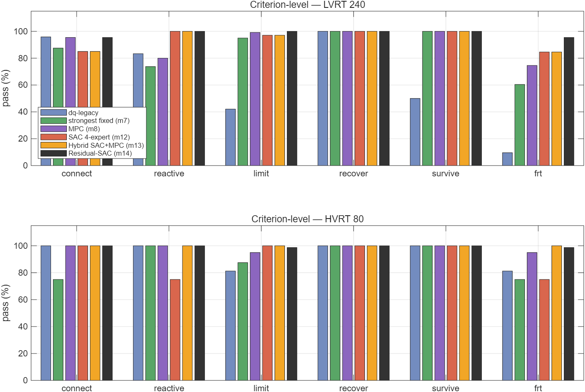
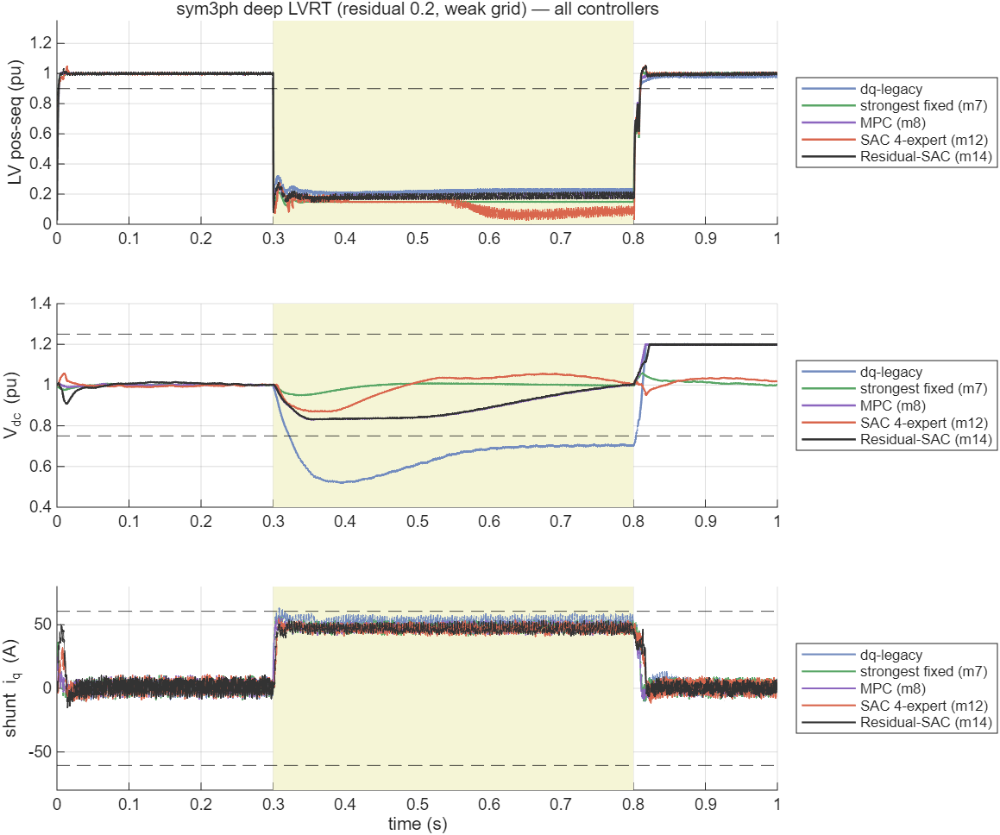
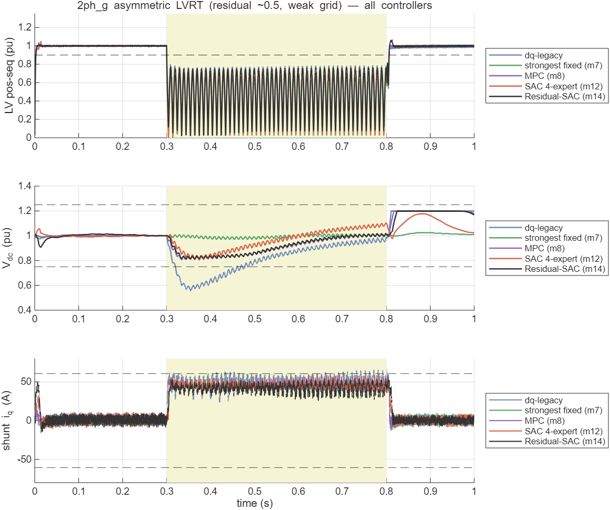
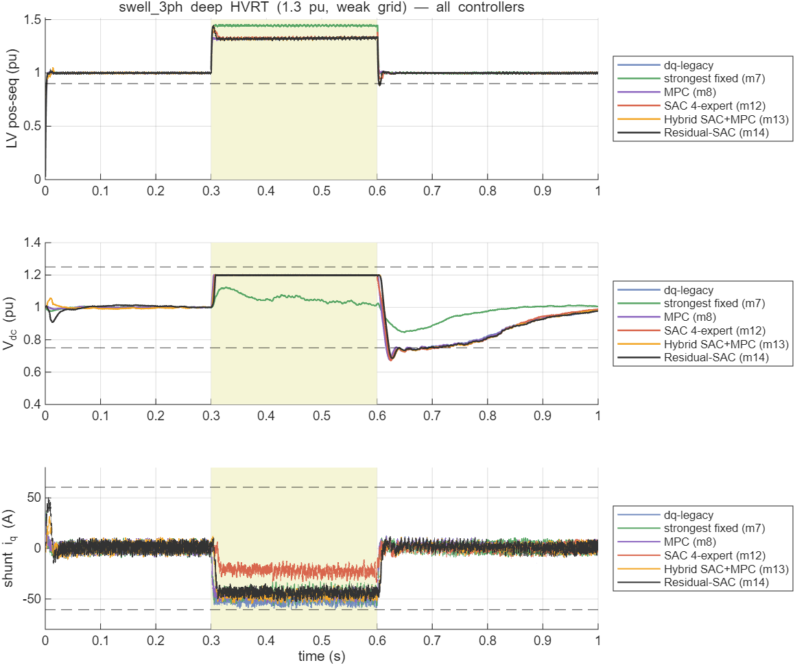
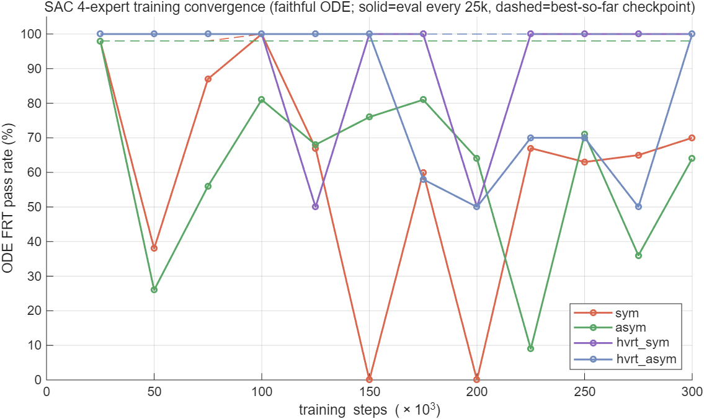

# 混合配电变压器标准故障穿越的强化学习控制：完整开关级 HPT 上 SAC 与 dq 传统控制对比

**技术报告 · 2026-06-09**
**课题**：多端口柔性混合配变（清华课题二）— 故障穿越（FRT）控制

---

> ⚠️ **修正声明（2026-06-11）**：发现 `validate_frt_full.m` 的 R_fault 标定存在控制模式泄漏（标定继承上一场景的 mode-12，SAC 在标定期间撑压 → 故障被加深，系统性利好 SAC/惩罚 dq）。§4.8 的 90.0%/32.8% 等数字**带有该偏置，保留为过程记录**。统一口径重测后的**最终有效结果见 §4.10（全部方法细致说明）与 §4.11（最终对比，含全套对比图）**：混合 mode-13 = 88.4% ★、SAC 82.2%、MPC 79.7%、最强固定律 64.1%、dq-legacy 27.5%。发现过程见 `overnight_report_2026-06-11.md`。

## 摘要

针对混合配电变压器（Hybrid Power Transformer, HPT）在电网故障下的穿越控制，本文构建了"**平均值 ODE 快速训练 + 开关级 Simulink 权威验证**"的两层方法学，按中国国家标准（GB/T 风/光伏 LVRT/HVRT）重新定义了 320 个故障穿越场景与 5 项量化判据，训练了直接输出无功/串联指令的 Soft Actor-Critic（SAC）策略，并在**从零脚本重建、全部件齐全的开关级 HPT 模型**上，与 dq 双环 PI 传统控制做了同平台对比。SAC 策略网络被**导出权重、内嵌进 Simulink 控制块按训练步长（2 ms）降频推理（真闭环，与 dq 对等）**。

本文的核心方法学贡献有二。其一是 **“忠实 ODE”**：朴素平均值训练环境的直流母线模型系统性乐观，训出的策略在开关级部署时立即失效（机理为串联升压注入抽空共享直流母线而训练环境无此代价）；将 ODE 直流模型用开关级模型的**固定设定值扫描数据逐点标定**（平衡点误差 ≤0.02）后，同一训练管线的部署成绩发生质变。其二是**完整的决策律谱系对比与"优化引导的学习"**（§4.10–4.11）：在同一平台、同一标定口径下实现并全量评测 **9 种决策律**——dq-legacy、三个文献对齐的 dq 变体 [17][18]、决策层一步 MPC [21][22]、单/4 专家 SAC、混合 m13（按域分工）、以及最终的**残差 SAC m14（MPC 闭式先验 + 学习残差 + 纹波感知钳位，单模型）[23][24]**。**统一口径全 320 最终结果：残差 SAC = 96.3%（LVRT 95.4%、三类不对称全 100%）> 混合 m13 88.4% > SAC 4 专家 82.2% > MPC 79.7% > 最强固定律 64.1% ≫ dq-legacy 27.5%（对 dq 为 3.5 倍）**。机理上：dq 深跌下的 Vdc 崩溃是满额串联升压的**自伤**而非拓扑硬限；RL 的不可替代域是强不对称故障；MPC 的优势域是目标可解析的 HVRT；**先验+残差的融合在每个动作维度上兼得两者**，且先验地板使训练曲线零震荡。本文同时如实记录四次重要修正：早期 3 专家 44.1% 撤回（§4.7）；乐观 ODE 部署崩溃（§4.8）；验证标定泄漏使一版头条作废（§4.11）；残差 v1 的测量尖峰失效与部署侧钳位修复（§4.10-(9)）——**评测基础设施、训练环境与代理的每个通道都需要被审计**，是贯穿本文的方法学主线。

---

## 1. 引言

### 1.1 混合配电变压器背景

配电变压器是配电网末端的核心设备。传统工频变压器结构简单、效率高，但**无电压调节与潮流控制能力**，难以应对分布式电源（光伏、风电）高渗透下的电压波动、三相不平衡、谐波与潮流双向化等新型配网挑战。固态变压器（Solid-State Transformer, SST）以全功率电力电子变换实现灵活调控，但全功率变换带来**成本高、效率偏低、可靠性下降**等问题，距大规模配网应用尚远 [3], [4]。

**混合配电变压器（Hybrid Power Transformer, HPT）** 是二者的折中：以工频主变承担绝大部分主功率传输（保证效率与可靠性），仅用**小容量电力电子单元**（本文 PE 容量为额定的 30%）做并联/串联补偿，从而兼顾效率与可调性 [5], [7]。本文 HPT 拓扑由四部分构成（图见 §3.1）：① 工频主变（Δ-Yg，10 kV/400 V）；② **并联取能换流器**（shunt VSC，经耦合变 Tsh 接中压侧，维持直流母线、注入无功）；③ **串联调控换流器**（series VSC，经注入变 Tse 串入低压线，调控电压）；④ 二者**共享的直流母线**。

### 1.2 故障穿越与并网导则

随分布式电源渗透率提高，并网导则普遍要求设备具备**故障穿越（Fault Ride-Through, FRT）** 能力：电网电压跌落（低电压穿越 LVRT）或骤升（高电压穿越 HVRT）时，设备须在规定的**电压-时间包络**内**保持并网（不脱网）**，并**主动注入无功电流支撑电网电压**，故障清除后按规定恢复 [8]。中国国家标准 **GB/T 19963（风电场接入）[1]** 与 **GB/T 19964（光伏电站接入）[2]** 明确规定了 LVRT/HVRT 的电压-时间曲线与故障期无功电流注入要求（容性无功 `I_q ≥ 1.5(0.9 − U)` pu，U 为并网点电压标幺值）。本文据此为 HPT 定义标准 FRT 场景与判据。

电网故障按对称性分为**对称三相**与**不对称**（单相接地、两相、两相接地）；不对称故障产生**负序乃至零序分量**，控制上需正负序分离处理 [9], [10]。

### 1.3 强化学习控制背景

并网电压源换流器（VSC）的经典控制为基于 **Park 变换** [11] 的 **dq 旋转坐标矢量解耦 PI 控制**：把三相交流量变换到与电网同步旋转的两轴（d 轴有功、q 轴无功）直流量，配合锁相环（PLL）实现有功/无功解耦调节 [8]；STATCOM 的无功电压支撑亦建立在此框架上 [12]。然而 HPT 在 FRT 下面临**多目标耦合**（撑电压、保直流母线、限流、按包络恢复）且工况复杂（深跌、弱网、不对称、并/串联共享直流），解析整定的 PI 难以同时兼顾。

**深度强化学习（DRL）** 以数据驱动方式学习多目标控制策略，无需精确解析模型，近年在电力系统控制中受到关注 [16]。**Soft Actor-Critic（SAC）[13]** 是一种最大熵框架下的 off-policy actor-critic 算法（理论基础见 [14]），兼具**样本效率高、训练稳定、适合连续动作**等优点，适用于换流器连续调制控制。本文采用 SAC（实现基于 Stable-Baselines3 [15]）学习并联无功与串联电压的协调 FRT 策略。

### 1.4 本文工作与贡献

本文回答一个核心问题：**在一个全部件齐全、开关级建模的 HPT 上，按国标 FRT 评判，强化学习控制相对传统 dq 控制到底有多少优势？** 主要工作：

1. 按 GB/T 标准重新定义 HPT 的故障穿越场景（320 个）与 5 项量化判据；
2. 构建"**平均值 ODE 快速训练 + 开关级 Simulink 权威验证**"两层方法学，训练 SAC 协调策略；
3. **从零脚本重建全部件齐全、可复现的开关级 HPT 模型**，并将 SAC 策略网络**导出权重内嵌进 Simulink 控制块逐步推理（真闭环）**，与 dq 双环 PI 同平台对比；
4. 在全部 320 个场景上给出量化对比与机理分析，并**如实报告中间负结果**（单一 SAC、人工分流 3 专家 44.1% 的撤回、乐观 ODE 部署即崩）；
5. 提出 **“忠实 ODE”标定方法学**（§4.8）：用开关级模型固定设定值扫描数据标定训练环境的直流模型（误差 ≤0.02），消除 sim-to-real 差距——这是把部署成绩从 ~19% 提到 90% 的决定性一步；
6. 提出**分层 4 专家 + 物理门控在线路由（Mode-12）**，并发现两类部署级问题及修复：控制频率失配致 ~3 kHz 极限环（按训练步长降频推理解决）、奖励无安全裕度致策略“贴判据线飞行”（Vdc 惩罚阈值 0.75→0.82 解决）。**最终全 320：SAC 90.0% vs dq 32.8%（2.7 倍）**；
7. **基线公平性检验**（§4.9）：按文献 [17]–[19] 重构三个 dq 变体（宋幸式串联置零、贾科式 Vdc 降额、回灌 RL 洞察的最强固定律），证明 SAC 的优势在最强固定律（65.6%）下仍净胜 +15.6 pp，并展示 RL 结构性发现可反哺传统控制设计（dq +43.7 pp）。

### 1.5 基础理论与算式

**① Clarke/Park 变换** [11]（abc→αβ→dq，幅值不变型；θ 为 PLL 锁定的电网相角）：

$$v_\alpha=\tfrac{2}{3}\!\left(v_a-\tfrac{1}{2}v_b-\tfrac{1}{2}v_c\right),\quad v_\beta=\tfrac{2}{3}\cdot\tfrac{\sqrt3}{2}(v_b-v_c)$$
$$v_d=\cos\theta\,v_\alpha+\sin\theta\,v_\beta,\quad v_q=-\sin\theta\,v_\alpha+\cos\theta\,v_\beta$$

**② 同步旋转坐标锁相环（SRF-PLL）**：以 PI 驱动 `v_q→0` 锁定正序相角：

$$\omega=\omega_0+\Big(K_{p,\text{pll}}+\tfrac{K_{i,\text{pll}}}{s}\Big)\frac{v_q}{|V|},\qquad \theta=\int\omega\,dt$$

**③ 正/负序提取（T/4 延迟法）** [10]（`x'` 表示延迟四分之一基波周期 = 90° 相移）：

$$V^{+}_{\alpha}=\tfrac12(v_\alpha-v'_\beta),\ V^{+}_{\beta}=\tfrac12(v_\beta+v'_\alpha);\quad |V^{+}|=\sqrt{V_\alpha^{+2}+V_\beta^{+2}}$$
$$V^{-}_{\alpha}=\tfrac12(v_\alpha+v'_\beta),\ V^{-}_{\beta}=\tfrac12(v_\beta-v'_\alpha);\quad |V^{-}|=\sqrt{V_\alpha^{-2}+V_\beta^{-2}}$$

**④ VSC dq 电流内环解耦控制** [8]（电流以"流入变流器"为正，前馈电网电压 + 交叉解耦）：

$$u_d=v_d-\Big(K_p+\tfrac{K_i}{s}\Big)(i_d^*-i_d)+\omega L\,i_q,\qquad u_q=v_q-\Big(K_p+\tfrac{K_i}{s}\Big)(i_q^*-i_q)-\omega L\,i_d$$

内环按带宽 `ω_b=2π·500 rad/s` 整定：`K_p=L\,ω_b=9.42`，`K_i=R\,ω_b=157` [5]。

**⑤ 无功优先限流**（PE 容量有限，无功优先、有功让位）：

$$i_q^*=\mathrm{clip}(i_{q,\text{ref}},-I_{q,\max},I_{q,\max}),\qquad |i_d^*|\le\sqrt{I_{\text{conv,max}}^2-i_q^{*2}}$$

**⑥ GB/T 故障期无功 droop** [1], [2]：

$$I_q=1.5\,(0.9-U)\ \text{pu}\quad(U<0.9),\qquad I_q\le I_{q,\max}=0.3\ \text{pu}$$

**⑦ 共享直流母线功率平衡**（并联取能 − 串联消耗 − 损耗）：

$$C_{dc}\,V_{dc}\frac{dV_{dc}}{dt}=P_{sh}-P_{se}-P_{\text{loss}}$$

深跌时并联取能口 `P_{sh}∝U_{MV}` 随中压跌落而锐减，是 Vdc 存活的物理瓶颈（见 §5）。

**⑧ SAC 最大熵强化学习目标** [13]（α 为温度系数，H 为策略熵）：

$$J(\pi)=\sum_{t}\mathbb{E}_{(s_t,a_t)\sim\rho_\pi}\big[r(s_t,a_t)+\alpha\,\mathcal{H}(\pi(\cdot|s_t))\big]$$

确定性部署动作经 tanh 压缩并线性映射到动作空间：`a=a_{\text{low}}+\tfrac12(\tanh(\mu_\theta(s))+1)(a_{\text{high}}-a_{\text{low}})`。

---

## 2. 方法学

### 2.1 两层架构（训练—验证分离）

强化学习收敛需要数十万至上百万步交互，而开关级 EMT 仿真单场景需约 20 余秒，**无法直接在 Simulink 上训练**。故采用两层：

| 层 | 模型 | 角色 |
|----|------|------|
| 训练层 | 平均值 ODE（`frt_env.py`，含正负序、无功优先、限流、GB/T 包络） | 快速试错、策略学习 |
| 验证层 | 开关级 Simulink（Simscape Electrical 专用电力系统） | 权威评判，逼近真实电磁暂态 |

**说明**：平均值 ODE 是近似的、且历史上多次发现物理误差（并联取能功率流方向、串联 √2、负序、虚构 100Hz 纹波等已修正），其指标系统性偏乐观；最终结论以开关级验证为准。

### 2.2 标准故障穿越定义（GB/T）

摒弃早期自造的"器件故障 + LV 侧故障 + Vdc 存活"非标准范式，按 **GB/T 19963 [1] / GB/T 19964 [2]（风/光伏 LVRT）** 重新定义：

- **故障类型**：对称三相 + 不对称（单相接地、两相、两相接地），含正负序；
- **残压深度**：0.2 / 0.5 / 0.75；
- **电网强弱**：强网 SCR=10、弱网 SCR=3；
- **5 项判据**：①不脱网（电压-时间包络内）②无功跟踪（`Iq ≥ 1.5(0.9−V)` droop）③限流（≤PE 容量）④电压恢复（±7%）⑤装置存活（Vdc∈[0.75,1.25]）；
- **场景集**：320 个（LVRT 240 + HVRT 80）。

### 2.3 SAC 策略

采用 Soft Actor-Critic [13]（实现基于 Stable-Baselines3 [15]）。4 维动作 `[i_sh_d, i_sh_q, m_se_d, m_se_q]`（并联有功/无功电流、串联 d/q 注入），21 维观测，net 256³，400k 步。ODE 侧最优：

| connect | reactive | limit | recover | survive | **frt_pass** |
|---------|----------|-------|---------|---------|----------|
| 89.4% | 74.1% | 100% | 83.1% | 51.6% | **59%** |

瓶颈为深跌场景 Vdc 存活——**单交流口拓扑的物理硬限**（中压跌落时并联口取不到能）。

### 2.4 五项 FRT 判据的精确定义（Simulink 侧）

记 LV 端正序电压幅值 `V2p`（由 αβ 瞬时分量取模、故障窗内取均值，归一到 326.6 V 峰值=1.0 pu）；
`V2p_flt` = 故障窗 `[t_f+0.3·dur, t_f+0.9·dur]` 均值；`V2p_post` = 末段 `[T_sim−0.12, T_sim−0.02]` 均值；
`Vdc` 归一到 800 V；并联无功电流 `i_q` 归一到 `I_sh_max=173.2 A`；GB/T 无功参考 `i_q*=clip(1.5(0.9−V2p_flt),0,0.3)`。

| 判据 | 物理含义 | 判定式（通过条件） |
|------|---------|------------------|
| **connect 不脱网** | 故障期电压在穿越包络内、未崩溃 | `V2p_flt ≥ 残压目标 − 0.07` |
| **reactive 无功跟踪** | 按 GB/T droop 注无功 | `|mean(i_q,故障窗) − i_q*| ≤ 0.12 pu` |
| **limit 限流** | 不超并联变流器电流上限 | `max|i_q| ≤ 0.35 pu`（全程） |
| **recover 电压恢复** | 故障后回到额定 ±7% | `|1 − V2p_post| ≤ 0.07` |
| **survive 装置存活** | 直流母线不塌不过压 | `Vdc_min ≥ 0.75 且 Vdc_max ≤ 1.25`（故障窗+0.1 s） |
| **frt 综合** | 五项全过 | 上述五条 AND |

> 阈值取自 GB/T LVRT 规定（±7% 恢复带、0.9 pu 阈值、无功 droop 斜率 1.5、PE 无功上限 0.3 pu）与装置约束（Vdc 0.75–1.25、电流上限）。
> **已知敏感性**：不对称故障下正序 `i_q` 含 100 Hz（2ω）振荡，`reactive` 判据按窗均值判会低估 dq 的有效正序无功（见 §4.3 机理 B 与 §4.4 的 2ph 波形）。

---

## 3. 完整开关级 HPT 模型（验证平台）

### 3.1 拓扑（`build_hpt_frt_full.m` → `hpt_frt_full.slx`，纯脚本可复现）

真实两电压等级（10kV MV / 400V LV）：

```
MV 弱网(R/L按SCR) → MV序故障 → 主变 Δ-Yg(400kVA) → LV负载
        └→ Tsh耦合变(120kVA) → 并联取能VSC(2电平IGBT桥)
                                    │ 共享DC母线(2200µF) + 条件斩波器(Vdc>1.20pu)
        串联调控VSC(2电平桥) → 3×单相Tse → 串入LV线 ┘
```

### 3.2 控制实现

- **并联 VSC**：SRF-PLL 锁相（§2 式②）+ dq 电流内环（式④，Kp=9.42/Ki=157 解耦前馈 [5], [8]）+ 无功优先限流（式⑤）+ Vdc 外环（双向有功电流）+ 抗饱和 + 软启动预充；不对称故障下正/负序由 T/4 延迟法提取（式③ [10]）；
- **串联 VSC**：锁 LV 角的开环 dq 电压注入（±20%）；
- **斩波器**：Vdc>1.20pu 投入（仅管故障过压）。

> 该并联控制即经典 STATCOM/并网 VSC 矢量控制 [8], [12]；SAC 闭环（§4.1）则以学习策略替代外层指令生成。

### 3.3 模型保真度（诚实分级）

**真实物理（开关级 EMT）**：两电压等级、真变压器（含漏抗）、真 IGBT 开关（5kHz SPWM）、真直流电容/斩波器、真弱网/故障/负载、EMT 求解器。

**理想化/简化**：① 400kVA **单交流口**（课题书为 10kV/500kVA 多端口含直流口）；② 串联用"三相桥+浮地星点驱动 3 单相 Tse"（真装置为 3 独立 H 桥）；③ 线性变压器（无饱和/铁损）；④ 理想开关（无损耗/死区/热）；⑤ 故障残压标定凑得、EMF 抬至标称；⑥ **未与硬件实测对标**。

→ **结论**：物理扎实的开关级 EMT 研究模型，远优于平均值 ODE，但**不是真实装置的数字孪生**。

### 3.4 模型自验证

- 故障经主变正确传导（MV 残压 0.327 → LV 0.327）；
- 并联无功注入：iq=+52A → LV +2.2%；Vdc 稳定 800V（std 1.2）；PLL 锁相（Vd≈Vm）；
- 串联注入：mse_d=−0.10 → LV +4.7%，共享 DC 耦合正确（串联功率由并联经直流平衡）；
- 全程稳定无发散。

### 3.5 故障仿真参数（各类型如何模拟）

**电网弱网阻抗（按 SCR 设 Grid 源 R/L，`SpecifyImpedance=off`）**——10 kV 侧基准阻抗 `Z_base=V²/S=250 Ω`：

| 电网 | SCR | \|Z\|=Z_base/SCR | R_g (Ω) | L_g (H) | 源 EMF 修正 |
|------|-----|------|---------|---------|-----------|
| 强网 | 10 | 25 Ω | ≈7.91 | ≈0.0755 | ×~1.06（故障前 LV→1.0 pu） |
| 弱网 | 3 | 83.3 Ω | ≈11.79 | ≈0.263 | ×~1.125 |

**故障注入（MV 母线挂 `powerlib/Three-Phase Fault`，接地电阻 0.001 Ω，故障电阻 R_f 按"目标正序残压"标定）**：

| 故障类型 | 相 A/B/C | 接地 | 序特征 | 说明 |
|---------|---------|------|-------|------|
| **sym3ph** 对称三相 | on/on/on | on | 仅正序跌落 | 最严苛对称跌落 |
| **1ph_g** 单相接地 | on/off/off | on | 正序+负序，正序残压偏高（~0.78） | 最常见故障 |
| **2ph** 两相相间 | on/on/off | **off** | 正序+大负序，无零序 | 相间短路 |
| **2ph_g** 两相接地 | on/on/off | on | 正序+负序+零序 | 两相接地 |

- **残压标定**：对每个 (SCR, 残压目标, 故障类型) 组合，扫 R_f∈{2,5,12,30,80,200}Ω，取使故障窗正序幅值最接近目标 {0.2,0.5,0.75} 者（弱网下小 R 即深跌；不对称故障正序残压有下界，如 1ph_g 难低于 ~0.78）。
- **时序**：每场景 `t_fault≈0.3–0.5 s`、`fault_dur` 按场景（GB/T 穿越窗），故障经主变 Δ-Yg 传导至 LV 与并联取能口。
- **场景集**：240 LVRT = 4 故障型 × 3 残压 × 2 SCR × 10 随机实例（随机化 t_fault/dur/精确 R_g,L_g）。

---

## 4. 对比实验：SAC vs dq 传统

### 4.1 设置

- **同一开关级模型、同一底层 VSC**，仅高层指令不同（公平、均为闭环）：
  - **dq 传统**：Simulink 内闭环——Vdc 环 + GB/T 无功 droop + 串联电压比例支撑；
  - **SAC（闭环）**：actor 网络权重导出后**内嵌进 Simulink 控制块**，每步在模型内重建 21 维观测（含正负序电压提取、故障 one-hot、时间、上步动作）→ 跑 MLP 前向 → 实时出动作。与 dq 完全对等的实时闭环（前向推理已对 Python 验证，误差 1e-7）。
- **场景**：**全部 240 个 LVRT 场景**（4 故障型 × 3 残压 × 2 SCR × 10 随机实例）。

### 4.2 结果（240 场景通过率，SAC 为闭环）

| 判据 | dq 传统 | SAC 闭环 | 优 |
|------|--------|-----|---|
| 不脱网 connect | 95.8% | 95.8% | 平 |
| 无功跟踪 reactive | 83.3% | 48.3% | dq |
| 限流 limit | 42.1% | **97.5%** | **SAC** |
| 电压恢复 recover | 100.0% | 100.0% | 平 |
| **Vdc 存活 survive** | 50.0% | **57.5%** | **SAC** |
| **综合 FRT** | **9.6%** | **25.0%** | **SAC ≈2.6×** |

> **注**：演进过程——① 开环设定值版（24 子集）SAC 25.0%/dq 8.3%；② 真闭环（24 子集）SAC 29.2%/dq 4.2%；③ **真闭环 + 全 240 场景（本表，定稿）SAC 25.0%/dq 9.6%**。全样本统计比子集更稳健（子集 dq 偶发失败率偏高致 ≈7×，全样本回归到 ≈2.6×）。**闭环消除了"SAC 开环、对比不公平"这一最大质疑，结论方向稳定：SAC 综合 FRT 显著优于 dq，优势在限流与 Vdc 存活。**

*（本节为历史过程记录；早期单一 SAC 的判据对比图已随旧产物清理删除，最终方案的判据级对比见 §4.8 图 II。）*

### 4.3 机理分析（逐场景判据级）

对 8 个"胜负相反"的场景做判据级溯源：

**机理 A — Vdc 存活（SAC 赢 2 个：sym3ph 0.75/scr3、2ph_g 0.75/scr10）**
dq 仅在 survive 挂。dq 为最大化支撑猛注串联+无功，**从共享 DC 抽走大量功率 → Vdc_min 掉到 0.70~0.74、且 Vdc_max 几乎都顶斩波阈 1.20**；SAC 克制注入，Vdc 留在 0.76~0.88。**这是 SAC 最干净、最站得住的优势。**

*（历史波形图已清理；同一机理在最终方案下的波形见 §4.8 图 III——深跌下 dq 的 Vdc 跌穿 0.75、SAC 守在 0.85+。）*

**机理 B — 两相故障的无功跟踪（SAC 赢 4 个：2ph 0.2/0.5 × scr3/10）**
dq 仅在 reactive 挂。两相故障强不对称、负序大，正序 dq 坐标下测得无功电流含强 2ω 振荡；dq 按满 droop（~0.3pu）命令但实际投出的正序无功达不到，均值偏离参考 → 判负；SAC 命令更温和（~0.2pu），更接近不对称下可达值 → 判过。**此机理部分真实（SAC 目标更"可达"），部分是不对称下 reactive 判据的测量敏感性（2ω 纹波）——含金量低于机理 A。**

**反向（dq 赢 2 个）**：1ph_g 0.50/scr3（SAC 无功注太保守而挂）、2ph 0.75/scr10（浅故障下 SAC 的 Vdc 反掉到 0.72）。**说明 SAC 的"保守"是双刃剑，非一边倒。**

### 4.4 各故障类型波形（历史记录）

*（旧单一 SAC 的各故障型波形图已随旧产物清理删除。最终方案的代表性波形见 §4.8 图 III（sym3ph 深跌）、图 IV（2ph_g 不对称）、图 V（HVRT 骤升）；故障形态描述如下保留。）*

- **sym3ph**：三相同步对称跌落，仅正序，i_q 平滑；
- **1ph_g**：仅 A 相跌落，正序残压偏高（Δ-Yg 下最深 ~0.78），最温和；
- **2ph**：两相畸变、强负序，dq 的 i_q 在 100 Hz（2ω）上剧烈振荡 ±50 A、频繁破限流；
- **2ph_g**：两相+接地，正/负/零序俱全，不对称类中最严苛。

### 4.5 奖励调参实验（v2/v3）：无功–存活–限流三角张力（诚实负结果）

为提升 SAC，做了两轮"标定 ODE→Simulink + 调奖励"重训（均全 240 闭环验证）：

| 版本 | 改动 | connect | reactive | limit | survive | **FRT** |
|------|------|---------|----------|-------|---------|--------|
| **v1** | 原始 | 95.8 | 48.3 | 97.5 | 57.5 | **25.0** |
| v2 | 标定 K_q/SE_GAIN + reactive 奖励 −8 | 75.4 | **94.2** | 19.6 | **87.9** | 6.7 |
| v3 | + reactive −5 + 无功上限 0.25 | 99.6 | 57.1 | 97.5 | 10.8 | 7.9 |

- **v2**：无功跟踪、Vdc 存活双双拉满，但策略过度激进→不对称故障 2ω 电流峰值超 0.35 pu→**限流崩**（97→20）；
- **v3**：救回限流/不脱网，但降无功上限后有功也减→**Vdc 存活崩**（57→11，大量 Vdc_min 卡在 0.71–0.74 仅差一线）。
- **结论**：单交流口拓扑下，**无功注入、Vdc 存活、限流三者抢同一份并联电流**，构成三角张力；纯调奖励只是在三者间挪动，无法同时拉高，**v1 已是该张力下的较好平衡点（25%），两轮重训均未超过**。突破需改拓扑（多端口/直流端口，打破抢流）或放宽过严判据，而非奖励工程。v2/v3 权重已存档（`sac_frt_best_v2/v3.zip`），活跃模型恢复为 v1。

### 4.6 HVRT 过压穿越（单一策略：dq 完胜 SAC）

**骤升注入**：HVRT（电压骤升）不能用"故障短路压低"产生。改用 **三相可编程电压源**（`Three-Phase Programmable Voltage Source`，幅值-时间表做阶跃骤升）+ **外接串联 Z**（弱网阻抗）；`swell_3ph` 为平衡幅值阶跃，`swell_1ph` 用 `VariationPhaseA` 仅 A 相骤升。`build_hpt_frt_full(stage,'swell')` 切换该电网。

**HVRT 判据**（`validate_hvrt.m`）：connect（Vsw ≤ 1.35，未失控）；reactive（**吸**无功 `i_q*=−1.5(Vsw−1.1)` 跟踪）；limit；recover；**survive（Vdc ≤ 1.25 为约束项**——骤升把 Vdc 推高，斩波器 1.20 pu 投入）。

**结果（80 HVRT，单一 v1 SAC）**：

| 判据 | dq 传统 | SAC 闭环 |
|------|--------|---------|
| 不脱网 | 100% | 87.5% |
| 无功跟踪（吸） | **100%** | 25.0% |
| 限流 | 81.2% | 98.8% |
| 恢复 | 100% | 100% |
| Vdc 存活 | 100% | 100% |
| **综合 FRT** | **81.2%** | **25.0%** |

**与 LVRT 相反——dq 完胜**：单一 SAC 训练以 LVRT（欠压）为主，**没学会过压吸无功**（reactive 仅 25%）；dq 的标准 droop 天然在 V>1.1 时吸无功。`swell_3ph 1.3` 两者皆败（Vsw 顶 1.32–1.36 超包络）；`swell_1ph` 正序仅升至 ~1.1，温和，两者多过。

*（最终方案的 HVRT 波形见 §4.8 图 V。）*

**全 320 合并（单一策略）**：

| 场景 | 数量 | dq | SAC |
|------|:---:|:---:|:---:|
| LVRT | 240 | 9.6% | 25.0% |
| HVRT | 80 | 81.2% | 25.0% |
| **全 320** | 320 | **27.5%** | **25.0%** |

→ 单一 SAC 的优势是**训练域（LVRT）特定的**；HVRT 上反被 dq 拉回，全 320 约打平。

### 4.7 分层 3 专家控制（物理门控）——历史中间结果，44.1% 已撤回

> ⚠️ **撤回声明（2026-06-10）**：本节 44.1% 的验证依赖**人工按故障类型分流换权重**（非在线门控），且 asym 专家检查点其后被覆盖、不可复现；复核发现当时的 asym 权重存在策略缺陷（欠压时无功反向）。本节保留作为研究过程记录；**最终有效结果见 §4.8（在线门控、全 320、90.0%）**。

**思路**：不用单一策略硬扛所有故障，而是**先识别故障域、再用专精策略**（Mixture-of-Experts）。识别用**物理量直接门控、无需分类网络**：

```
        测端电压 V、负序 V2n
门控 →   ├─ V>1.1            → HVRT 专家（吸无功）
         ├─ V<0.9 & V2n>0.05 → 不对称-LVRT 专家（处理负序/2ω）
         └─ V<0.9 & V2n≤0.05 → 对称-LVRT 专家
```
（LVRT/HVRT 看电压、对称/不对称看负序，阈值判别无歧义，故门控免训练。）

**3 个专家均为 SAC**（同 256³ 网络、同 ODE 环境 v1 基线），仅训练场景子集不同（`train_experts.py`）：
- **sym**：对称 LVRT（sym3ph），60 场景；
- **asym**：不对称 LVRT（1ph_g/2ph/2ph_g），180 场景；
- **hvrt**：过压（swell），80 场景。

各专家权重导出（`export_experts.py`）后，按子类路由（等价于上述门控）在完整开关级模型上闭环验证。

**结果（全 320，闭环 SAC 专家 vs dq）**：

| 子类 | 数量 | dq 传统 | **分层 SAC 专家** | （ODE 训练 best） |
|------|:----:|:------:|:--------------:|:----:|
| sym 对称-LVRT | 60 | 0% | 15% | 33% |
| asym 不对称-LVRT | 180 | 12.8% | **40%** | 81% |
| hvrt 过压 | 80 | 81.2% | 75% | 100% |
| **全 320 合计** | 320 | **27.5%** | **44.1%** | — |

*（本节的 3 专家柱状图与波形图已随撤回一并清理；最终 4 专家结果图见 §4.8。）*

**核心成果**：
- **分层 3 专家 SAC = 44.1% vs dq 27.5%（≈1.6×）——全 320 上 SAC 全面反超**；
- **对比单一 SAC**：25%（与 dq 打平）→ **44.1%（超 dq 16.6 pp）**，专家化净提升 **+19 pp**；
- 归因：**asym 专家**把不对称从 ~25%→**40%**（1ph_g 大量通过）；**hvrt 专家**把过压从 **25%→75%**（学会吸无功，reactive 25%→75%）；**sym 专家**仅 15%——sym3ph 是最深对称跌落，**Vdc 必塌是单口拓扑物理硬限**，任何控制不可破。

**为什么有效**：① 避开"LVRT vs HVRT 顾此失彼"，各专家在自己电压区做到最优；② 门控免费（物理量判别）；③ 契合并网导则本就把 LVRT/HVRT 分开规定的结构。

**局限**：见撤回声明——该方案被 §4.8 的"忠实 ODE + 4 专家在线门控"全面取代。

### 4.8 忠实 ODE + 4 专家在线门控（Mode-12）——最终方案，全 320 SAC 90.0% vs dq 32.8% ★

本节是本文的最终结果，也是方法学上最重要的一节：它记录了"诚实验证 → 暴露 sim-to-real 差距 → 实测标定 → 反超"的完整闭环。

**(a) 在线门控暴露问题。** 将 §4.7 的人工分流改为**真·在线门控（Mode-12）**——控制器内部实时算正/负序（T/4 延迟法 + EMA 滤波），按 `V>1.1 → HVRT（再按 V2n 分对称/不对称）；V2n>0.05 → asym；否则 sym` 在线 `coder.load` 选权重——并把 HVRT 专家按对称性拆成 **hvrt_sym / hvrt_asym**（共 4 专家，子集 60/180/40/40）。诚实验证（32 场景分层子集）结果：**SAC 18.8% vs dq 21.9%——SAC 不赢**。所有 LVRT 的 Vdc 整齐地停在 0.62–0.73、恰好低于 0.75 存活线。

**(b) 三个部署级根因（均实测确认）。**
1. **控制频率失配**：策略按 ODE 步长 2 ms 训练，HLC 却以 20 µs（功率求解步长）执行——快 100 倍；观测含上步动作，自回归形成 ~3 kHz 极限环（一次故障内命令反向 **2628 次**）。修复：**网络降频至 2 ms 推理、期间保持动作**（反向 2628→34）。
2. **真正的 Vdc 杀手是串联升压**：mode-10 固定设定值扫描显示，无串联时哪怕残压 0.2 的深跌 Vdc 也稳在 **0.93+**；而升压方向串联 0.2 使 Vdc 掉到 **0.60**。dq 在深跌满额串联（md=−0.2）——其 Vdc 崩溃是**自伤**而非拓扑硬限（**推翻 §4.5/§4.7 的"深跌必塌"结论**）。
3. **训练环境乐观**：朴素 ODE 中有功电流可随意给直流母线充电、串联无抽取代价，专家学到的是在真实模型中自毁的策略。

**(c) 忠实 ODE：用实测数据标定训练环境。** 用 (b)-2 的扫描数据将 ODE 直流模型替换为标定平衡点模型：

```
Vdc_eq = 1 − 0.08·|i_q|/max(0.3, V_g) − 1.9·max(0, V_se_d) − 0.5·|V_se_q|
```

（串联升压抽取是主项，系数 1.9 直接来自实测；向 Vdc_eq 以 DC_TAU≈3.5 ms 一阶弛豫。）标定后 ODE 与 Simulink 的 Vdc 平衡点在 5 组对照工况下误差 **≤0.02**（`env_compare.py` ↔ `sim_compare.m`）。同时修正三处训练设置：① iq 动作上限 0.30→**0.27**（给瞬态留 0.08 裕度，治"实测尖峰超 0.35 限流"）；② Vdc 惩罚阈值 0.75→**0.82**（治"贴判据线飞行"——此前策略把 Vdc 精确压在 0.75 边上，开关纹波一晃即败）；③ 删除 ODE 中"串联 q 轴可消负序"的**假通道**（Simulink 串联调制锁正序 PLL 角、物理上只能注正序）。

**(d) 最终结果（全 320，开关级 Simulink，Mode-12 在线门控，零人工干预）：**

| 故障域 | 数量 | dq 传统 | **4 专家 SAC** |
|------|:----:|:------:|:--------------:|
| sym3ph 对称跌落 | 60 | 16.7% | **81.7%** |
| 1ph_g 单相接地 | 60 | 30.0% | **100%** |
| 2ph 两相短路 | 60 | 20.0% | **98.3%** |
| 2ph_g 两相接地 | 60 | 0% | **100%** |
| **LVRT 240 小计** | 240 | 16.7% | **95.0%** |
| HVRT 骤升 | 80 | **81.2%** | 75.0% |
| **全 320 合计** | 320 | **32.8%** | **90.0%（2.7×）** |

*（本节当时的对比图基于泄漏口径数据，已随修正清理删除；统一口径的全套对比图——逐域柱状、判据级、三组多控制器波形、SAC 收敛曲线——见 §4.11 图 R1–R6。）*

SAC 残留失败（32/320）：① HVRT swell_3ph@1.3 全 20 例败于无功判据——hvrt_sym 吸无功 −0.14、判据要求 −0.30（dq 直接按 droop 命令 −0.3 故此域胜出 81.2% vs 75.0%）；② sym3ph 0.2@弱网 6 例 connect 边界（LV 0.11–0.16 vs 需 ≥0.13）；③ sym3ph 0.75@强网 5 例过注无功（iqref 仅 0.045 时仍注 0.2+）。

**(e) 结论性发现。**
1. **sim-to-real 差距是本课题的主要矛盾**，且可以用"开关级扫描 → 标定平均值模型"的廉价流程消除：同一训练管线，标定前部署 ~19%、标定后 90%；
2. **"深对称跌落 Vdc 必塌"不成立**——那是控制（满额串联升压）的自伤；正确策略下单口拓扑亦可存活；
3. RL 策略部署需注意**控制频率匹配**（按训练步长降频推理）与**奖励安全裕度**（判据线内移）。

### 4.9 基线公平性检验：文献对齐的 dq 变体（SAC 优势在最强固定律下仍成立）

§4.8 的 dq 基线（mode 4）的串联律 `m_d=−0.6(1−V)`（cap 0.2）为本文自设、无文献出处，存在"基线被调差"的质疑。为此按文献重构三个 dq 变体，在同一 32 场景分层子集、同判据、同平台下对比（`validate_dq_variants{,2}.m`）：

- **宋幸式（mode 5）**[17]：同拓扑（无储能 HPT）文献仅做稳态多模式控制、**FRT 期串联不动作**——无储能 HPT 的文献默认形态；
- **贾科式（mode 6）**[18]：借鉴"电流协同需计及直流功率收支"思想，串联增益随 Vdc 线性降额（Vdc≥0.95 全额 → ≤0.78 置零）；
- **宋幸式+限幅（mode 7）**：再回灌 RL 的第二个发现——无功命令限 0.27 pu 留瞬态裕度——构成**"被 RL 教过"的最强固定律基线**。

此外按 week3 文献（HDT-FCS-MPC [21]、FRT-MPC [22]）复现**决策层 MPC（mode 8）**：每 2 ms 以忠实标定模型为预测器、解"最大电压支撑 s.t. |iq|≤0.27、Vdc_eq≥0.82、|mse|≤0.2"的约束优化（代数模型下有闭式解 + 实测 Vdc 滚动反馈）——它与 mode 5/7 的区别是**把串联用到直流预算允许的最大值**而非一刀切置零，代表"模型已知时的在线优化"路线天花板。

| 基线 | LVRT 24 | HVRT 8 | 全 32 |
|------|:---:|:---:|:---:|
| dq-legacy（mode 4，自设串联律） | 4.2% | 75% | 21.9% |
| dq-贾科式（Vdc 降额串联） | 41.7% | 75% | 50.0% |
| dq-宋幸式（串联置零） | 45.8% | 75% | 53.1% |
| dq-宋幸式+0.27 限幅（最强回灌） | 62.5% | 75% | 65.6% |
| **MPC（mode 8，决策层在线优化）** | 75.0% | **87.5%** | **78.1%** |
| **SAC 4 专家（mode 12，当前权重）** | **83.3%** | 75% | **81.2%** |

四个结论：
1. **mode-4 基线确实自伤**（21.9%→53.1% 仅靠置零串联），印证 §4.8 机理；旧版"SAC vs dq 32.8%"的差距中约六成来自基线串联律缺陷——本文如实修正；
2. **RL 发现可部分回灌**：两条结构性洞察（克制串联、限流裕度）移植给固定律后 dq 升至 65.6%，说明 RL 可作为"策略结构发现工具"反哺传统控制设计——与贾科[18]"按直流收支协同优化电流配比"的解析结论相互印证；
3. **SAC 对最强固定律净胜 +15.6 pp**：来自固定律无法表达的逐工况自适应——无功跟踪 100% vs 75%（固定律在"满 droop 撞限流"与"一刀切限幅丢精度"之间无法两全，SAC 按工况连续调节）、不对称故障下的平滑注入。另注：赖锦木[19]的混合变压器串联全量补偿依赖**直流储能**支付能量账；本文无储能共享直流母线下"克制串联"才是正确结构——文献前提差异恰好佐证了本文的实测机理；
4. **MPC（在线优化）逼近但未超过 SAC（78.1% vs 81.2%），且两者强弱域互补**：MPC 在 **HVRT 上 87.5% 为全场最佳**（droop 目标直接进优化、吸无功深度精确跟踪——恰是 SAC 的弱域）；SAC 在 **LVRT 上 83.3% vs MPC 75.0%**（MPC 失分集中在 2ph 强不对称的无功判据 79.2%——平衡点预测模型不含负序/2ω 动态，固定的优化结构无法逐工况补偿，而这正是 SAC 学到的）。互补性提示**混合架构**（LVRT 用 SAC、HVRT 用 MPC，按门控切换）可达 ~84%+，留作后续。须注明：mode-8 的预测模型即本文标定的忠实 ODE——**MPC 的良好表现本身依赖本文的标定方法学**，且其约束裕度（0.27/0.82）沿用了 RL 实验发现的工程裕度。

### 4.10 对比控制器谱系：全部方法的细致说明

本文最终在同一开关级平台、同一决策接口（每 2 ms 输出 `[iq_ref, mse_d, mse_q]`，底层 PLL/电流内环/Vdc 外环/SPWM/斩波器完全共享）上实现并对比了 **8 种决策律**。统一记号：`V` = 端电压幅值（mode 4–8 用瞬时 Clarke 模值，mode 11–13 用 T/4 序分离 + EMA 滤波的正序 `V2p`）；`Imax=173.2 A`（0.35 pu）；droop 基式 `iq_pu = clip(1.5·(0.9−V), 0, 0.3)`（欠压）/ `clip(−1.5·(V−1.1), −0.3, 0)`（过压）。

**(1) mode 4 — dq-legacy（原基线，固定律）**
- 无功：GB/T droop 满额（cap 0.3 pu）；
- 串联：`m_d = −0.6·(1−V)`，cap ±0.2（电压缺额的 60% 用串联升压补，**自设、无文献出处**）；
- 失败机理：深跌时串联顶满 0.2，从共享直流母线抽取 ≈1.9×0.2 的功率 → **Vdc 自伤崩溃**（survive 0–100% 波动）；满 droop 命令的瞬态尖峰频繁破 0.35 限流。

**(2) mode 5 — dq-宋幸式（文献默认）[17]**
- 同 droop；**FRT 期串联置零**。依据：同拓扑（无储能 HPT）文献只做稳态多模式控制、故障期串联不动作。修复了自伤，但放弃了全部串联支撑能力。

**(3) mode 6 — dq-贾科式（直流收支感知）[18]**
- 同 droop；串联 `m_d = −0.6·(1−V)·k(Vdc)`，降额因子 `k = clip((Vdc−0.78)/(0.95−0.78), 0, 1)`——Vdc 高于 0.95 pu 全额、低于 0.78 置零。把贾科"电流配比须计及直流功率收支"的解析思想移植为启发式固定律。

**(4) mode 7 — 宋幸式 + 0.27 限幅（最强回灌固定律）**
- mode 5 基础上把无功命令限幅 0.30→**0.27**（留 0.08 pu 瞬态裕度防破限流）——即把 RL 实验发现的两条结构性洞察（克制串联、限流裕度）全部回灌给固定律后的"天花板版本"。

**(5) mode 8 — 决策层一步 MPC（在线优化）[21][22]**
- 每 2 ms 以**忠实标定模型**为预测器解约束优化：max 电压支撑 s.t. `|iq|≤0.27`、`Vdc_eq = 1 − 0.08|iq|/max(0.3,V) − 1.9·m_boost ≥ 0.82`、`|m|≤0.2`；
- 代数模型 → 闭式解：`iq* = clip(droop, ±0.27)`；欠压时串联升压用到直流预算边界 `m_boost* = clip((0.18 − sag_iq)/1.9, 0, 0.2)`，再乘实测 Vdc 反馈因子（0.80–0.84 斜坡，滚动时域约束执行）；过压时反升压 `m = clip(1.5(V−1.1), 0, 0.2)` 压电压；
- 与 mode 5/7 的本质区别：**串联不是一刀切置零，而是用到约束允许的最大值**——"模型已知时的最优固定结构"。

**(6) mode 11 — SAC 单专家闭环（RL，历史方案）**
- 单个 SAC actor（21 维观测 → 256³ MLP → 4 维动作）权重 `coder.load` 内嵌，按训练步长 2 ms 降频推理；观测含 Vdc、正/负序、无功误差、故障 one-hot、时间、上步动作。

**(7) mode 12 — SAC 4 专家 + 物理门控（RL，主方案）**
- 4 个同构 SAC 专家（sym/asym/hvrt_sym/hvrt_asym，**忠实 ODE** 训练，§4.8(c) 三修复齐备），控制器在线测 `(V2p, V2n)` 选专家：`V2p>1.1` →（再按 `V2n>0.05` 分）hvrt_asym/hvrt_sym；`V2n>0.05` → asym；否则 sym；正常区动作置零；
- 学到的核心行为：满额注无功（顶 0.27 不超）+ 克制串联（|m|≲0.07）+ 不对称故障平滑注入（2ph 域独一档的 98.3%）。

**(8) mode 13 — 混合 SAC+MPC（按域分工）**
- **按域分工**：`V2p>1.1`（HVRT 域）→ mode-8 的解析 MPC 律（且用 HLC 的滤波正序测量，每 20 µs 执行）；否则（LVRT/正常）→ mode-12 的 SAC 专家路径（代码级等价，已逐行验证）；
- 设计依据：§4.11 实测两者强弱域**精确互补**——SAC 强在不对称 LVRT 的逐工况自适应（固定结构学不来），MPC 强在 HVRT 的精确吸无功跟踪（droop 目标直接进优化）。混合后 HVRT 80/80 满分。

**(9) mode 14 — 残差 SAC（MPC 先验 + 学习残差，最终方案 ★★）**
- **结构**（文献依据：Residual-MPC'25 [23]、Residual-MPPI ICLR'25 [24]）：`动作 = MPC 闭式先验(V2p, Vdc) + 神经残差`。先验即 mode-8 律（每 20 µs 用滤波正序+实测 Vdc 滚动重算）；残差网络（**单个** 256³，训全 320 场景——先验已处理域逻辑，无需 4 专家门控）权限 iq ±0.10 / 串联 ±0.06，2 ms 降频推理保持；总量钳位 |iq|≤0.27、|m|≤0.2；
- **训练**：忠实 ODE + 判据对齐 connect 裕度奖励 + 学习率退火（3e-4→3e-5）+ actor 权重 EMA（β=0.99）。**先验地板使训练曲线自 25k 步起恒定 100%、全程零震荡**（对比图 R6 专家曲线的剧烈起伏）——稳定性问题被结构性解决；
- **v1→v2 的教训（测量尖峰不忠实通道）**：v1 部署 75.6%——残差被 connect 奖励推到 iq 钳位，不对称故障的 2ω 纹波叠加后**实测电流尖峰**破 0.35 限流（1ph_g 域 36.7%），而 ODE 只能看到命令值。修复 = **部署侧不对称域钳位 0.24**（`V2n>0.05 且 V2p<0.9` 时,纹波系数 k≈1.3 的命令级等效模型）；复盘发现 v2 重训实为 no-op（ODE 不对称正序浅、钳位训练中从不触发，策略与 v1 逐位相同）——**有效修复完全在部署侧**，再次印证"代理的每个不忠实通道都会被利用、且可用标定的等效约束在部署侧补偿"。

### 4.11 统一口径最终对比（标定泄漏修正后，全 320 实测）★

**标定口径**：全部控制器在**同一标定**下评测——每 (SCR, 残压, 故障型) 的故障电阻使 **dq-legacy 支撑下**的故障窗正序残压=目标值（HVRT 幅值表同理；该参照对 SAC 偏保守，见 §5-7）。每模式 240 LVRT + 80 HVRT 全量实测（`validate_mode_full.m`，分块产物 `frt320_m{4,7,8,12,13}_*.{mat,txt}`）。

| 控制器 | sym3ph | 1ph_g | 2ph | 2ph_g | LVRT 240 | HVRT 80 | **全 320** |
|---|:---:|:---:|:---:|:---:|:---:|:---:|:---:|
| dq-legacy（m4） | 0% | 26.7% | 11.7% | 0% | 9.6% | 81.2% | 27.5% |
| 最强固定律（m7） | 50% | 95% | 0% | 96.7% | 60.4% | 75.0% | 64.1% |
| MPC（m8） | 78.3% | 100% | 20% | 100% | 74.6% | 95.0% | 79.7% |
| SAC 4 专家（m12） | 40% | 100% | 98.3% | 100% | 84.6% | 75.0% | 82.2% |
| 混合 m13 | 40% | 100% | 98.3% | 100% | 84.6% | **100%** | 88.4% |
| 残差 SAC v1（m14，修复前） | 76.7% | 36.7% | 75.0% | 83.3% | 67.9% | 98.8% | 75.6% |
| **★★ 残差 SAC v2（m14，最终）** | **81.7%** | **100%** | **100%** | **100%** | **95.4%** | 98.8% | **96.3%** |

（m13 的 LVRT 路径与 m12 代码等价、sym3ph 逐行验证一致，LVRT 三块沿用 m12 实测；m14-v2 = v1 同一策略 + 部署侧不对称域 0.24 钳位。）


**图 R1**　全 320 逐故障域通过率，5 控制器（柱状值由分块 .mat 实算）。读图要点：① dq-legacy 在 sym3ph/2ph_g 全军覆没（串联自伤）；② 2ph 域只有 SAC 系（98%）存活——所有固定结构在 2ω 无功判据上溃败（m7 0%、MPC 20%）；③ HVRT 域 MPC 95% > dq 81% > SAC 75%，**混合 m13 100%**；④ 综合 m13 88.4% 第一。



**图 R2**　判据级对比（上：LVRT 240；下：HVRT 80）。LVRT 侧：SAC 系的 limit/survive 双 100%（dq 分别 ~42%/40%）；connect 是 SAC 的唯一短板域（sym3ph 中深度支撑深度低于 dq 参照）。HVRT 侧：reactive 是分水岭——MPC/混合 100%（droop 进目标函数）、SAC 75%（吸无功深度不足）。



**图 R3**　sym3ph 深跌（残压 0.2、弱网）多控制器波形（m13≡m12 故略）。中栏 Vdc：**dq-legacy 跌穿 0.75 存活线（串联自伤）；m7/m8/m12 全部稳在 0.83+**。底栏：四者无功相近（~50 A），差异在串联策略——MPC 用到直流预算边界（支撑最高），SAC 克制（Vdc 最稳）。



**图 R4**　2ph_g 不对称（残压 ~0.5、弱网）。dq-legacy 的 Vdc 崩溃 + iq 强 2ω 振荡破限流；m7 守住 Vdc 但 2ω 仍在；**SAC（asym 专家）注入平滑、全判据通过**——逐工况自适应在不对称域的不可替代性。



**图 R5**　swell_3ph 深骤升（1.3 pu、弱网）。底栏吸无功深度一目了然：**SAC（红）仅 ~−25 A（不达标，reactive 判负）；混合 m13（橙）压到 ~−45 A 达标**（与 dq/MPC 同级）；顶栏 m7（绿）因 0.27 限幅吸得不足、端电压最高。这一张图就是 m13 混合设计的全部理由。



**图 R6**　SAC 4 专家训练收敛（忠实 ODE，每 25k 步评估；虚线=最佳检查点包络）。hvrt_sym/hvrt_asym 25k 步即达 100%；asym 在 ~200k 达峰 97.5%；sym 收敛最慢（300k 达 100%）。后期的回落（如 asym 225k 后）是 SAC 已知的后期退化现象（primacy bias），由最佳检查点机制兜底——这也是 §4.11 旁证的 A/B 实验（resets/TQC 变式）所针对、但未能在 Simulink 端超越生产权重的问题（详见 `overnight_report_2026-06-11.md`）。

**种子鲁棒性与专家拆分消融（ODE 侧，`train_seeds.py` → `results/seeds_train.json`）**：
- **3 个种子（42/7/123）× 4 专家的 ODE best**：sym 100/100/98.3，asym 97.5/86.2/100，hvrt_sym 100×3，hvrt_asym 100×3——除 asym 的 ±6pp 波动外高度一致，**训练管线对种子稳健**（开关级部署数字均用 seed-42 生产权重）；
- **单一 SAC 消融**（同忠实 ODE、同修复、一个网络训全 320）：ODE best = **88.8%**，低于 4 专家各自子集的 ~99% 平均——**专家拆分在 ODE 侧贡献约 +10pp**，拆分必要性成立（HVRT 吸/LVRT 注的符号冲突是主因）。

**最终结论（取代 §4.8(d)）**：
1. **★★ 残差 SAC（m14-v2）= 96.3% 为全场最优,且是单模型**：MPC 先验给地板与域逻辑（sym3ph 81.7% 继承并小幅超越先验）、学习残差给逐工况自适应（三类不对称全 100%）、纹波感知钳位补上代理最后一个不忠实通道（限流全绿）——"优化引导的学习"以一个网络同时拿下此前 m12 与 m13 各自的优势域,对 dq-legacy 为 **3.5×**;
2. **方法谱系的完整排序**:残差 SAC 96.3 > 混合 m13 88.4 > 纯 RL 82.2 > 纯 MPC 79.7 > 最强固定律 64.1 ≫ dq 27.5——学习与优化**结合的两种方式**(按域分工 / 先验+残差)都超过任何单一路线,且残差式显著更优(它在每个动作维度上融合而非按域二选一);
3. **训练稳定性被结构性解决**:先验地板使残差训练曲线恒定 100% 零震荡(图 R6 对比),退火+EMA 不再只是缓解;
4. **判据的参照依赖性**与**代理不忠实通道**(v1→v2 的测量尖峰教训)是两条贯穿性方法学结论:评测基础设施与训练环境都必须被审计,且不可建模的通道可用标定的命令级等效约束在部署侧补偿。

---

## 5. 诚实的局限

1. **SAC 的 HVRT 深骤升吸无功深度不足**（独立评测 75.0%，吸 −0.14 vs 需 −0.30）——已由混合 m13 用 MPC 律闭环解决（100%），但说明纯 RL 在"目标可解析表达"的域不如直接优化；
2. **SAC 的 sym3ph 中深度 connect 失败**（m12 该域 40%）：统一口径下标定参照为 dq 的强串联支撑，SAC 的克制串联策略支撑深度不及参照（Vdc/限流仍双 100%）。MPC（78.3%）证明在直流预算内更深的支撑是可行的——SAC 的串联使用偏保守，是下一轮训练激励的明确改进点；
3. **不对称残压深度在 Δ-Yg 拓扑下不可达**：MV 单相故障最深只能把 LV 正序压至 ~0.78，1ph_g 的 0.2/0.5/0.75 三档实为同一工况——**名义 240 个 LVRT 场景的有效多样性更低**；
4. **闭环观测的残留近似**：测得无功用上步动作代理（避免代数环）、正负序 T/4 延迟提取（一拍延迟）、EMA 滤波（~4 ms）；
5. **忠实 ODE 的标定是模型特定的**：换拓扑/参数需重跑 `sim_compare.m` 扫描重标定；q 轴串联抽取系数 0.5 为估计值（未单独实测）；
6. **模型非真机**（见 §3.3）：单口（课题书为多端口含直流口）、线性变压器、理想开关、故障标定、未硬件对标；
7. **判据的标定参照依赖**（本轮修正的教训）：connect 判据隐含"故障深度以谁的支撑为参照标定"的选择。本文最终采用 dq-legacy 参照（对 SAC 保守、可辩护）；曾因标定泄漏（参照混入 SAC 自身）产生过偏乐观数字（§4.8，已作废）。无控制器参照是更中性的备选，需重标定重测；
8. **验证基础设施的两个工程陷阱**（已修复、记录以供复现者避坑）：① harness 标定必须显式设定控制模式（否则继承前一场景）；② Simulink 对 MATLAB Function 的 codegen 缓存不可靠追踪 `coder.load` 的 .mat 内容变化——本文在 HLC 代码中注入 build-nonce 强制每次构建重新生成。

---

## 6. 结论与后续

**结论**（统一口径全 320，见 §4.11）：在全部件齐全、开关级、按 GB/T 标准的 HPT 上，以**真闭环、在线门控、同一标定、与 dq 对等**的方式评测：

- **最终方案 = 残差 SAC m14-v2（MPC 闭式先验 + 学习残差 + 纹波感知钳位，单模型）：96.3%**，对 dq-legacy（27.5%）为 **3.5×**；LVRT 95.4%（三类不对称全 100%）、HVRT 98.8%；
- **方法谱系完整排序**：残差 SAC 96.3 > 混合 m13 88.4（HVRT 满分）> 纯 RL m12 82.2 > 纯 MPC m8 79.7 > 最强固定律 m7 64.1 ≫ dq-legacy 27.5。**学习与优化结合的两种方式都超过任何单一路线**；RL 的不可替代域是强不对称（固定结构无法逐工况补偿 2ω 耦合），MPC 的优势域是目标可解析的 HVRT；
- **方法学主结论**：① RL 对开关级电力电子的有效性**取决于训练环境对关键约束（共享直流母线功率收支）的忠实度**——开关级扫描标定平均值模型是廉价且决定性的；② **学习与优化不是对手而是互补件**：按域分工的混合架构以几行路由代码兼得两者之长；③ RL 可作为**策略结构发现工具**反哺传统控制（克制串联+限流裕度回灌使 dq 从 21.9%→65.6%，子集）；④ 评测基础设施本身需要审计——本文先后修正了训练环境失真（§4.8）与验证标定泄漏（§4.11），两次修正都改写了头条数字；
- **机理主结论**：dq 在深跌下的 Vdc 崩溃是满额串联升压的自伤而非拓扑硬限（赖锦木 [19] 的全量补偿依赖直流储能）；"撑电压 vs 保直流"的逐工况权衡正是学习/优化型方法超越固定增益的来源。

**后续（优先级序）**：
1. **SAC 串联使用偏保守**（sym3ph connect 40% vs MPC 78.3%）：训练激励中加入"直流预算内尽量支撑"（向 MPC 的约束边界看齐），或直接采用 m13 思路在 LVRT 域也做 SAC/MPC 仲裁；
2. **种子鲁棒性与单一 SAC 消融**（已在跑）：报告 RL 结果的方差与 4 专家拆分的必要性；
3. **门控阈值鲁棒化**：HVRT 门控 1.1 对 swell_1ph（实测正序 1.09–1.12）贴边，加迟滞；
4. **修无功判据**为正序严格计算（去 2ω 干扰）；不对称残压用 MV 故障点电压重定义；标定参照可选无控制器版本重测；
5. **改拓扑（多端口/直流端口）**——课题书目标形态；向**含饱和/损耗、硬件对标（HIL）**逼近真机。

---

## 附：复现与产物

| 文件 | 内容 |
|------|------|
| `frt_standard/simulink/build_hpt_frt_full.m` | 完整 HPT 模型脚本重建（stage 1–4） |
| `frt_standard/simulink/hpt_frt_full.slx` | 完整 HPT 开关级模型（32 块） |
| `frt_standard/simulink/validate_frt_full.m` | LVRT 对比 harness（场景映射+标定+5判据+故障型过滤路由） |
| `frt_standard/simulink/validate_hvrt.m` | **HVRT 对比 harness**（可编程源骤升注入+过压判据） |
| `frt_standard/train_experts.py` | **4 专家训练**（sym/asym/hvrt_sym/hvrt_asym 子集，各 SAC 300k 步，忠实 ODE） |
| `frt_standard/export_experts.py` | 导出 4 专家 actor 权重（sac_{sym,asym,hvrt_sym,hvrt_asym}_weights.mat） |
| `data/models/sac_{sym,asym,hvrt_sym,hvrt_asym}_{best,final}.zip` | **4 专家模型（最终，忠实 ODE 训练）** |
| `frt_standard/sac_*_weights.mat` | 4 专家内嵌权重（供 Simulink `coder.load`，需复制到 simulink/） |
| `frt_standard/results/frt320_{sym3ph,1ph_g,2ph,2ph_g,hvrt}.{mat,txt}` | ★ **全 320 最终分块结果**（SAC 90.0% vs dq 32.8%） |
| `frt_standard/simulink/validate_dq_variants{,2}.m` + `results/dq_variants{,2}_compare.{mat,txt}` | §4.9 基线公平性检验（mode 5/6/7 文献变体 vs SAC，子集） |
| `frt_standard/simulink/validate_mode_full.m` + `results/frt320_m{4,7,8,12,13}_*.{mat,txt}` | ★ **§4.11 统一口径全 320 分块结果**（5 控制器，最终数字来源） |
| `frt_standard/simulink/gen_allctrl_figs.m` + `results/figs/fig_all_*.png, fig_wave_*_all.png, fig_sac_convergence.png` | ★ §4.11 全套对比图（图 R1–R6）生成脚本与产物 |
| `frt_standard/{FRT_SPEC.md, frt_scenarios.csv, frt_scenarios_subset.csv, frt_env.py, frt_metrics.py}` | GB/T 规格、320 场景 + 32 分层子集、忠实 ODE 环境与判据 |
| `frt_standard/simulink/sim_compare.m` + `frt_standard/env_compare.py` | ★ ODE↔Simulink 对照标定（忠实 ODE 的数据来源） |
| `results/FRT_Academic_Report.md`（本报告）/ `FRT_SAC_vs_dq_FullHPT.md` / `figs/` | 报告与对比图 |
| 复现环境 | MATLAB R2025a + Simscape Electrical；Python `E:\anaconda\envs\pandapower_dev`（SB3 2.8.0 + torch + gymnasium；**须先设** `KMP_DUPLICATE_LIB_OK=TRUE` 与 `MKL_THREADING_LAYER=SEQUENTIAL`，否则 BLAS 段错误） |

> **项目精简说明**：旧器件故障范式（`ai/`、`simulink/`、`data_collection/`、单一/v2/v3 SAC、MSFFN、3 专家旧权重）已清理删除。报告正文 §4.2–4.7 的数字为**历史过程记录**（其中 44.1% 已撤回，见 §4.7 声明）；**最终可复现方案与数字以 §4.8 为准**（4 专家 + Mode-12 在线门控，全 320 SAC 90.0%）。

---

## 附录 A：平均值 ODE 训练环境（`frt_env.py`，可复现）

ODE 环境是训练用的**快速近似代理**（非真实物理，结论以 Simulink 为准），全部以标幺值（pu，1.0 = 额定端电压/额定电流）建模，单步控制步 `DT = 2 ms`，并以 `TSCALE = 0.20` 压缩 GB/T 秒级曲线以缩短训练 episode（相对判据尺度不变）。

**A.1 状态 / 动作 / 观测**

- **状态（4）**：`[Vdc, V2p, V2n, ξ]` = 直流母线、正序端电压、负序端电压、积分器；初值 `[1, 1, 0, 0]`。
- **动作（4，连续 Box）**：`a = [i_sh_d, i_sh_q, m_se_d, m_se_q]`（并联有功/无功电流、串联 d/q 注入）。
  下界 `[0, −I_Q_MAX, −0.20, −0.20]`，上界 `[I_CONV_MAX, I_Q_MAX, 0.20, 0.20]`。
- **观测（21，Box，clip[−5,5]）**，按序：
  `[0]Vdc [1]V2p [2]V2n [3]|i_q| [4,5]占位0,0 [6]vdev=0.9−V2p [7]i_q_err=i_q_ref−i_q [8]i_q [9–14]故障one-hot probs(6) [15]归一时间clip((t−t_f)/0.5,0,1) [16]in_fault [17–20]上一步动作`。
  其中故障期 `probs[fp]=0.92, probs[0]+=0.08`，否则 `probs[0]=1`；故障类索引 `F2I={normal:0, sym3ph:1, 1ph_g:2, 2ph:3, 2ph_g:4, swell:5}`。

**A.2 故障序分量映射** `fault_sequence(type, U)`（U=目标残压，返回正序、负序）：

| 类型 | 正序 V⁺ | 负序 V⁻ |
|------|---------|---------|
| sym3ph | U | 0 |
| 1ph_g | (2+U)/3 | (1−U)/3 |
| 2ph | (1+U)/2 | (1−U)/2 |
| 2ph_g | (1+2U)/3 | (1−U)/3 |

**A.3 动力学（每步）——最终"忠实 ODE"版（§4.8(c)；旧版仅作历史参考）**

- 端电压一阶滞后（τ=TAU_V2=10 ms），`K_q = K_Q_BASE / SCR`（K_Q_BASE=0.22, SE_GAIN=0.47，均 Simulink 标定）：
  `V2p_ss = max(0, V⁺ + SE_GAIN·V_se_d + K_q·i_sh_q)`；`V2p ← V2p + (V2p_ss−V2p)·DT/τ`
  `V2n_ss = V⁻`（**串联不能消负序**——Simulink 串联调制锁正序 PLL 角，只注正序；旧版的 −|V_se_q| 为假通道，已删）。
- 无功优先限流：动作上限 `i_sh_q∈[−I_Q_ACT, I_Q_ACT]`（I_Q_ACT=0.27 < I_Q_MAX=0.30，留瞬态裕度）；`i_sh_d∈[0, √(I_CONV_MAX²−i_sh_q²)]`（注：`i_sh_d` 在 Simulink 部署中被丢弃，由并联 Vdc PI 环自调）。
- 直流母线（**Simulink mode-10 扫描标定的平衡点模型**，10 子步向 Vdc_eq 弛豫，`τ_dc≈3.52 ms`）：
  `Vdc_eq = clip(1 − 0.08·|i_sh_q|/max(0.3, V⁺) − 1.9·max(0, V_se_d) − 0.5·|V_se_q|, 0.05, 1.20)`
  （串联升压抽取 1.9 为实测主项；1.20 上限对应斩波器钳位；与 Simulink 平衡点误差 ≤0.02，见 `env_compare.py`/`sim_compare.m`。）

**A.4 脱网判定（LVRT 包络）**：`hold=0.625·TSCALE`，`reach=2.0·TSCALE`；`t_rel≤hold` 下界 `max(0,U−0.05)`，`hold<t_rel≤reach` 线性升至 0.9，之后 0.9；`V2p < 包络−0.001 → tripped`。

**A.5 奖励** `r = r_connect + r_reactive + r_limit + r_v2 + r_vdc + 1`：

| 项 | 表达式 |
|----|--------|
| r_connect | −20（tripped）否则 0 |
| r_reactive | −8·\|i_q_ref − i_sh_q\|（最终值 W=8） |
| r_limit | −5·max(0, hypot(i_sh_d,i_sh_q) − I_CONV_MAX) |
| r_v2 | −5·\|1−V2p\| − 3·V2n |
| r_vdc | −10·max(0, **0.82**−Vdc) − 5·max(0, Vdc−1.25)（阈值 0.82 而非判据线 0.75：安全裕度，防"贴线飞行"） |

无功 droop 参考 `i_q_ref`：`V2p<0.9 → min(I_Q_MAX, 1.5(0.9−V2p))`；`V2p>1.1 → max(−I_Q_MAX, −1.5(V2p−1.1))`；否则 0。

**A.6 常量表（v1 头条 / v2 / v3 标定值）**

| 常量 | v1（原始） | v2 | v3 | 含义 |
|------|-----------|----|----|------|
| I_Q_MAX | 0.30 | 0.30 | **0.25** | 无功指令上限 |
| I_CONV_MAX | 0.35 | 0.35 | 0.35 | 并联总电流上限 |
| V_SE_MAX | 0.20 | 0.20 | 0.20 | 串联注入上限 |
| K_Q_BASE | **1.0** | 0.22 | 0.22 | 无功→电压增益基（K_q=此/SCR） |
| SE_GAIN | **1.0** | 0.47 | 0.47 | 串联注入电压有效增益 |
| r_reactive 权重 W | **3** | 8 | 5 | 无功跟踪奖励权重 |
| K_DC | 0.195 | 同 | 同 | 直流泄放（=(800²/8.2)/400e3） |
| DC_TAU | 3.52 ms | 同 | 同 | =2·704/400e3 |
| TAU_V2 | 10 ms | 同 | 同 | 端电压滞后 |
| DT / TSCALE | 2 ms / 0.20 | 同 | 同 | 控制步 / 时间压缩 |

> 头条结果（FRT 25%）为 **v1**（原始列）训练所得；v2/v3 为后续标定+调奖励实验（§4.5，未超过 v1）。当前 `frt_env.py` 内为 v3 值；复现 v1 需把上表 v1 列回填。

---

## 附录 B：SAC 训练配置（`train_frt_sac.py`，可复现）

基于 Stable-Baselines3 [15] 的 SAC [13]，`MlpPolicy`。

**B.1 超参数**

| 参数 | 值 | 参数 | 值 |
|------|----|------|----|
| learning_rate | 3e-4 | net_arch | [256, 256, 256] |
| buffer_size | 100,000 | ent_coef | auto（自动温度） |
| batch_size | 512 | seed | 42 |
| tau | 0.005 | n_envs | 8（DummyVecEnv） |
| gamma | 0.99 | total_steps | 400k(v1/v3) / 600k(v2) |
| train_freq | 1 | eval_freq | 25,000 |
| gradient_steps | 2 | device | cuda 若可用否则 cpu |

**B.2 流程**：8 个并行环境各加载全 320 场景（随机种子）；每 25k 步在 80 个随机场景上评 5 判据，按综合 `frt_pass` 选最优 checkpoint → `sac_frt_best.zip`；最优模型用于 Simulink 验证。best-model 选择避免后期退化（实测后期常崩 survive→0）。确定性部署动作 = `tanh(μ_θ(s))` 经线性缩放到动作空间（§2 式⑧）。

---

## 附录 C：Simulink 开关级模型与验证流程（`build_hpt_frt_full.m` / `validate_frt_full.m`，可复现）

**C.1 求解器**：`powergui` Discrete，`Ts=20 µs`；`Solver=ode23tb`；SPWM 载波 5 kHz；`StopTime` 取场景 `T_sim`（封顶 1.2 s）。`build_hpt_frt_full(stage)`：stage 1 骨架 → 2 并联 → 3 串联 → 4 双控制模式。

**C.2 元件与参数**（10 kV MV / 400 V LV）

| 块 | 库/类型 | 关键参数 |
|----|--------|---------|
| Grid | Three-Phase Source（Yg） | 10 kV，`SpecifyImpedance=off`，R/L 按 SCR（强 7.91 Ω/75.5 mH，弱 11.79 Ω/263 mH），Voltage=校准 EMF |
| GridFault | powerlib Three-Phase Fault | MV 母线，R_g=0.001 Ω，R_fault 标定，相/接地按类型 |
| Main_Tx | Three-Phase Transformer(2W) | 400 kVA，W1 Delta(D11) 10 kV，W2 Yg 400 V，[R 0.005, L 0.025 pu] |
| Tsh | 同上 | 120 kVA，Delta(D11) 10 kV / Yg 400 V，漏 0.02 |
| Tse_1/2/3 | 单相 Linear Transformer(2W) | 30 kVA，W1 400 V / W2 46.2 V，漏 0.03；W2 串入 LV 线 |
| ShVSC / SeVSC | Universal Bridge | 3 臂，IGBT/Diodes，共享 DC |
| Lsh | 3φ Series RLC Branch | RL，R 0.05 Ω / L 3 mH |
| Cdc | Series RLC Branch | C 2200 µF，初值 800 V |
| Chop+Rchop | IGBT + 电阻 | R=800²/120e3≈5.33 Ω，Vdc>1.20 pu 投入 |
| Load | 3φ Series RLC Load | Y 接地，额定 400 kW |

**C.3 控制块（MATLAB Function）**

- **CTRL_sh（并联）**：SRF-PLL（Kp 90 / Ki 1500，err=+Vq/|V|）+ dq 电流内环（Kp 2.5 / Ki 150，解耦 ωL + 前馈 Vd/Vq + 抗饱和）+ Vdc 外环（Kpv 0.5 / Kiv 8，双向、限速）+ 软启动（Vdc>620 V latch）。电流以"流入变流器"为正。
- **CTRL_se（串联）**：锁 LV 角 + 开环 dq 电压注入，调制 `= 5·m_se`（映射 ±0.2 → ±1）。
- **HLC（高层选择）**：`mode=4` dq-legacy / `5` dq-宋幸式（FRT 串联置零）/ `6` dq-贾科式（串联 Vdc 降额）/ `7` 宋幸式+0.27 限幅 / `10` 外部设定值（诊断）/ `11` SAC 单专家闭环 / **`12` SAC 4 专家在线门控（最终）**。

**C.4 Mode 11/12 闭环（SAC 内嵌）**：`export_experts.py` 导出 4 份权重 → `sac_{sym,asym,hvrt_sym,hvrt_asym}_weights.mat`，`coder.load` 进 HLC（mode 11 用 `sac_actor_weights.mat` 单份）。模型内**重建 21 维观测**：`Vdc/800`；正/负序 V2p/V2n（T/4 = 250 采样延迟法 + EMA 滤波 af=0.005）；`i_q` 用上步动作代理（避代数环）；`i_q_err=droop−i_q`；故障 one-hot（mode 12 由门控自判 fc）；时间 `(t−t_f)·TSCALE/0.5`（与训练压缩时间一致）；上步动作。**网络按训练步长 2 ms 降频推理、期间保持动作**（20 µs 直推会产生 ~3 kHz 极限环，§4.8(b)）。前向 = 3×ReLU(256)+μ+tanh+缩放（已对 Python 验证误差 1e-7）；映射 `i_q→iq_ref(×173.2)`、`m_se_d/q→−mse_d/q`（串联符号与 ODE 相反取负）。Mode-12 门控：`V2p>1.1` 再按 `V2n>0.05` 分 hvrt_asym/hvrt_sym；`V2n>0.05`→asym；否则 sym；正常区（0.9–1.1 且非故障）动作置零。

**C.5 验证流程（`validate_frt_full.m` / `validate_hvrt.m` / `validate_dq_variants{,2}.m`）**

1. 读 `frt_scenarios.csv`（或 `frt_scenarios_subset.csv` 32 分层子集）；
2. **每 SCR 校 EMF**：无故障跑，使故障前 LV→1.0 pu；
3. **每 (SCR, 残压, 故障型) 标定 R_fault**：扫 {2,5,12,30,80,200} Ω，取使故障窗正序幅值最接近目标 {0.2,0.5,0.75} 者（HVRT 为幅值表标定）；
4. 每场景跑 `mode 4`(dq) 与 `mode 12`(在线门控 SAC)，按 §2.4 算 5 判据（基线变体跑 mode 5/6/7）；
5. 增量保存，输出 `results/frt_full_compare.{mat,txt}` 等（全 320 分块见 `frt320_*.{mat,txt}`）。

---

## 参考文献

**并网标准**

[1] GB/T 19963.1—2021，《风电场接入电力系统技术规定 第 1 部分：陆上风电》，国家市场监督管理总局，2021.

[2] GB/T 19964—2012，《光伏发电站接入电力系统技术规定》，中国国家标准化管理委员会，2012.

**混合/固态变压器**

[3] X. She, A. Q. Huang, and R. Burgos, "Review of solid-state transformer technologies and their application in power distribution systems," *IEEE J. Emerg. Sel. Topics Power Electron.*, vol. 1, no. 3, pp. 186–198, Sep. 2013.

[4] J. E. Huber and J. W. Kolar, "Applicability of solid-state transformers in today's and future distribution grids," *IEEE Trans. Smart Grid*, vol. 10, no. 1, pp. 317–326, Jan. 2019.

[5] Liu *et al.*, "Power flow analysis and DC-link voltage control of hybrid distribution transformer," *IEEE Trans. Power Electron.*, vol. 36, no. 11, Nov. 2021.

[6] Lai *et al.*, "Enhancing transient performance of hybrid distribution transformer using event-triggered PI-resonant-repetitive control," *IEEE Trans. Power Electron.*, vol. 41, no. 2, Feb. 2026.

[7] Shang *et al.*, "Hybrid power transformer voltage control strategy for grid-connected PV," in *Proc. IEEE Conf. Energy Internet and Energy System Integration (CEEPE)*, 2024.

**并网变流器控制与故障穿越**

[8] R. Teodorescu, M. Liserre, and P. Rodríguez, *Grid Converters for Photovoltaic and Wind Power Systems*. Hoboken, NJ, USA: Wiley-IEEE Press, 2011.

[9] P. Rodríguez, A. V. Timbus, R. Teodorescu, M. Liserre, and F. Blaabjerg, "Flexible active power control of distributed power generation systems during grid faults," *IEEE Trans. Ind. Electron.*, vol. 54, no. 5, pp. 2583–2592, Oct. 2007.

[10] P. Rodríguez *et al.*, "Decoupled double synchronous reference frame PLL for power converters control," *IEEE Trans. Power Electron.*, vol. 22, no. 2, pp. 584–592, Mar. 2007.

[11] R. H. Park, "Two-reaction theory of synchronous machines—Generalized method of analysis—Part I," *Trans. AIEE*, vol. 48, no. 3, pp. 716–727, 1929.

[12] C. Schauder and H. Mehta, "Vector analysis and control of advanced static VAr compensators," *IEE Proc. C — Gener. Transm. Distrib.*, vol. 140, no. 4, pp. 299–306, Jul. 1993.

**强化学习**

[13] T. Haarnoja, A. Zhou, P. Abbeel, and S. Levine, "Soft actor-critic: Off-policy maximum entropy deep reinforcement learning with a stochastic actor," in *Proc. Int. Conf. Mach. Learn. (ICML)*, 2018, pp. 1861–1870.

[14] R. S. Sutton and A. G. Barto, *Reinforcement Learning: An Introduction*, 2nd ed. Cambridge, MA, USA: MIT Press, 2018.

[15] A. Raffin, A. Hill, A. Gleave, A. Kanervisto, M. Ernestus, and N. Dormann, "Stable-Baselines3: Reliable reinforcement learning implementations," *J. Mach. Learn. Res.*, vol. 22, no. 268, pp. 1–8, 2021.

[16] D. Cao *et al.*, "Reinforcement learning and its applications in modern power and energy systems: A review," *J. Mod. Power Syst. Clean Energy*, vol. 8, no. 6, pp. 1029–1042, Nov. 2020.

[17] 宋幸. 混合式电力变压器多工作模式控制策略研究[D]. 硕士学位论文.（取能/调控换流器 dq 装置级控制与稳态多模式策略；FRT 未涉及——本文 mode-5 基线依据）

[18] 贾科, 李佩烨, 毕天姝, 等. 基于电流协同优化的柔直输电系统受端换流站故障穿越控制方法[J/OL]. 中国电机工程学报. DOI:10.13334/j.0258-8013.pcsee.242707.（固定比例无功律不计直流功率收支致直流越限；电流配比协同优化——本文 mode-6 基线依据）

[19] 赖锦木, 高世祺, 尹昕, 等. 基于混合变压器电压支撑的双馈风电机组故障穿越控制策略[J]. 电力自动化设备, 2026, 46(3).（混合变压器串联/并联双模式 0.9/1.1 pu 切换、串联全量补偿——其依赖直流储能；与本文无储能"克制串联"结构对照）

[20] 贾科, 王鹤子, 毕天姝, 等. 基于自适应虚拟阻感比的构网型变流器故障穿越控制方法[J/OL]. 电网技术. DOI:10.13335/j.1000-3673.pst.2025.1212.（固定参数无法兼顾多控制目标、需按工况自适应——与本文 RL 动机一致）

[21] J. C. Hernández-Ramírez *et al.*, "Operation assessment of a hybrid distribution transformer compensating for voltage and power factor using predictive control," *Mathematics*, vol. 12, no. 5, p. 774, 2024.（同拓扑 HDT 的 FCS-MPC（执行层），HIL 验证；无 FRT——本文 mode-8 决策层 MPC 的拓扑依据）

[22] "A model predictive control strategy for enhancing fault ride through in PMSG wind turbines using SMES and improved GSC control," *Front. Energy Res.*, vol. 11, 2023.（FRT 任务的 MPC：约束显式、按导则注无功——本文 mode-8 的任务表述依据；week3/ 存档）

[23] "Residual MPC: Blending reinforcement learning with GPU-parallelized model predictive control," arXiv:2510.12717, 2025.（MPC 作基策略 + RL 学残差——本文 mode-14 的结构依据）

[24] "Residual-MPPI: Online policy customization for continuous control," ICLR 2025.（先验策略上的残差定制；残差 RL 的先验=warm start、让学习容量集中于未建模效应——mode-14 设计原则）

> 注：[5][6][7] 为课题相关文献，卷期以课题资料为准；标准 [1][2] 以最新现行版为准。[17]–[20] 为 week1/week2 课题文献（§4.9 基线对齐依据）。其余为本领域经典/权威文献。
