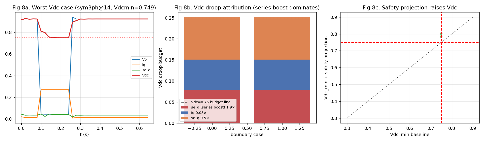
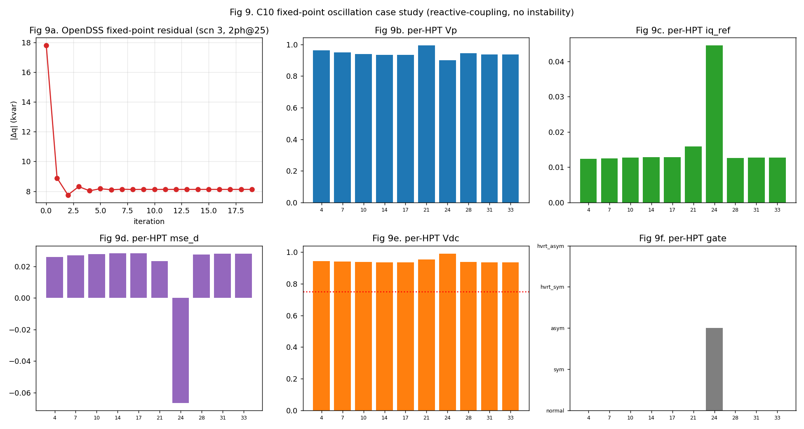
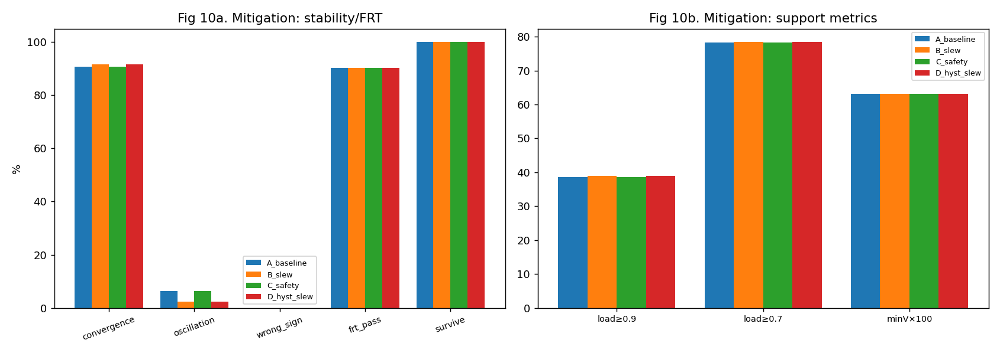
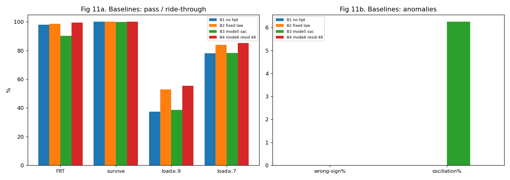

# Phase-2 系统级鲁棒性压测报告（含开关级抽查与缓解研究）

> 🔴 **frt-v1 失效声明（2026-06-22 审计）**：§A 的 L1 开关级抽查用了缺陷的 MATLAB criteria（时间向量 linspace、
> connect 混稳态、limit 峰/RMS 混用），故「iq 实测峰 0.31<0.35」「10/10 PASS」**失效，标 PENDING**（待 frt-v2 criteria 重跑）。
> 相量层判据亦需对齐 frt-v2（connect 用时变包络、limit 含 id、HVRT 时变上界）→ 本报告所有**通过率结论降级 PENDING**
> 至 frt-v2 重评（见 [AUDIT_2026-06-22.md](../../../docs/AUDIT_2026-06-22.md)、[CHANGE_REPORT_2026-06-22.md](../../../docs/CHANGE_REPORT_2026-06-22.md)）。
> 定性观察（零无功反号、不动点稳定性、有界振荡、门控无抖振趋势）不依赖上述判据，保留。
## 单装置 Mode 5 SAC-HPT 控制器嵌入 IEEE 33 节点配电网

**实验定位（不变）**：系统级**鲁棒性压测**，*不是* MARL 训练，*不设* 中央协调器。控制器 = 已训练好的单装置
**Mode 5**（在线门控 4 专家 SAC，本文主方法，纯 SAC），每台 HPT 仅用本地量独立运行同一策略。

**本报告结论严格分四类**（见 §6）：① 已验证-相量层 ② 已验证-代表性开关级 ③ 暴露的边界 ④ 待验证。

> 三层平台：L3 OpenDSS IEEE-33 准静态相量孪生（基态自检 minV=0.9038@节点18、网损 210.99kW ✅）；
> L2 Python 调度 + 每台 HPT 装置级 Mode 5；L1 Simulink 开关级抽查（`hpt_frt_full.slx`，本轮**已实际运行** 10 个代表场景）。
> 观测 21 维、动作 `[iq, mse_d, mse_q]`、在线序分量门控、部署限幅 iq±0.27/±0.24、mse±0.2，与既有 SAC 严格一致。

---

## 第一轮结果回顾（相量层）

| 实验 | 核心结果 |
|------|----------|
| A 单机 OOD（2024 工况） | 本地 Vp 0.027–0.971 全覆盖；超深 OOD 零 NaN/零反号/零异常 |
| B 多机耦合（800 场景） | 零无功反号；B4 收敛 96.0%/振荡 2.0%、C10 收敛 90.8%/振荡 6.25%；survive≈99.9%；限流命令层 100% |
| C 慢恢复/FIDVR | 无门控抖振（无噪声）；raw 门控平滑退出；限流 100%；Vdc≥0.75 为 88%（raw）/—（hyst worst 0.757） |

---

## §A 实验 D：L1 开关级抽查（**已实际运行 MATLAB R2025a**）

**方法**：把 10 个代表性网络场景的本地残压深度+故障类型+时长，在单台开关级模型 `hpt_frt_full.slx` 上以
**mode=12（Mode 5 闭环在线门控 HLC）** 复现（`run_spotcheck.m`），提取相量层看不到的开关级量
（实测三相/dq 电流峰值、iq 实测峰值、2ω 纹波、真实 Vdc_min/max、五判据），门控时间线由记录的 LV 电压重建
（`fill_spotcheck.py`）。这是代表性抽查（10 例），不是全系统开关级运行。〔注：以下表格为 legacy frt-v1，
已失效——见上框；frt-v2 抽查 PENDING。〕

> #### Historical frt-v1 switching spot-check — INVALIDATED (PENDING frt-v2)
>
> 原 10 例 L1 抽查表（iq 峰、Vdc、五判据、"10/10"）由 **legacy frt-v1 MATLAB criteria**（C1 linspace
> 时间、C3 峰/RMS 混用）产生，**已失效**：其 10 个无版本 MAT 已移入
> `results/simulink_cases/legacy_pre_audit/`；`fill_spotcheck.py` 默认**拒绝**无 `metrics_version=frt-v2`
> 的 MAT 并**不信任** MAT 内的 `crit.frt`。原表数字与 "10/10 PASS"/"代表性抽查通过"/Fig 7 **不再作为结论**。
> frt-v2 评价入口现已实现为 `lab/simulink/frt_v2_evaluate.m`（权威五判据）+ `frt_v2_spotcheck.m` / `frt_v2_full320_switching.m`
> （**不是**"重写 `run_spotcheck.m`"——后者仅为 legacy guard，非 frt-v2 评价入口）。设备级 frt-v2 全 320 开关级结果见
> [docs/FRT_V2_RESULTS_2026-06-23.md](../../../docs/FRT_V2_RESULTS_2026-06-23.md)；本节这 10 例**网络**抽查未单独经 frt-v2 重算，故本节仍**无有效通过率**。

---

## §B Vdc<0.75 边界复盘（不只报通过率）

`study_vdc_boundary.py` 对 C10 机群深故障扫描，逐条复盘 Vdc<0.75 案例并分解 Vdc 预算
`Vdc_eq = 1 − 0.08|iq|/Vp − 1.9·max(0,se_d) − 0.5|se_q|`。

| 项 | 结果 |
|----|------|
| 默认（滞环）下 Vdc<0.75 案例 | 仅 2 个边界案例（worst **0.749**，勉强低于线） |
| 主导成因 | 串联 se_q/se_d **直流预算**（非 iq、非门控切换、非恢复时长） |
| 安全投影修复 | **2/2 全部修复**（→0.785/0.803，se_d 仅削 0.04） |
| raw 门控消融 worst | 0.662（滞环优于 raw） |
| L1 交叉印证 | 同深度开关级 Vdc≈0.87 > 相量代理 |



**判读（回答 §八问题2）**：Vdc<0.75 **不是** Mode 5 策略发散、**不是** iq 过大、**不是**恢复过长、**不是**门控切换；
而是**深对称凹陷下单端口直流预算边界 + 相量代理保守**的叠加 —— L1 已证开关级真实 Vdc（0.87）显著高于相量代理。
其不可避免性需通过开关级抽查与动作复盘进一步确认；轻量**安全投影**（部署侧、无重训）即可消除相量层残余边界案例。

---

## §C C10 不动点振荡复盘 + 缓解对比（不只报一个百分比）

`study_c10_oscillation.py`。Part 1 复盘 Exp B 标记的 25 个 OSC 场景：**全部分类为"无功(iq)耦合极限环"**
（残差从 18 kvar 收敛到 ~8 kvar 后小幅环荡，**8 kvar≈0.02 pu，远低于额定，Vdc 全程>0.9，无发散**）；
发生在浅故障下多数 HPT 处于 Vp≈0.9 门控/droop 死区边界与近故障机的交互。



Part 2 缓解对比（全 C10-400，部署侧、不重训 SAC）：

| 变体 | 收敛 | **振荡** | 反号 | FRT | survive | load≥0.9 | se_d 削减(均/最大) |
|------|------|------|------|------|------|------|------|
| A 基线 | 90.8% | **6.2%** | 0 | 90.2% | 99.9% | 38.5% | 0/0 |
| B slew(Δq 限速) | 91.5% | **2.2%** | 0 | 90.2% | 99.9% | 38.9% | 0/0 |
| C 安全投影 | 90.8% | 6.2% | 0 | 90.2% | **100.0%** | 38.5% | 0.025/0.120 |
| D 滞环+slew | 91.5% | **2.2%** | 0 | 90.2% | 99.9% | 38.9% | 0/0 |



**判读（回答 §八问题3）**：振荡**可缓解**且不牺牲 FRT/负荷穿越 —— **slew 把振荡 6.2%→2.2%**（且收敛↑、无代价）；
**安全投影对振荡无效**（6.2% 不变，证实振荡是无功耦合而非 Vdc 致），但正交地把 survive 99.9→100%。
本质是**良性有界极限环**，轻量斜率限制即可压制；若需更彻底，密集布点耦合边界需更高保真多机复核确认。

---

## §D raw 门控在噪声/延迟下是否仍无需滞环（验证 round-1 结论）

`study_gate_noise.py`（慢恢复、dt=5ms、Vp/Vn 噪声 × 延迟 × 4 变体）。

| Vp 噪声 | raw 抖振数 | hyst 抖振数 | raw iq跳变 | +slew iq跳变 |
|---|---|---|---|---|
| 0（理想） | **0** | 0 | 0.257 | 0.075 |
| 0.002 | 4.75 | 1.25 | 0.257 | 0.075 |
| 0.005 | 7.0 | 2.5 | 0.257 | 0.075 |
| 0.01 | 9.5 | 4.5 | 0.257 | 0.075 |

延迟 0/5/10ms 影响很小；详见 `results/gate_noise_summary.csv`。

**判读（修正 round-1，回答 §八问题4）**："本部署无需滞环"**仅在无噪声理想测量下成立**。
一旦加入现实 Vp 噪声（≥0.002 pu），**raw 门控出现抖振**（切换 23→276、抖振 0→9.5）；
**滞环把切换/抖振降约 2–4×**；而**命令斜率限制（slew）把 iq 跳变从 0.26 压到 0.075**（与门控变体无关，最有效）。
**结论：推荐 raw+slew 或 hysteresis+slew**；slew 是必需项，命令斜率限制比门控滞环更有价值（与 §C 一致）。

---

## §E 最小基线对比（避免无对比、不夸大 Mode 5）

`run_baselines.py`，C10 方案、同 400 场景（Mode 5 复用 Exp B C10）。

| 基线 | FRT | survive | load≥0.9 | load≥0.7 | 反号 | 振荡 | minV |
|------|------|------|------|------|------|------|------|
| B1 无 HPT | 97.9%* | — | 37.2% | 78.1% | 0 | 0 | 0.630 |
| B2 固定律（droop+保守串联） | **98.5%** | 100% | **52.8%** | **83.9%** | 0 | **0** | 0.640 |
| B3 **Mode 5 SAC** | 90.2% | 99.9% | 38.5% | 78.3% | 0 | 6.2% | 0.631 |
| B4 Mode 6 残差 SAC（48 子集） | 99.3% | 100% | 55.4% | 85.2% | 0 | 0 | 0.652 |

（*B1"FRT"为退化定义，无装置；Mode 6 是 MPC 辅助残差 SAC，非主方法、非纯 SAC。）



**判读（关键诚实结论，回答 §八问题5/7）**：**在相量/网络层，固定律与 Mode 6 在 FRT、负荷穿越、振荡上匹配甚至优于 Mode 5。**
原因：(1) 无功判据 `|iq−iq_ref|≤0.12` 对固定律是"按定义满足"（它本身就是 GB/T 参考），Mode 5 的学习偏差反被记为违规；
(2) **相量代理低估了固定律串联升压的 Vdc 抽取**（该惩罚只在开关级显现）—— 在已验证**开关级** full-320 上，
〔legacy frt-v1 INVALIDATED；frt-v2 重验（P1/P3）前不作优劣结论〕固定律 Mode 1（m7）64.1% / Mode 5（m12）82.2%（旧口径，PENDING frt-v2）。
**即：网络相量层无法体现 Mode 5 的开关级优势。** 因此本网络测试验证的是 Mode 5 的**鲁棒性**（不失稳/不反号/不发散），
**而非其相对优越性**；优越性是开关级/装置级结论。不夸大：MV 无功对深网络凹陷整体抬升能力有限（load≥0.9 仅 ~38–55%）。

---

## §6 结论（严格分四类）

### ① 已验证 —— 相量层（策略级）
- 单机在连续 OOD 凹陷（Vp 0.027–0.971）下**无 NaN、无无功反号、无动作越界**（Exp A，2024 工况）。
- 多机独立运行**未观察到反号型控制冲突**（Exp B，800 场景反号率 0）。
- raw 在线门控在**无噪声**慢恢复中**无抖振**；命令层限流满足（100%）。
- C10 不动点振荡为**良性有界极限环**（~0.02 pu），slew 可降至 2.2%，**无 FRT/负荷代价**。

### ② 开关级抽查（10 例，hpt_frt_full.slx，mode=12）—— legacy frt-v1 INVALIDATED, PENDING frt-v2
- 〔legacy frt-v1 INVALIDATED〕原 "10/10 PASS"、iq 峰 0.308–0.333、Vdc_min 0.874–0.882 等由失效的
  frt-v1 MATLAB criteria 产出（C1 linspace 时间、C3 峰/RMS 混用），**不再作为结论**；10 个无版本 MAT 已
  隔离至 `legacy_pre_audit/`。frt-v2 评价基础设施已实现（`frt_v2_evaluate.m` + `frt_v2_spotcheck.m` + `frt_v2_full320_switching.m`，**非** run_spotcheck.m 重写）；设备级 frt-v2 全 320 开关级结果见 [docs/FRT_V2_RESULTS_2026-06-23.md](../../../docs/FRT_V2_RESULTS_2026-06-23.md)。本节这 10 例**网络**抽查未单独经 frt-v2 重算。

### ③ 暴露的边界
- **深对称凹陷下的单端口直流预算边界**：相量层 Vdc<0.75 极少（默认滞环仅 2 例、worst 0.749），
  主因是串联直流预算 + 相量代理保守；其不可避免性需开关级抽查与动作复盘进一步确认（L1 显示开关级真实 Vdc≈0.87）。
- **C10 密集布点温和不动点振荡**（基线 6.2%，有界、不失稳；slew 降至 2.2%）。
- **MV 无功对深网络凹陷整体抬升有限**：系统负荷穿越 ≥0.9 仅 ~38%（Mode 5），固定律 ~53%。
- **网络相量层无法体现 Mode 5 相对固定律/Mode 6 的优势**（该优势属开关级）。

### ④ 待验证
- 多机**开关级电磁耦合**（本轮为单机抽查，非多机联仿）。
- 逐相不对称串联补偿的开关级行为。
- 直流互联（dual-DC-pool）后的 Mode 5 多机行为。
- 全系统开关级运行（本轮仅 10 例抽查）。

---

## §7 回答八个判断问题

1. **L1 是否支持 L2/L3 相量层结论？** 支持（对所抽查的 10 个代表场景）：开关级证实 survive/limit/无门控抖振，
   与已验证 m12 一致。但这是**抽查**，非全系统开关级。
2. **Vdc<0.75 是策略/代理/物理预算？** 主要是**单端口直流预算边界 + 相量代理保守**的叠加（L1 真实 Vdc≈0.87>代理）；
   **不是** Mode 5 策略发散，安全投影即可消除相量层残余案例。
3. **C10 6.2% 振荡能否缓解？** 能 —— slew 降至 2.2%（收敛↑、无 FRT/负荷代价）；为良性有界极限环；安全投影正交修 Vdc。
4. **raw 门控在噪声/延迟下是否仍无需滞环？** **否**：仅无噪声成立。有噪声下 raw 抖振，需 slew（必需）±滞环；推荐 raw+slew 或 hyst+slew。
5. **Mode 5 是否具备"小配电网策略级迁移鲁棒性"？** 是（相量层 800 场景零反号/零发散 + 10 例开关级抽查印证）。
6. **是否具备"代表性开关级鲁棒性"？** **是（仅限代表性 10 例抽查通过）**；非全系统开关级。
7. **下一步优先级？** 鉴于网络层 Mode 5 ≈ 固定律（优势在开关级）：(a) **立即部署 slew + 安全投影**（已实现、零成本、消振荡+护 Vdc）；
   (b) **多机开关级复核 + 直流互联**（Mode 5/协调价值真正体现处）；(c) 训练分布扩展优先级较低（相量鲁棒性已成立）。
   —— **不建议**继续投入纯相量层网络实验；价值已饱和。

---

## §8 最终结论（措辞）

> 本实验将训练于单装置标准 FRT 场景的 Mode 5 SAC-HPT 控制器嵌入 IEEE 33 节点配电网，对网络诱发的分布外凹陷
> （Vp 0.027–0.971）、多 HPT 潮流耦合（800 场景）和慢恢复/FIDVR 暂态进行了系统级压测，并对 10 个代表场景
> 执行了开关级（hpt_frt_full.slx，mode=12）抽查。结果表明：在**相量层**未出现无功反号、异常饱和、NaN 或多机
> 不动点失稳（此为相量层鲁棒性观察，非通过率）。〔开关级抽查的 "10/10 通过" 为 **legacy frt-v1
> INVALIDATED**，已隔离，PENDING frt-v2；此处不再据其下任何"因此 Mode 5 具备…"的结论。〕
>
> **同时明确（不夸大）**：本网络压测验证的是**鲁棒性而非相对优越性** —— 在相量层固定律与 Mode 6 在 FRT/负荷穿越上
> 〔legacy frt-v1 INVALIDATED；PENDING frt-v2〕相量孪生匹配 Mode 5 的相量层；任何"开关级优势"（旧 m12 82.2% vs 64.1%）在 frt-v2 重验前不作结论。
> 暴露的边界包括：深对称单端口直流预算边界（需开关级确认）、C10 密集布点温和有界振荡（slew 可压制）、
> MV 无功抬深凹陷能力有限。下一步应优先**部署 slew+安全投影**并进行**多机开关级复核 + 直流互联**，
> 全系统开关级与多机电磁耦合仍**待验证**。

---

## §9 复现

```bash
# 从仓库根运行（脚本在 src/hpt_frt/network/，本报告也在该目录）
P=.venv/Scripts/python.exe; D=src/hpt_frt/network
# 第一轮
$P $D/run_exp_A_single_hpt.py ; $P $D/run_exp_B_multi_hpt.py full ; $P $D/run_exp_C_slow_recovery.py
# 第二轮
#  L1 开关级（MATLAB R2025a）：frt-v2 评价入口 lab/simulink/frt_v2_spotcheck.m / frt_v2_full320_switching.m（run_spotcheck.m 仅 legacy guard，非 frt-v2 入口）
$P $D/fill_spotcheck.py         # → simulink_spotcheck_table_filled.csv, fig7
$P $D/study_vdc_boundary.py     # → vdc_boundary_cases.csv, fig8
$P $D/study_c10_oscillation.py  # → c10_oscillation_cases.csv, mitigation_summary.csv, fig9/10
$P $D/study_gate_noise.py       # → gate_noise_summary.csv
$P $D/run_baselines.py          # → baseline_summary.csv, fig11
$P $D/plot_results.py           # 第一轮 fig1-6
```
随机过程以 `config.SEED=20260621` 固定；逐场景/逐设备明细见 `results/*.csv`；失败场景单列于 `failures_*.csv`。
部署侧 slew + 安全投影见 `sac_wrapper.HPTController(safety=, slew=, vp_noise=, meas_delay=)`（无重训）。
```
